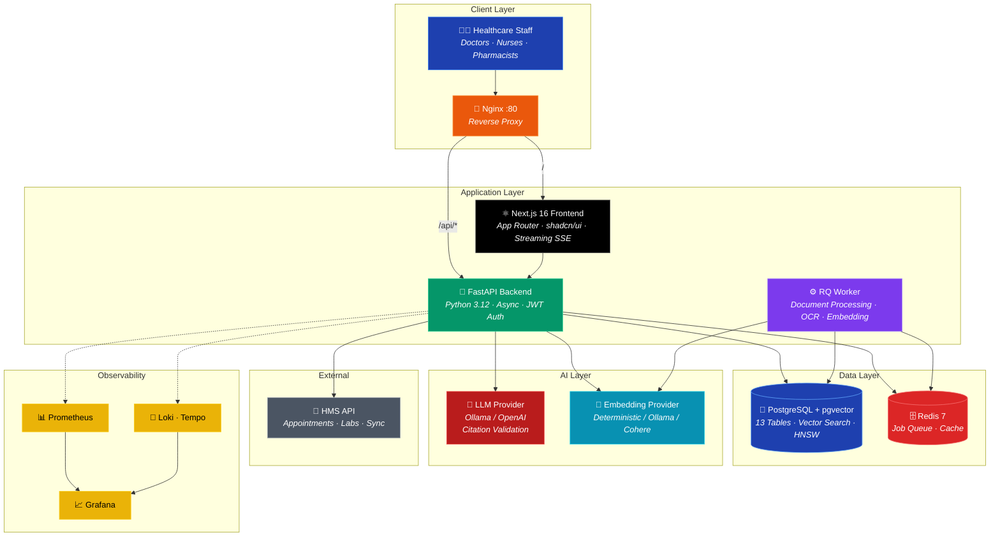
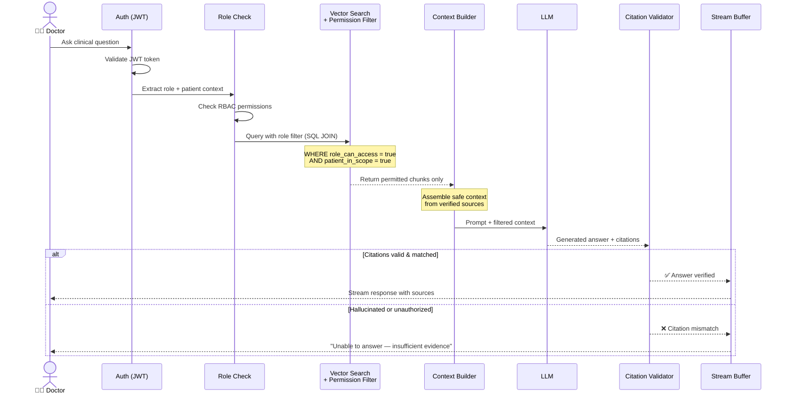
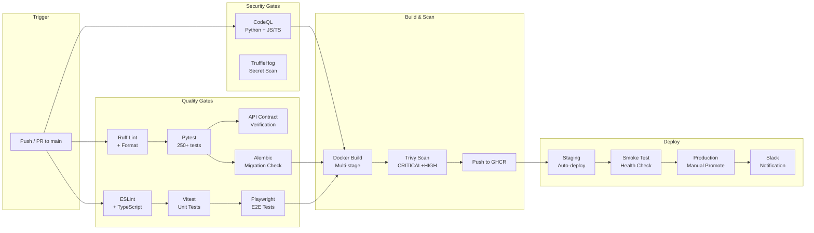
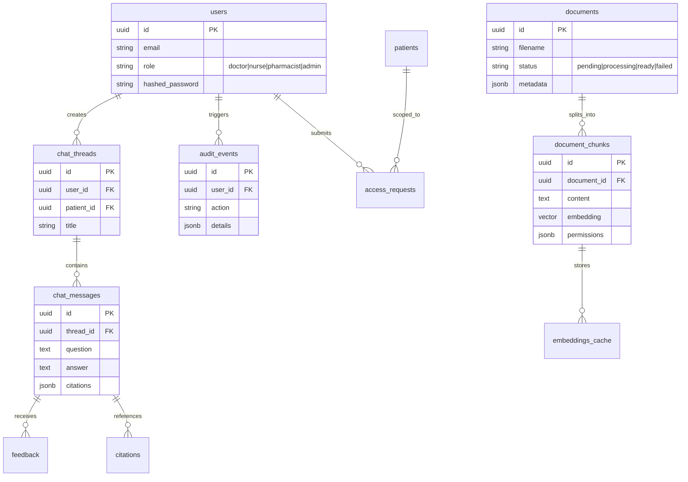
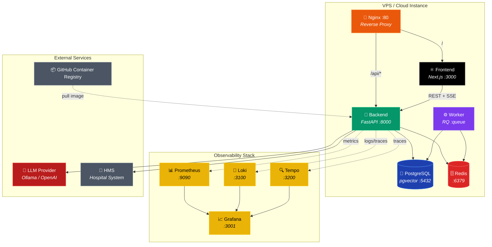
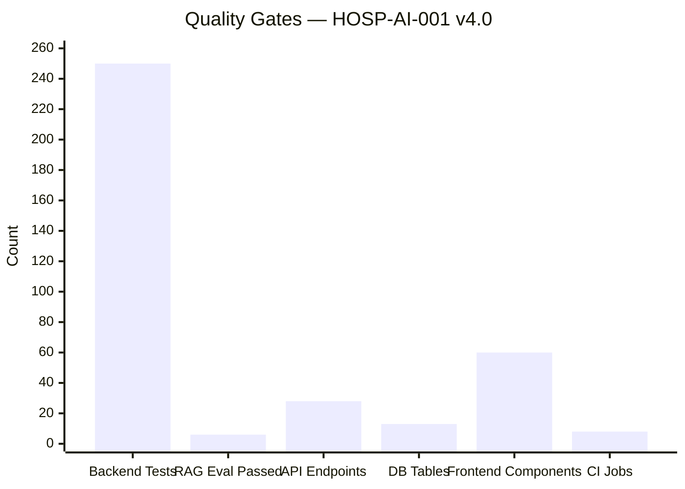

# 🏥 AI-Powered Hospital Knowledge Assistant

<div align="center">

[](https://www.python.org/)
[](https://fastapi.tiangolo.com/)
[](https://nextjs.org/)
[](https://react.dev/)
[](https://www.postgresql.org/)
[](https://redis.io/)
[](https://www.docker.com/)
[](https://github.com/qwan30/chat-hospital-system/actions)
[](https://github.com/qwan30/chat-hospital-system/actions)
[](https://github.com/qwan30/chat-hospital-system)
[](https://github.com/qwan30/chat-hospital-system)

**An AI-powered clinical decision support system** integrating RAG (Retrieval-Augmented Generation) with permission-aware vector search, citation hallucination detection, and HMS (Hospital Management System) data synchronization. Built with a **hybrid Clean/Pipeline architecture** — framework-free domain core, abstract provider interfaces, centralized prompt registry, and domain-driven exceptions. Designed to demonstrate production-grade AI engineering with strict PHI (Protected Health Information) compliance considerations.

> **🟢 Production Status: v4.0 — June 15, 2026**
> 250+ Pytest tests passing. 6/6 RAG synthetic evaluation scenarios passed. 5 CI/CD workflows active with CodeQL, Trivy, and TruffleHog scanning. Full Grafana observability stack.
>
> 📚 **[Interactive Documentation Portal →](docs/documentation-portal.html)** | 📂 **[Documentation Index →](docs/README.md)** | 📋 **[API Contract →](docs/05-api/api-contract.md)**

</div>

---

## 🎯 Key Features & Business Value

| # | Clinical Domain | Technical Implementation | Business Impact |
|---|---------------|-------------------------|-----------------|
| 🔍 | **Permission-Aware RAG** | Vector search with SQL JOIN permission filter — only document chunks the user's role can access are included in LLM context | Zero PHI leakage across role boundaries; HIPAA-aligned data access |
| ✅ | **Citation Validation** | Post-generation verification: every LLM citation cross-checked against actual document chunks; hallucinated references blocked before streaming | Eliminates clinical misinformation from AI-generated responses |
| 📄 | **Document OCR & Indexing** | Async RQ worker pipeline: PDF parsing (PyMuPDF) → OCR (PaddleOCR) → chunking → embedding (Ollama/OpenAI/Cohere) → pgvector HNSW index | Converts unstructured hospital documents into searchable knowledge base |
| 🏥 | **HMS Data Sync** | API bridge to Hospital Management System — imports appointments, lab results, medications; caches as RAG-readable context | Real-time patient context without manual data entry |
| 💊 | **Drug-Allergy Pre-Check** | Cross-references prescribed medications against patient allergy list + current medications using RAG context + LLM analysis | Prevents adverse drug events at point of care |
| 🔐 | **RBAC + ABAC Security** | JWT authentication with role-based claims; 7 roles with scoped patient permissions; enforcement at API gateway + RAG retrieval layers | Enforced separation of duties; audit-ready access control |
| 📊 | **Impact Metrics** | Time-saved and cost-saved tracking per AI-assisted query; helpfulness feedback loop; dashboard analytics | Quantifiable ROI for hospital administration |
| 🔄 | **Streaming SSE** | Server-Sent Events for real-time token streaming; buffered until citation validation passes; client-side progressive rendering | Immediate clinician feedback with safety gate |

---

## 🎯 Engineering Skills Demonstrated

| Dimension | Demonstrated Skills |
|-----------|-------------------|
| **AI/ML Engineering** | RAG pipeline with citation validation, permission-aware vector search, multi-provider LLM/embedding abstraction (Ollama/OpenAI/Cohere), synthetic RAG evaluation suite, centralized prompt registry |
| **Backend Engineering** | FastAPI async, SQLAlchemy 2.0+asyncpg, pgvector HNSW, Redis/RQ workers, Alembic migrations, API contract verification, structured JSON logging |
| **Frontend Engineering** | Next.js 16 App Router, React 19, shadcn/ui, Tailwind CSS v4, SSE streaming, Playwright E2E, Vitest unit tests |
| **DevOps / SRE** | 5 GitHub Actions workflows (CI/CD/Security/Rollback/Dependabot), Docker multi-stage, Trivy+CodeQL scanning, Grafana+Prometheus+Loki+Tempo observability |
| **Security** | JWT RBAC+ABAC, PHI-aware SQL JOIN filters, citation hallucination detection, TruffleHog+Bandit+pip-audit+npm audit, security headers |
| **Documentation** | 100+ docs across 12 domains, interactive HTML portal with dark mode+search+Mermaid, ADRs, 5 architecture diagrams |

---

## 🏗️ System Architecture



---

## 🔐 Permission-First RAG Flow

This sequence diagram shows how the system ensures **zero PHI leakage** by filtering document access at the database query level before any context reaches the LLM:



---

## 🔄 CI/CD Pipeline



---

## 🗄️ Database Entity Relationship



---

## 🚢 Deployment Architecture



---

## 📊 Verified Project Metrics



| Metric | Value | Status |
|--------|-------|--------|
| **Backend Pytest Tests** | 250+ (Unit + Integration) | ✅ All Passing |
| **RAG Synthetic Eval** | 6/6 scenarios passed | ✅ 100% Pass Rate |
| **REST API Endpoints** | 35+ route decorators, 28 OpenAPI paths | ✅ Verified |
| **Database Schema** | 13 tables, 6 Alembic migrations | ✅ Migrated |
| **Frontend Components** | 60+ React components (shadcn/ui) | ✅ Built |
| **CI/CD Workflows** | 5 pipelines (CI, CD, Security, Rollback, Dependabot) | ✅ Active |
| **Code Quality** | Ruff + ESLint + TypeScript strict | ✅ Zero Errors |

---

## 🧠 Architectural Decision: Why Hybrid Clean/Pipeline Architecture?

> **"Why not full DDD layers like `hospital-management-system`?"**

The `hospital-management-system` is a **complex ERP CRUD** application with deep domain logic, multi-role workflows, inventory, billing, and clinical operations. Full DDD layers (domain/application/infrastructure/presentation) add **necessary structure** to manage that complexity.

This project (`chatbot-hospital-system`) is a **RAG data pipeline** — the core flow is:

```
Ingest Document → Chunk → Embed → Store Vector → Query → Retrieve → Generate → Validate → Stream
```

This maps naturally to a **pipeline architecture** where each stage is a self-contained service. Adding DDD directory layers would introduce **indirection without benefit** — the data flow IS the domain.

**However**, we still achieve the **same architectural goals** as DDD:

```
 ┌─────────────────────────────────────────────────────────┐
 │                    api/ (Presentation Layer)              │
 │   14 Route Modules · Middleware · Exception Handlers     │
 │   Auth · Patients · Chat · Documents · Audit · HMS      │
 ├─────────────────────────────────────────────────────────┤
 │                 services/ (Application Layer)            │
 │   RAG Pipeline · Chat Orchestration · Document OCR      │
 │   HMS Sync · Drug Check · Search · Embedding            │
 ├─────────────────────────────────────────────────────────┤
 │                   core/ (Domain Layer)                   │
 │   ┌──────────┬──────────┬──────────┬────────────────┐   │
 │   │Exceptions│Interfaces│ Prompts  │ Config/Security│   │
 │   │ 13 domain│7 ABC/    │ 4 modules│ JWT · Rate     │   │
 │   │ errors   │Protocol  │ versioned│ Limiting       │   │
 │   └──────────┴──────────┴──────────┴────────────────┘   │
 ├─────────────────────────────────────────────────────────┤
 │                   db/ (Infrastructure Layer)             │
 │   SQLAlchemy Models · Alembic Migrations · pgvector     │
 └─────────────────────────────────────────────────────────┘
     Dependency Flow: db ← core ← services ← api
```

| DDD Principle | How We Achieve It |
|---------------|-------------------|
| **Dependency Inversion** | `core/` has ZERO FastAPI imports. Business logic depends on abstract protocols (`ILLMProvider`, `IEmbeddingProvider`), not frameworks |
| **Domain Isolation** | Domain exceptions (`MedicalDataAccessException`, `CitationHallucinationException`) live in `core/`. The API layer maps them to HTTP codes |
| **Separation of Concerns** | `api/` handles HTTP, `services/` handles orchestration, `core/` handles pure business rules, `db/` handles persistence |
| **Testability** | Every component testable in isolation. Core logic tested without database or HTTP |

This is the **Clean Architecture dependency rule** implemented through convention, not directory structure. An interviewer who reads the `core/` directory will immediately recognize the discipline.

---

## 📂 Project Structure

```
.
├── .github/
│   ├── workflows/
│   │   ├── ci.yml              # 8-job CI pipeline (CodeQL, test, build, scan)
│   │   ├── cd.yml              # Multi-env CD (staging → production)
│   │   ├── security-scan.yml   # Weekly: pip-audit, npm audit, TruffleHog, Trivy
│   │   └── rollback.yml        # Manual rollback with confirmation gate
│   └── dependabot.yml          # Automated dependency updates (npm, pip, GHA)
├── infra/
│   ├── docker-compose.yml           # Production stack (5 services)
│   ├── docker-compose.observability.yml  # Grafana, Prometheus, Loki, Tempo
│   ├── nginx/default.conf           # Reverse proxy with SSE streaming
│   └── observability/              # Prometheus, Tempo, Loki, Grafana configs
├── app/
│   ├── backend/
│   │   ├── src/hospital_ai/
│   │   │   ├── api/            # FastAPI routes, middleware, exception handlers
│   │   │   ├── core/           # Framework-free business logic (ZERO FastAPI deps)
│   │   │   ├── db/             # SQLAlchemy models, sessions, migrations
│   │   │   ├── schemas/        # Pydantic request/response models
│   │   │   └── services/       # RAG pipeline, LLM, embedding, HMS integration
│   │   ├── alembic/            # Database migration history
│   │   └── tests/              # 250+ Pytest tests
│   └── frontend/
│       ├── src/
│       │   ├── app/            # Next.js App Router pages
│       │   ├── components/     # 60+ React components (shadcn/ui)
│       │   ├── hooks/          # Custom React hooks
│       │   └── lib/            # API client, streaming, utilities
│       └── e2e/                # Playwright E2E tests
└── docs/
    ├── documentation-portal.html   # Interactive HTML documentation portal
    ├── 00-overview/                # Project foundation & governance
    ├── 01-business/                # BRD, BRs, stakeholders, glossary
    ├── 04-architecture/            # ADRs, tech stack, security architecture
    ├── 05-api/                     # API contract & error codes
    ├── 06-database/                # ERD, schema, data dictionary
    └── ... (12 documentation domains, 100+ files)
```

---

## 🚀 Quick Start

### Prerequisites
- Python 3.12+ · Node.js 22+ · Docker & Docker Compose

### 1. Start Infrastructure
```bash
docker compose up -d postgres redis
```

### 2. Backend (FastAPI)
```bash
cd app/backend
python -m venv venv && source venv/bin/activate  # Windows: .\venv\Scripts\activate
pip install -e ".[dev,postgres]"
alembic upgrade head
uvicorn "hospital_ai.main:create_app" --factory --host 0.0.0.0 --port 8000 --reload
```
Swagger UI: http://localhost:8000/docs

### 3. Frontend (Next.js)
```bash
cd app/frontend
npm install
npm run dev
```
UI: http://localhost:3000

### 4. Full Production Stack
```bash
docker compose -f infra/docker-compose.yml up -d
# With observability:
docker compose -f infra/docker-compose.yml -f infra/docker-compose.observability.yml up -d
```

### Demo Accounts

| Role | Email | Password |
|------|-------|----------|
| 👨‍⚕️ Doctor | `doctor@hospital.vn` | `Doctor@1234` |
| 👩‍⚕️ Nurse | `nurse@hospital.vn` | `Nurse@1234` |
| 💊 Pharmacist | `pharmacist@hospital.vn` | `Pharma@1234` |
| ⚙️ Admin | `admin@hospital.vn` | `Admin@1234` |

---

## 🧪 Testing & Quality

```bash
# Backend — 250+ Pytest tests
cd app/backend && python -m pytest tests/ -v --tb=short

# Backend — RAG synthetic evaluation (6 scenarios)
cd app/backend && python scripts/run_rag_eval.py

# Backend — API contract verification
cd app/backend && python scripts/verify_contracts.py

# Frontend — Unit tests (Vitest)
cd app/frontend && npm run test

# Frontend — E2E tests (Playwright)
cd app/frontend && npx playwright test --project=chromium
```

---

## 📈 CI/CD & Observability

| Pipeline | Trigger | Actions |
|----------|---------|---------|
| **CI** (`ci.yml`) | Push / PR | CodeQL · Ruff · Pytest · ESLint · Playwright · Docker build+Trivy → GHCR |
| **CD** (`cd.yml`) | CI success / Manual | SCP configs · SSH deploy · Alembic migrate · Smoke checks · Slack notify |
| **Rollback** (`rollback.yml`) | Manual | Confirmation gate · Specific tag deploy · Health check |
| **Security** (`security-scan.yml`) | Weekly / Manual | pip-audit · npm audit · Bandit · TruffleHog · Trivy container scan |
| **Dependabot** (`dependabot.yml`) | Weekly | Automated PRs for npm, pip, GitHub Actions |

**Observability Stack:** `Nginx → Backend → Prometheus → Grafana + Loki → Tempo`

Configurations in [`infra/observability/`](infra/observability/) — Prometheus metrics, Grafana dashboards, Loki log aggregation, Tempo distributed tracing.

---

## 📚 Documentation

| Section | Content | Primary Doc |
|---------|---------|-------------|
| **00-overview** | Project foundation, conventions, governance | [`project-foundation.md`](docs/00-overview/project-foundation.md) |
| **01-business** | Business rules, BR-001–BR-007, glossary, scope | [`business-rules.md`](docs/01-business/business-rules.md) |
| **02-product** | PRD, personas, MVP criteria | [`prd.md`](docs/02-product/prd.md) |
| **03-requirements** | SRS (24 FRs + 22 NFRs), use cases UC-001–UC-009, permissions | [`srs.md`](docs/03-requirements/srs.md) |
| **04-architecture** | System design, security architecture, ADR-001–ADR-012, coding standards | [`architecture.md`](docs/04-architecture/architecture.md) |
| **05-api** | API contract, endpoint specs, error codes | [`api-contract.md`](docs/05-api/api-contract.md) |
| **06-database** | Schema (13 tables), ERD, data dictionary, migrations | [`db-schema.md`](docs/06-database/db-schema.md) |
| **07-flows** | Business flows, state machines, user journeys | [`end-to-end-business-flow.md`](docs/07-flows/end-to-end-business-flow.md) |
| **08-ui-ux** | Design system, Figma specs, UI/API traceability | [`00_product_ui_truth.md`](docs/08-ui-ux/00_product_ui_truth.md) |
| **09-testing** | Test strategy, plan, RTM, 250+ test cases | [`test-plan.md`](docs/09-testing/test-plan.md) |
| **10-deployment** | CI/CD (5 workflows), env variables, Docker, rollback | [`deployment-guide.md`](docs/10-deployment/deployment-guide.md) |
| **11-operations** | Monitoring (Grafana), incident response, troubleshooting | [`monitoring-guide.md`](docs/11-operations/monitoring-guide.md) |
| **12-handover** | Developer onboarding, repository guide, known issues | [`developer-onboarding.md`](docs/12-handover/developer-onboarding.md) |

> 📄 **[Interactive Documentation Portal →](docs/documentation-portal.html)** | 📂 **[Full Documentation Index →](docs/README.md)**

---

## 🛡️ Security & Compliance

- **PHI Protection**: Permission filters applied at SQL JOIN level before LLM context assembly — zero PHI leakage to unauthorized roles
- **Citation Validation**: Every LLM response verified against source database before streaming to client — hallucination detection blocks fabricated references
- **Authentication**: JWT access tokens with role-based claims, token refresh, httpOnly cookie support
- **Authorization**: RBAC with ABAC overlay — 7 roles with scoped patient permissions enforced at API gateway + RAG retrieval layers
- **Rate Limiting**: Configurable per-endpoint rate limits via slowapi — public endpoints protected, streaming endpoints exempted
- **Audit Trail**: Every access, denial, query, and config change logged with user ID + timestamp — 100% coverage on sensitive operations
- **Container Scanning**: Trivy scans on every CI push (CRITICAL+HIGH severity) + weekly scheduled full scan (CRITICAL,HIGH,MEDIUM)
- **Secret Detection**: TruffleHog weekly scan across full git history + Bandit SAST for Python source code
- **Dependency Monitoring**: Dependabot (npm, pip, GitHub Actions) + pip-audit + npm audit for continuous vulnerability tracking
- **Transport Security**: Nginx reverse proxy with security headers (X-Frame-Options, X-Content-Type-Options, X-XSS-Protection, Referrer-Policy)

---

<div align="center">

**Built with ❤️ following Clean Architecture principles, AI safety engineering practices, and healthcare industry compliance standards.**

*This project uses synthetic/de-identified data. It demonstrates engineering capability for portfolio purposes — not a certified medical device.*

</div>
