# 🏥 AI-Powered Hospital Knowledge Assistant

<div align="center">

[](https://www.python.org/)
[](https://fastapi.tiangolo.com/)
[](https://tanstack.com/start)
[](https://vitejs.dev/)
[](https://react.dev/)
[](https://www.postgresql.org/)
[](https://redis.io/)
[](https://www.docker.com/)
[](https://github.com/qwan30/chat-hospital-system/actions)
[](https://github.com/qwan30/chat-hospital-system/actions)
[](app/backend/data/evaluation/rag_sentinel_v2.jsonl)
[](app/backend/scripts/run_ai_evaluation.py)

**An AI-powered clinical decision support system** integrating RAG (Retrieval-Augmented Generation) with permission-aware vector search, citation hallucination detection, and HMS (Hospital Management System) data synchronization. Built with a **hybrid Clean/Pipeline architecture** — framework-free domain core, abstract provider interfaces, centralized prompt registry, and domain-driven exceptions. Designed to demonstrate production-grade AI engineering with strict PHI (Protected Health Information) compliance considerations.

> **🟠 AI evaluation status: CONDITIONAL**
> The versioned corpus and 300 source-backed cases are available, but the 50-case sentinel is still `draft`. It requires two independent reviewer approvals with no unresolved issues and therefore blocks release. Retrieval, Graph RAG, chat, and controlled-scan OCR are not represented as passing until their real adapters execute and produce run artifacts.
>
> **Mainline snapshot:** `main` is at `467dbc3` (PR #104, 2026-08-11). PR #90's CDI V2 foundation and PR #104's full-project E2E/security fixes are in this tree. GitHub marks stacked PRs #91–#103 as merged, but their merge SHAs are not ancestors of `main`; their follow-on generation, evidence, and release-lane code is therefore not advertised here as shipped. See the [PR/commit audit](history/pr-commit-audit-2026-08-13.md).
>
> 📚 **[Interactive Documentation Portal →](docs/documentation-portal.html)** | 📂 **[Documentation Index →](docs/README.md)** | 📋 **[API Contract →](docs/05-api/api-contract.md)**

</div>

---

## 🧭 Three Core AI Architectures

The three diagrams below are the shortest way to understand how this system turns hospital documents into permissioned clinical answers. Each diagram is available as an editable [Excalidraw source](docs/architecture/) and as an SVG preview for GitHub.

### 1. OCR and document indexing

The ingestion path starts with an immutable upload session and ends with page-level evidence, searchable chunks, embeddings, and an optional graph projection. A Redis/RQ worker performs the work asynchronously, retries failed jobs through the indexing dead-letter queue, and protects an existing ready index when a same-source reindex fails. The current source adapters are text, HL7/DOCX normalization, native PDF text extraction through PyMuPDF, and optional PaddleOCR for image-only PDF pages.

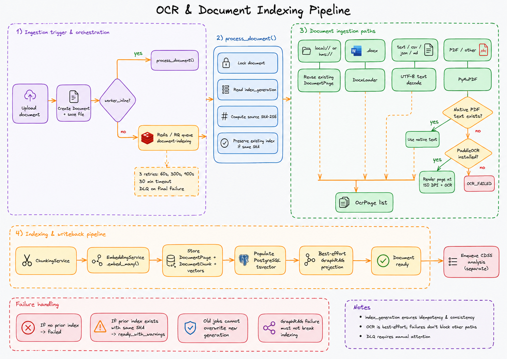

Editable source: [ocr-architecture.excalidraw](docs/architecture/ocr-architecture.excalidraw). Implementation anchors: [`process_document`](app/backend/src/hospital_ai/workers/jobs.py), [`OcrService`](app/backend/src/hospital_ai/services/ocr.py), [upload sessions](app/backend/src/hospital_ai/api/routes/document_uploads.py), and [document revisions](app/backend/src/hospital_ai/api/routes/document_revisions.py). The CDI V2 upload/revision APIs are a mainline foundation; the post-foundation generation/review stack is not claimed as shipped here.

### 2. Clinical chatbot and permission-first RAG

The chat stream checks authentication and patient scope before retrieval context is assembled. Input guardrails can terminate unsafe requests early; clinical requests use vector, BM25, or hybrid retrieval, optionally enrich results with GraphRAG, apply attachment/document scope, and refuse safely when evidence is missing or below threshold. Only then does the LLM generate. Output guardrails and citation-ID validation run before the answer is streamed over SSE, persisted, and made abortable by the client.

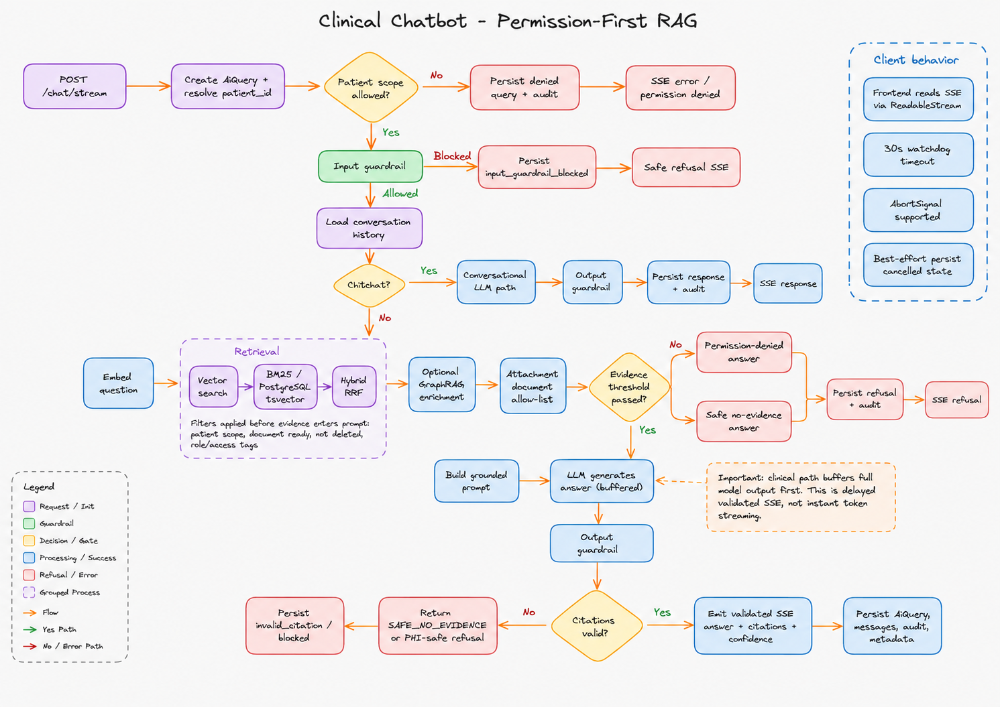

Editable source: [chatbot-architecture.excalidraw](docs/architecture/chatbot-architecture.excalidraw). Implementation anchors: [`chat_stream`](app/backend/src/hospital_ai/api/routes/chat_stream.py), [retrieval services](app/backend/src/hospital_ai/services/retrieval.py), [guardrails](app/backend/src/hospital_ai/services/guardrails.py), and the [frontend stream client](app/frontend/src/lib/stream-client.ts). Graph enrichment is optional and must re-enter the permission-scoped retrieval boundary.

### 3. SQL-backed GraphRAG

GraphRAG is implemented as a provenance-preserving projection over the existing relational store, not as a separate Neo4j-style database. Ready document chunks are processed into `GraphEntity` and `GraphRelation` rows with source chunk/document IDs. At query time, normalized terms seed a patient-scoped breadth-first traversal (default maximum two hops); related chunk IDs and a graph summary are returned to the chatbot, while the patient graph route exposes persisted nodes and edges for visualization. Invalid, deleted, or out-of-scope chunks are excluded, and GraphRAG may be skipped if extraction or traversal is unavailable.

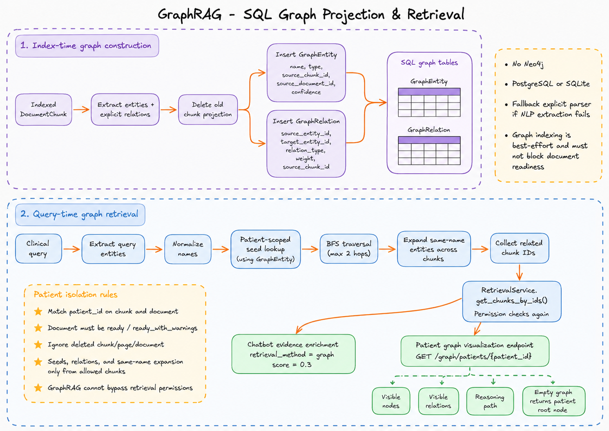

Editable source: [graphrag-architecture.excalidraw](docs/architecture/graphrag-architecture.excalidraw). Implementation anchors: [`graph_rag` module](app/backend/src/hospital_ai/services/graph_rag.py), [patient graph route](app/backend/src/hospital_ai/api/routes/graph.py), and the [chat-stream enrichment path](app/backend/src/hospital_ai/api/routes/chat_stream.py).

> **Architecture boundary:** these diagrams describe the current `main` source snapshot. They do not turn the conditional AI-evaluation state, optional OCR adapter, or un-ancestried stacked PRs into a release claim. See the [PR/commit audit](history/pr-commit-audit-2026-08-13.md) for the exact SHA and merge-history evidence.

---

## 🎯 Key Features & Business Value

| # | Clinical Domain | Technical Implementation | Business Impact |
|---|---------------|-------------------------|-----------------|
| 🔍 | **Permission-Aware RAG** | Vector/search retrieval applies patient and role scope before context assembly; the current mainline also retains the legacy Graph RAG boundary | Zero PHI leakage across role boundaries; HIPAA-aligned data access |
| ✅ | **Citation Validation** | Post-generation checks validate citation IDs against retrieved evidence; streaming retains citation and abort contracts | Blocks fabricated source references before they reach the client |
| 📄 | **Document Ingestion & Review Foundation** | PDF/PyMuPDF ingestion plus safe browser HL7/DOCX normalization and cleanup; CDI V2 adds immutable upload sessions, capability checks, idempotency, and revision APIs | Converts synthetic hospital documents into a reviewable searchable knowledge base |
| 🏥 | **HMS Data Sync** | API bridge to Hospital Management System — imports appointments, lab results, medications; caches as RAG-readable context | Real-time patient context without manual data entry |
| 💊 | **Drug-Allergy Pre-Check** | Cross-references prescribed medications against patient allergy list + current medications using RAG context + LLM analysis | Prevents adverse drug events at point of care |
| 🔐 | **RBAC + ABAC Security** | JWT authentication with role-based claims; 7 roles with scoped patient permissions; enforcement at API gateway + RAG retrieval layers | Enforced separation of duties; audit-ready access control |
| 🚨 | **Autonomous CDSS Agent** | Background RQ worker automatically analyses every ingested document using a flat dump of the patient's Knowledge Graph entities/relations as context; feeds LLM a structured risk-analysis prompt; persists `ClinicalAlert` records | Proactive clinical decision support — alerts clinicians to risk factors before they are noticed manually |
| 📊 | **Impact Metrics** | Time-saved and cost-saved tracking per AI-assisted query; helpfulness feedback loop; dashboard analytics | Quantifiable ROI for hospital administration |
| 🔄 | **Streaming SSE** | Server-Sent Events with citation validation, safe refusal handling, client-side abort, and progressive rendering | Immediate clinician feedback with a safety boundary |

---

## 🎯 Engineering Skills Demonstrated

| Dimension | Demonstrated Skills |

---

## 🎯 Engineering Skills Demonstrated

| Dimension | Demonstrated Skills |
|-----------|-------------------|
| **AI/ML Engineering** | RAG pipeline with citation ID validation, permission-aware vector search, chat providers (Stub/Ollama/OpenAI-compatible/Gemini), active embedding providers (Deterministic/Ollama/Gemini), source-backed AI evaluation contracts, centralized prompt registry |
| **Backend Engineering** | FastAPI async, SQLAlchemy 2.0+asyncpg, pgvector HNSW, Redis/RQ workers, Alembic migrations, immutable upload/revision contracts, API verification, structured JSON logging |
| **Frontend Engineering** | TanStack Start (Vite 8), React 19, shadcn/ui, Tailwind CSS v4, SSE streaming, Playwright E2E, 90+ routes with RBAC-gated navigation |
| **DevOps / SRE** | 5 GitHub Actions workflows (CI/CD/Security/Rollback/Dependabot), Docker multi-stage, Trivy+CodeQL scanning, Grafana+Prometheus+Loki+Tempo observability |
| **Security** | JWT RBAC+ABAC, PHI-aware SQL JOIN filters, citation hallucination detection, TruffleHog+Bandit+pip-audit+npm audit, security headers |
| **Documentation** | 100+ docs across 12 domains, interactive HTML portal with dark mode+search+Mermaid, ADRs, 8 architecture diagrams |

---

## 🏗️ System Architecture

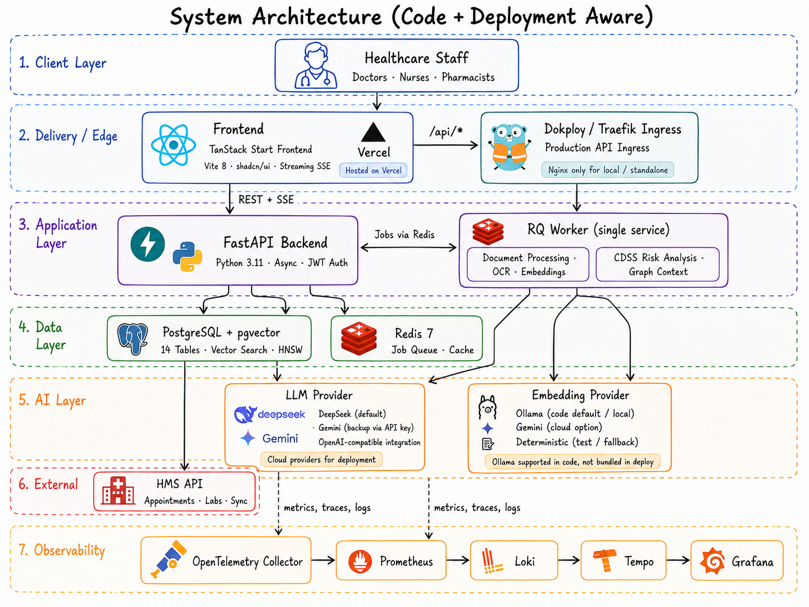

---

## 🔄 CI/CD Pipeline

> **Recorded `main` build status (SHA `467dbc3`).** In [CI run `31666780395`](https://github.com/qwan30/chat-hospital-system/actions/runs/31666780395), path detection, observability validation, CodeQL, backend lint/tests/contracts, migrations, and frontend lint/tests/build passed. The workflow source currently defers Playwright E2E because no backend service is provided in that job. The source-backed evaluation failed with repeated NLP extraction errors and no deterministic summary artifact; the Docker image job also failed during the build/Trivy lane. Live-model evaluation was skipped. The release gate therefore remains conditional/NO-GO; this is not release certification.
>
> The release lane also enforces `sentinel_independent_review` — *50 sentinel cases approved by two independent reviewers with no unresolved issues*. See [`evaluation/runner.py`](app/backend/src/hospital_ai/evaluation/runner.py) and [`rag_sentinel_v2.jsonl`](app/backend/data/evaluation/rag_sentinel_v2.jsonl).

Run the deterministic source-backed corpus gate with:

```bash
python app/backend/scripts/run_ai_evaluation.py --components corpus --output-dir app/backend/evaluation-artifacts/source-backed
```

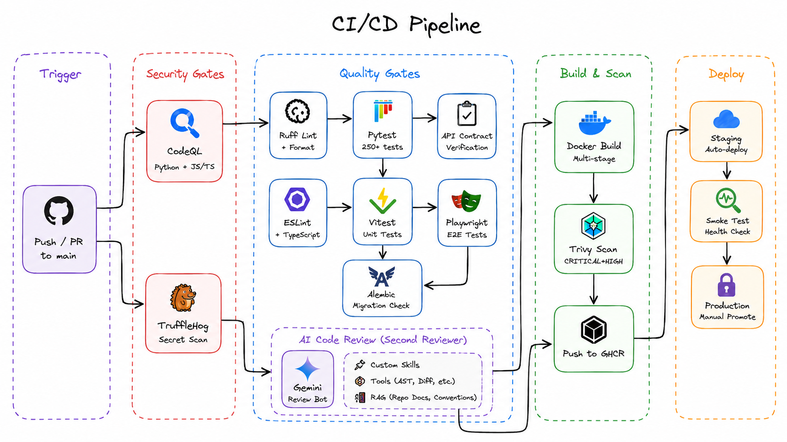

---

## 🚢 Deployment Architecture

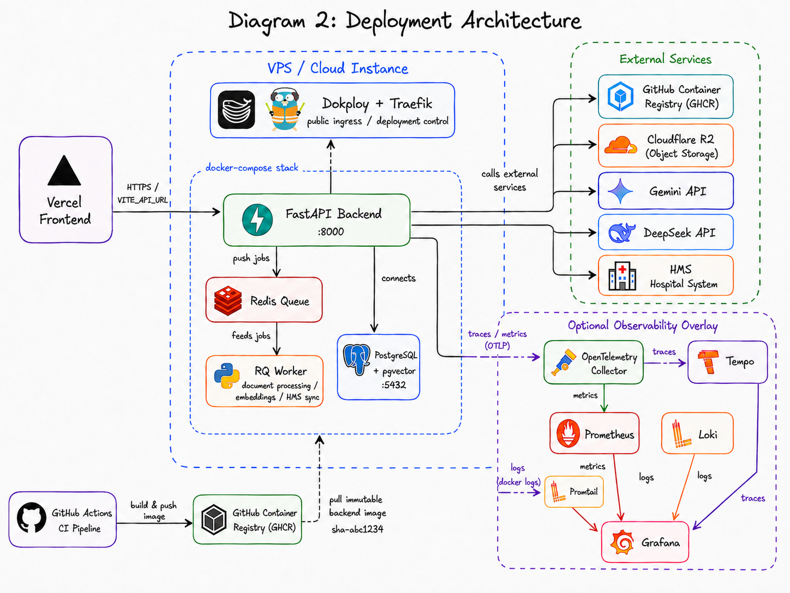

### 📈 Production Server & Container Monitoring (Dokploy)

The system is deployed on a self-hosted PaaS infrastructure (**Dokploy**) powered by Traefik edge routing, automated SSL/TLS termination, and Docker container orchestration:

- **Real-Time Resource Telemetry:** Active monitoring of CPU load, memory allocation, and host disk capacity across the full stack (FastAPI backend, Redis queue, PostgreSQL with pgvector, and RQ background workers).
- **Container Hygiene & Volume Tracking:** Real-time visibility into Docker storage distribution (build cache, running containers, images, and persistent volumes) to maintain high availability and support smooth rolling redeployments.

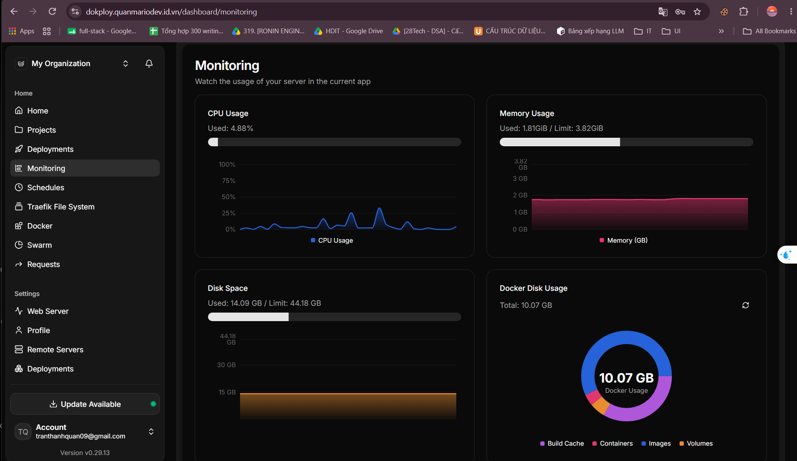

---

## 📸 Application Screenshots

<div align="center">

### 🔐 Login & Authentication

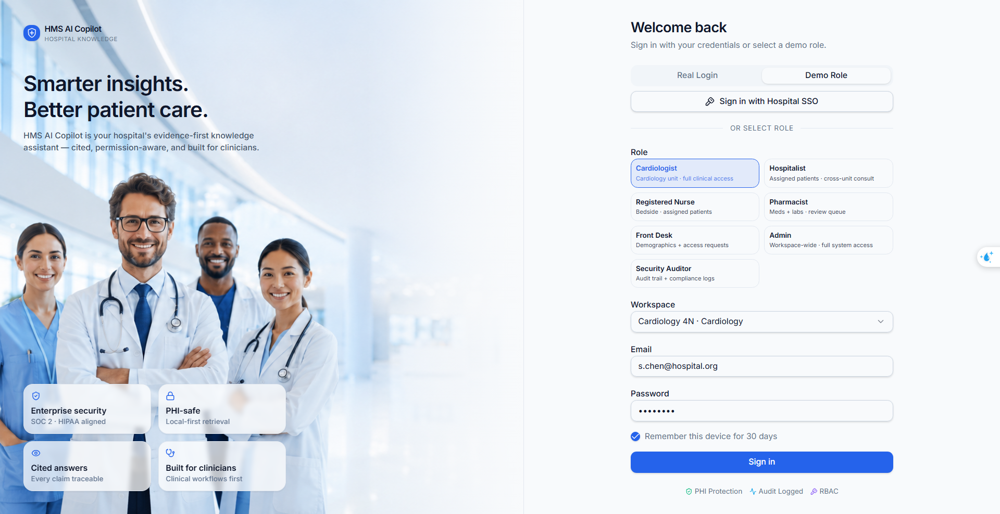

### 🏠 Dashboard & Navigation

| | |
|:---:|:---:|
| **Dashboard** — KPI metrics, recent patients, clinical overview | **Screen Index** — Navigation hub |
| 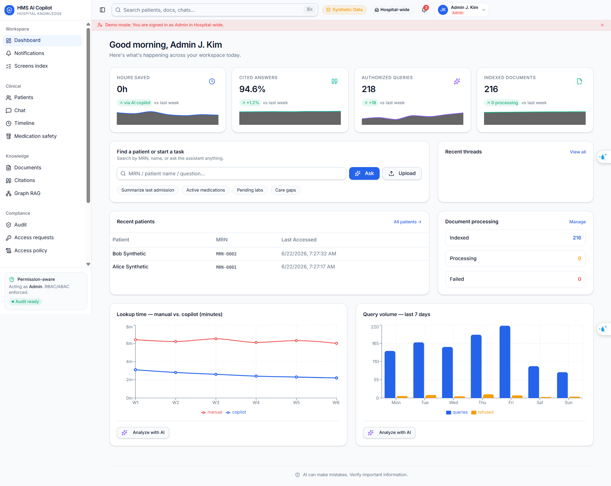 | 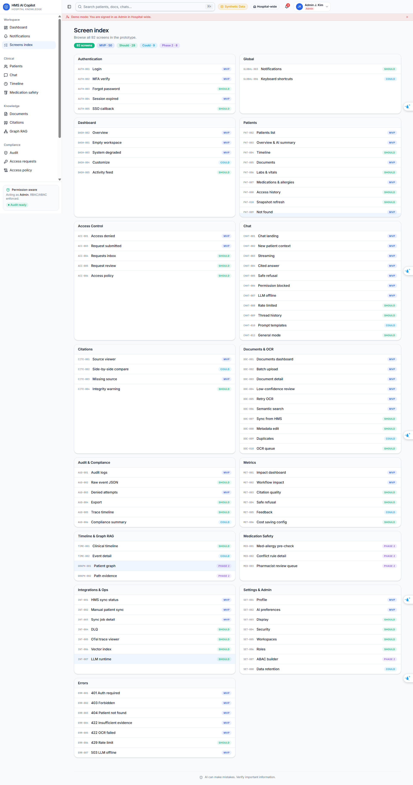 |

### 👤 Patient Management

| | |
|:---:|:---:|
| **Patient Records** — RBAC-filtered patient roster | **Patient Timeline** — Chronological clinical events |
| 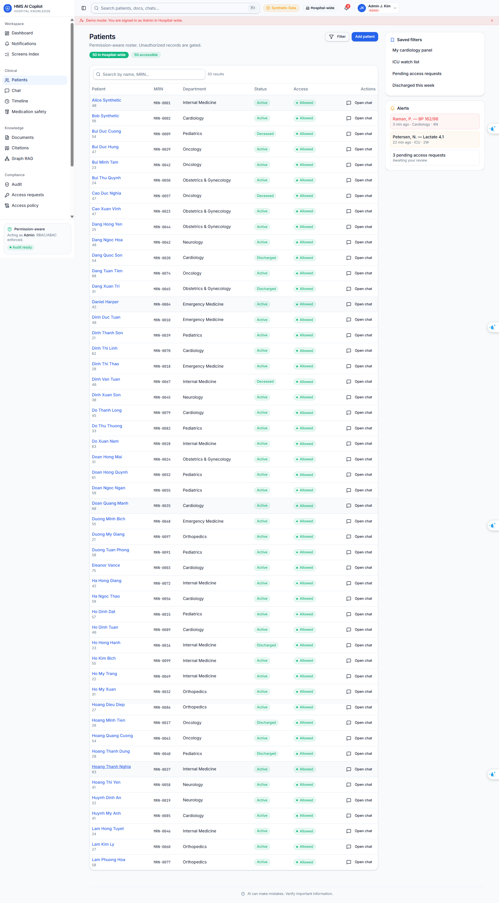 | 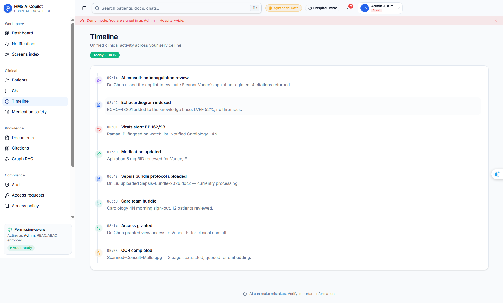 |

### 🤖 AI Chat & Knowledge Graph

| | |
|:---:|:---:|
| **AI Chat** — Evidence-cited clinical Q&A with streaming SSE | **Graph RAG** — Knowledge graph explainability view |
| 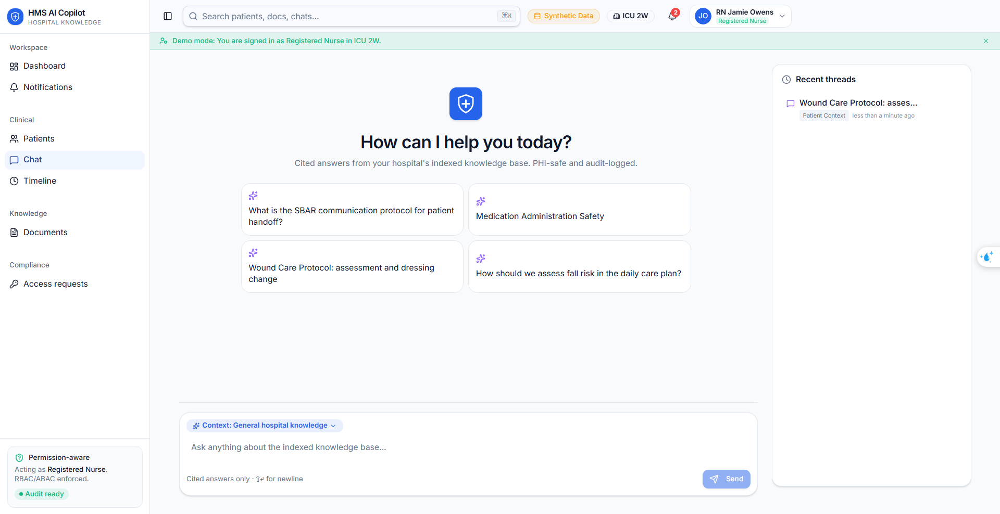 | 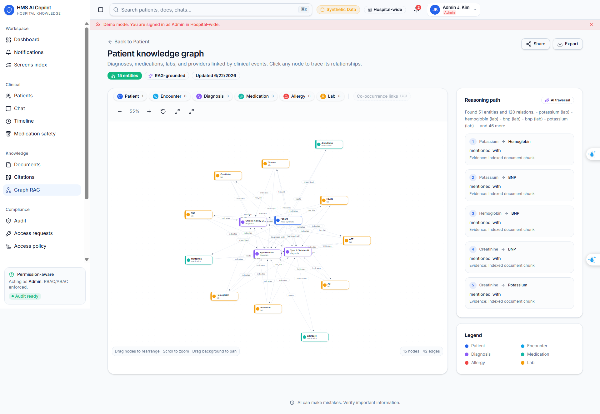 |

| |
|:---:|
| **Graph RAG Detail** — Node relationships, evidence, and citations |
| 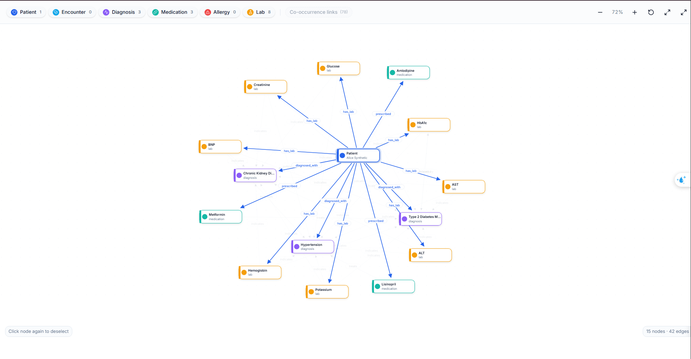 |

### 📋 Audit & Compliance

| | |
|:---:|:---:|
| **Audit Log** — Full event trail with filtering | **Notifications** — Real-time clinical alerts |
| 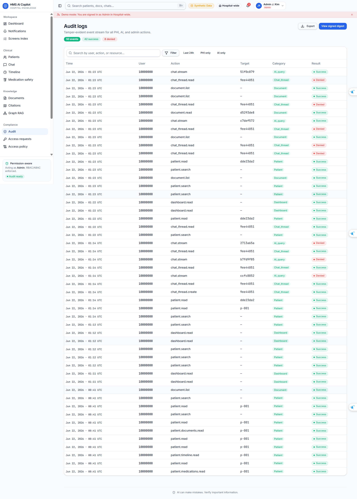 | 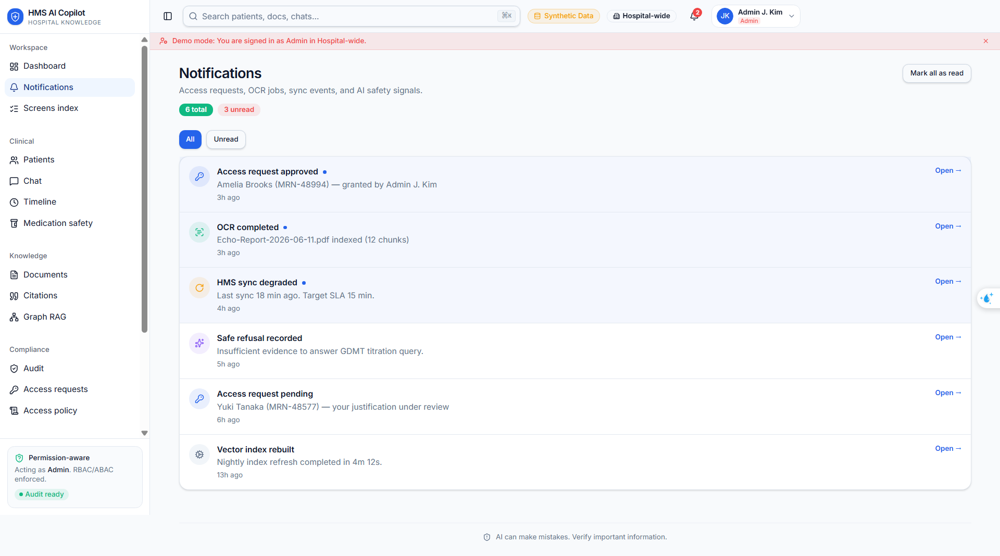 |

### 🖥️ Deployment & Infrastructure Monitoring

| |
|:---:|
| **Dokploy Server Telemetry** — Real-time CPU, Memory, Disk Space, and Docker container resource utilization |
|  |

</div>

---

## 🔐 Permission-First RAG Flow

This sequence diagram shows the two-stage authorization applied before any context reaches the LLM. **Patient-scope permissions are enforced in the SQL `WHERE` clause**, so chunks the user has no grant for never leave the database. A second **role-scope filter runs in Python after retrieval** (`_apply_role_filters`) — note it executes *after* `LIMIT :top_k`, so a filtered result set can be smaller than the requested `top_k`:

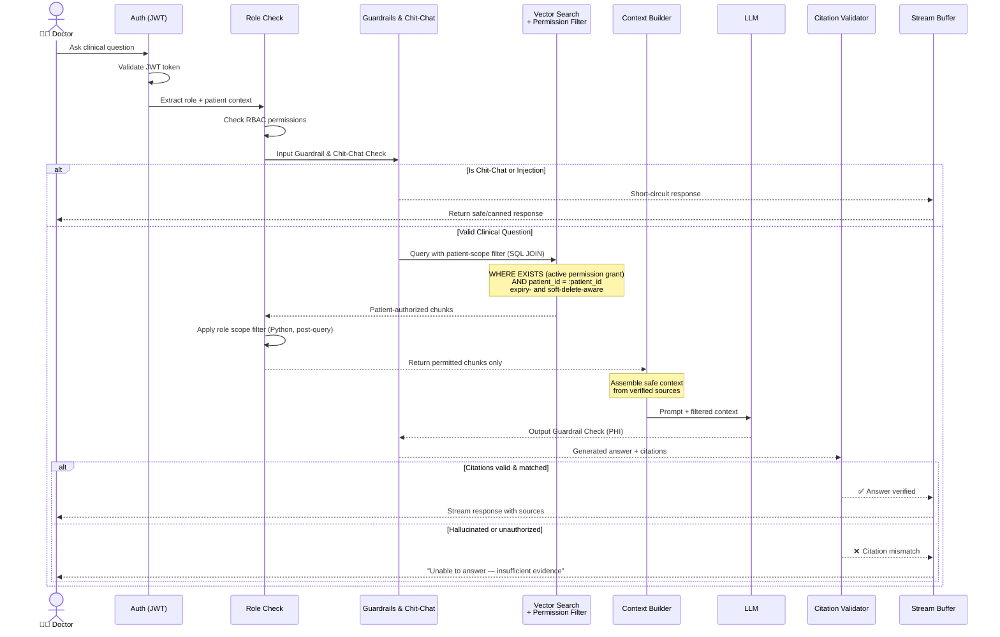
```mermaid
sequenceDiagram
    actor D as 👨‍⚕️ Doctor
    participant A as Auth (JWT)
    participant R as Role Check
    participant G as Guardrails & Chit-Chat
    participant V as Vector Search<br/>+ Permission Filter
    participant C as Context Builder
    participant L as LLM
    participant CV as Citation Validator
    participant S as Stream Buffer

    D->>A: Ask clinical question
    A->>A: Validate JWT token
    A->>R: Extract role + patient context
    R->>R: Check RBAC permissions
    R->>G: Input Guardrail & Chit-Chat Check
    alt Is Chit-Chat or Injection
        G-->>S: Short-circuit response
        S-->>D: Return safe/canned response
    else Valid Clinical Question
        G->>V: Query with patient-scope filter (SQL JOIN)

        Note over V: WHERE EXISTS (active permission grant)<br/>AND patient_id = :patient_id<br/>expiry- and soft-delete-aware

        V-->>R: Patient-authorized chunks
        R->>R: Apply role scope filter (Python, post-query)
        R-->>C: Return permitted chunks only

        Note over C: Assemble safe context<br/>from verified sources

        C->>L: Prompt + filtered context
        L-->>G: Output Guardrail Check (PHI)
        G-->>CV: Generated answer + citations

        alt Citations valid & matched
            CV-->>S: ✅ Answer verified
            S-->>D: Stream response with sources
        else Hallucinated or unauthorized
            CV-->>S: ❌ Citation mismatch
            S-->>D: "Unable to answer — insufficient evidence"
        end
    end
```

---

## 🗄️ Database Entity Relationship


```mermaid
erDiagram
    users ||--o{ chat_threads : creates
    users ||--o{ audit_events : triggers
    users ||--o{ access_requests : submits
    chat_threads ||--o{ chat_messages : contains
    documents ||--o{ document_chunks : splits_into
    document_chunks ||--o{ embeddings_cache : stores
    patients ||--o{ access_requests : scoped_to
    patients ||--o{ clinical_alerts : receives
    documents ||--o{ clinical_alerts : triggers
    chat_messages ||--o{ feedback : receives
    chat_messages ||--o{ citations : references
    patients ||--o{ graph_entities : has
    graph_entities ||--o{ graph_relations : participates_in

    users {
        uuid id PK
        string email
        string role "doctor|nurse|pharmacist|admin"
        string hashed_password
    }
    chat_threads {
        uuid id PK
        uuid user_id FK
        uuid patient_id FK
        string title
    }
    chat_messages {
        uuid id PK
        uuid thread_id FK
        text question
        text answer
        jsonb citations
    }
    documents {
        uuid id PK
        string filename
        string status "pending|processing|ready|failed"
        jsonb metadata
    }
    document_chunks {
        uuid id PK
        uuid document_id FK
        text content
        vector embedding
        jsonb permissions
    }
    audit_events {
        uuid id PK
        uuid user_id FK
        string action
        jsonb details
    }
    clinical_alerts {
        uuid id PK
        uuid patient_id FK
        uuid source_document_id FK "nullable"
        string severity "low|medium|high"
        string title
        text description
        boolean is_acknowledged "default: false"
        timestamp created_at
    }
    graph_entities {
        uuid id PK
        uuid patient_id FK
        string entity_type
        string name
        jsonb metadata
    }
    graph_relations {
        uuid id PK
        uuid source_entity_id FK
        uuid target_entity_id FK
        string relationship_type
        jsonb evidence_references
    }
```

---

## 📊 Verified Project Metrics

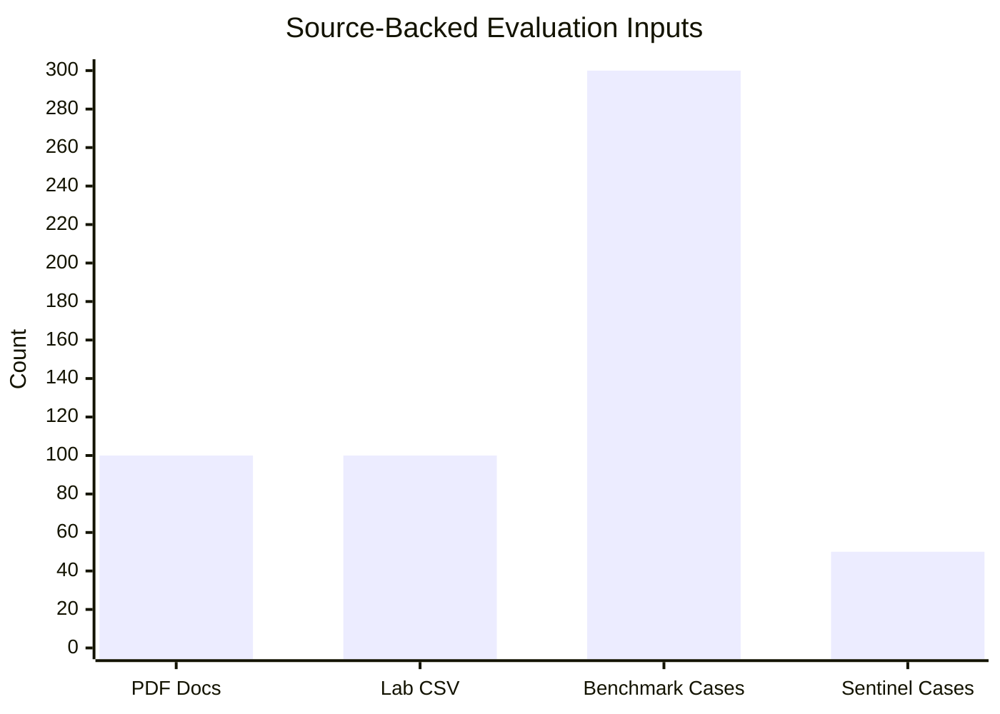
```mermaid
xychart-beta
    title "Source-Backed Evaluation Inputs"
    x-axis ["PDF Docs", "Lab CSV", "Benchmark Cases", "Sentinel Cases"]
    y-axis "Count" 0 --> 300
    bar [100, 100, 300, 50]
```

| Metric | Value | Status |
|--------|-------|--------|
| **Canonical patient corpus** | 100 PDF documents + 100 lab CSV files | ✅ Versioned manifest: `synthetic-100-v2` |
| **Source-backed AI benchmark** | 300 cases; 50-case sentinel | 🟠 Corpus smoke validates all 50 contracts; independent review still blocks release |
| **Evaluation evidence** | `run.json`, `cases.jsonl`, `junit.xml`, `summary.md` | ✅ Produced by each evaluation-runner invocation |
| **REST API surface** | FastAPI routes for chat/SSE, RBAC, HMS sync, uploads, revisions, patients, documents, and Graph RAG | ℹ️ Repository inventory; not a production-traffic claim |
| **Database schema** | 19 Alembic migration files, including the CDI V2 foundation migration | ℹ️ Repository inventory; migration execution is environment-specific |
| **Frontend components** | TanStack/React UI with document upload, review, chat, graph, timeline, audit, and RBAC surfaces | ℹ️ Repository inventory |
| **Backend test suite** | 670 passed, 3 skipped in the PR #104 validation snapshot | ✅ Core backend CI job passes on `main`; see the current run |
| **E2E test suites** | 15 Playwright specs; a historical PR #104 record reported 150 passed, 1 skipped against isolated synthetic SQLite | 🟠 Current CI source defers browser execution until a backend service is available; historical evidence is not current-SHA certification |
| **CDI V2 delivery** | Immutable upload/revision foundation is on `main`; stacked follow-ons #91–#103 are not in `main` ancestry | 🟠 Reconcile the remote merged-PR state before claiming generation/evidence/release-lane delivery |
| **CI/CD workflows** | 5 pipelines (CI, CD, Security, Rollback, Dependabot) | ℹ️ Workflow inventory; check the current GitHub run for status |
| **Backend coverage** | 73.3% statements (6,117 / 8,059), branch coverage on | ✅ CI gate at `--cov-fail-under=60`. Gaps are concentrated in LLM/embedding providers and document loaders (0%) — they need live services to exercise meaningfully |
| **Code quality** | Ruff + ESLint + TypeScript strict | ✅ Focused evaluation checks are recorded; no blanket “zero errors” claim |

---

## 🧠 Architectural Decision: Why Hybrid Clean/Pipeline Architecture?

> **"Why not full DDD layers like `hospital-management-system`?"**

The `hospital-management-system` is a **complex ERP CRUD** application with deep domain logic, multi-role workflows, inventory, billing, and clinical operations. Full DDD layers (domain/application/infrastructure/presentation) add **necessary structure** to manage that complexity.

This project (`chatbot-hospital-system`) is a **RAG data pipeline** — the core flow is:

```
    Upload / Ingest → Normalize → Chunk → Embed → Store Vector → Query → Retrieve → Generate → Validate → Stream
```

This maps naturally to a **pipeline architecture** where each stage is a self-contained service. Adding DDD directory layers would introduce **indirection without benefit** — the data flow IS the domain.

**However**, we still achieve the **same architectural goals** as DDD:

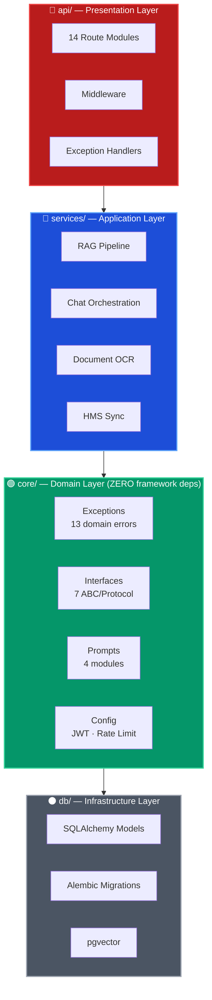
```mermaid
graph TB
    subgraph api["🔴 api/ — Presentation Layer"]
        direction LR
        A1[14 Route Modules]
        A2[Middleware]
        A3[Exception Handlers]
    end

    subgraph svc["🔵 services/ — Application Layer"]
        direction LR
        S1[RAG Pipeline]
        S2[Chat Orchestration]
        S3[Document OCR]
        S4[HMS Sync]
    end

    subgraph core["🟢 core/ — Domain Layer (ZERO framework deps)"]
        direction LR
        C1["Exceptions<br/>13 domain errors"]
        C2["Interfaces<br/>7 ABC/Protocol"]
        C3["Prompts<br/>4 modules"]
        C4["Config<br/>JWT · Rate Limit"]
    end

    subgraph db["⚫ db/ — Infrastructure Layer"]
        direction LR
        D1[SQLAlchemy Models]
        D2[Alembic Migrations]
        D3[pgvector]
    end

    api --> svc --> core --> db

    style api fill:#b91c1c,stroke:#ef4444,color:#fff,stroke-width:2px
    style svc fill:#1d4ed8,stroke:#60a5fa,color:#fff,stroke-width:2px
    style core fill:#059669,stroke:#34d399,color:#fff,stroke-width:2px
    style db fill:#4b5563,stroke:#9ca3af,color:#fff,stroke-width:2px
```

> ⬆️ **Dependency Flow: db ← core ← services ← api** (inner layers never depend on outer layers)

| DDD Principle | How We Achieve It |
|---------------|-------------------|
| **Dependency Inversion** | `core/` has ZERO FastAPI imports. Business logic depends on abstract protocols (`ILLMProvider`, `IEmbeddingProvider`), not frameworks |
| **Domain Isolation** | Domain exceptions (`MedicalDataAccessException`, `CitationHallucinationException`) live in `core/`. The API layer maps them to HTTP codes |
| **Separation of Concerns** | `api/` handles HTTP, `services/` handles orchestration, `core/` handles pure business rules, `db/` handles persistence |
| **Testability** | Every component testable in isolation. Core logic tested without database or HTTP |

This is the **Clean Architecture dependency rule** implemented through convention, not directory structure. An interviewer who reads the `core/` directory will immediately recognize the discipline.

---

## 📂 Project Structure

```
.
├── .github/
│   ├── workflows/
│   │   ├── ci.yml              # 8-job CI pipeline (CodeQL, test, build, scan)
│   │   ├── cd.yml              # Multi-env CD (staging → production)
│   │   ├── security-scan.yml   # Weekly: pip-audit, npm audit, TruffleHog, Trivy
│   │   └── rollback.yml        # Manual rollback with confirmation gate
│   └── dependabot.yml          # Automated dependency updates (npm, pip, GHA)
├── infra/
│   ├── docker-compose.yml           # Dokploy production stack (4 services)
│   ├── docker-compose.observability.yml  # Grafana, Prometheus, Loki, Tempo
│   ├── nginx/default.conf           # Reverse proxy with SSE streaming
│   └── observability/              # Prometheus, Tempo, Loki, Grafana configs
├── app/
│   ├── backend/
│   │   ├── src/hospital_ai/
│   │   │   ├── api/            # FastAPI routes, middleware, exception handlers
│   │   │   ├── core/           # Framework-free business logic (ZERO FastAPI deps)
│   │   │   ├── db/             # SQLAlchemy models, sessions, migrations
│   │   │   ├── schemas/        # Pydantic request/response models
│   │   │   ├── services/       # RAG pipeline, LLM, embedding, HMS integration
│   │   │   └── workers/        # RQ job handlers: OCR, Graph indexing, CDSS agent
│   │   ├── alembic/            # Database migration history
│   │   └── tests/              # 670+ Pytest tests (incl. CDI, security, and CDSS tests)
│   └── frontend/
│       ├── src/
│       │   ├── routes/         # TanStack Router pages (90+ routes)
│       │   ├── components/     # 100+ React components (shadcn/ui)
│       │   ├── hooks/          # Custom React hooks
│       │   └── lib/            # API client, auth, session, utilities
│       └── e2e/                # Playwright E2E tests
└── docs/
    ├── documentation-portal.html   # Interactive HTML documentation portal
    ├── 00-overview/                # Project foundation & governance
    ├── 01-business/                # BRD, BRs, stakeholders, glossary
    ├── 04-architecture/            # ADRs, tech stack, security architecture
    ├── 05-api/                     # API contract & error codes
    ├── 06-database/                # ERD, schema, data dictionary
    └── ... (12 documentation domains, 100+ files)
```

---

## 🚀 Quick Start

### Prerequisites
- Python 3.12+ · Node.js 22+ · Docker & Docker Compose

### 1. Start Infrastructure
```bash
docker compose up -d postgres redis
```

### 2. Backend (FastAPI)
```bash
cd app/backend
python -m venv venv && source venv/bin/activate  # Windows: .\venv\Scripts\activate
pip install -e ".[dev,postgres]"
alembic upgrade head
uvicorn "hospital_ai.main:create_app" --factory --host 0.0.0.0 --port 8000 --reload
```
Swagger UI: http://localhost:8000/docs

### 3. Frontend (TanStack Start)
```bash
cd app/frontend
bun install
bun run dev
```
UI: http://localhost:8082 (Vite dev server; Playwright uses the same default port; the Docker image serves on **8082**)

**Key capabilities:**
- **Backend-backed graph data** — nodes/edges come from the database, not hardcoded frontend data
- **Multi-patient support** — graph works for any accessible seeded patient, not only Eleanor Vance
- **Interactive controls** — zoom, fullscreen, filter by node type, highlight reasoning paths
- *(Planned)* **Node detail side panel** — click any node to see clinical summary, related evidence, and source citations
- *(Planned)* **Edge evidence** — click any relationship to see why two nodes are connected and the source document/page
- *(Planned)* **Export** — PNG screenshot and JSON data export; PDF report export

---

## ⚠️ Known Limitations

This project is a **portfolio demonstration**, not a certified medical device. The following limitations are clearly acknowledged:

| Area | Current Status | Future Plan |
|------|---------------|-------------|
| **Citation Validation** | Citation IDs are checked against retrieved evidence and streaming has explicit abort/safe-refusal contracts. Full semantic fact verification remains limited. | Extend claim-level verification across every answer path |
| **Streaming Endpoint** | The `chat_stream.py` endpoint forces `simple_qa` and ignores advanced reasoning pipelines (`decompose`, `patient_summary`) and HyDE | Enable full reasoning pipeline support for streaming responses |
| **Document Loaders** | Browser HL7/DOCX normalization and DOCX cleanup are covered; the broader loader/provider matrix remains environment-dependent | Complete the loader matrix and run it through the production ingestion worker |
| **OCR Pipeline** | PyMuPDF is the dependable local path; PaddleOCR remains an optional fallback and the full CDI V2 generation/review stack is not on `main` yet | Reconcile/land the stacked CDI V2 follow-ons, then certify OCR and generation adapters with artifacts |
| **Login / Credentials** | `/auth/token` is a stub: accepts the literal password `demo` and returns a static, non-expiring token. JWT *validation* is real; JWT *issuance* is not | Password hashing (argon2), real token minting, refresh rotation, revocation |
| **Token Storage** | Bearer token is kept in-memory to prevent XSS, but session rehydration re-derives a dev token | Implement an httpOnly refresh cookie for secure, persistent sessions |
| **CDSS Alert Grounding** | Clinical alerts are written from raw LLM JSON with no citation or confidence gate | Apply the same evidence-grounding contract to the CDSS worker |
| **E2E in CI** | The current `main` frontend CI job passes its Playwright lane, and PR #104 recorded an isolated synthetic browser run; an in-app browser recheck was not available in this audit | Keep the browser evidence tied to an exact SHA and add live-service coverage when the environment is available |
| **CDI V2 rollout** | GitHub reports PRs #91–#103 as merged, but their merge SHAs are not ancestors of `main@467dbc3`; only the #90 foundation is present in the current tree | Reconcile the stacked merge delivery and rerun exact-SHA CI/release evidence |
| **PHI Redaction** | Not implemented — UI honestly states "PHI redaction is planned for production hardening" | Implement NER-based PHI detection before embedding pipeline |
| **Break-Glass Emergency Access** | Disabled by default (`ENABLE_BREAK_GLASS=false`) — treated as planned/future | Implement with justification, expiry, audit trail, and mandatory review |
| **Session-Only Attachments** | All uploaded files go to the knowledge base — session-only temp files are planned | Add ephemeral document scope that expires with the chat thread |
| **PDF Graph Export** | PNG and JSON export available — PDF clinical report export is planned | Generate formatted PDF reports from graph data |
| **Multi-Role Users** | One role per account — multi-role mapping documented as future work | Many-to-many user-role table with role-switching workflow |
| **LLM Provider** | Stub, Ollama, OpenAI-compatible, and Gemini adapters are present; live providers still require configured credentials/service | Support additional providers (Anthropic, Azure OpenAI, local models) |
| **Data Source** | Uses synthetic/de-identified seed data only | Production deployment requires real HMS integration |

---

## 🔮 Future Improvements

- **PHI Redaction Pipeline** — NER-based detection (Presidio/spaCy) with dual-storage: redacted text for embeddings, originals for authorized citation viewing
- **Break-Glass Emergency Access** — Justification-required emergency override with automatic expiry, audit logging, and mandatory compliance review
- **Session-Only Chat Attachments** — Temporary file scope that doesn't persist to the hospital knowledge base
- **PDF Graph Reports** — Formatted clinical reasoning reports generated from Knowledge Graph data
- **Multi-Role Users** — Role-switching workflow with many-to-many user-role mapping
- **Live AI Evaluation Adapters** — Execute retrieval, Graph RAG, chat, and controlled-scan OCR against the source-backed benchmark and publish comparable regression artifacts
- **Real-Time HMS Integration** — WebSocket-based live sync with Hospital Management System for appointment updates, lab results, and medication orders
- **Mobile-Responsive UI** — Optimized touch-friendly layout for tablet/mobile clinical use

---

<div align="center">

**Built with ❤️ following Clean Architecture principles, AI safety engineering practices, and healthcare industry compliance standards.**

*This project uses synthetic/de-identified data. It demonstrates engineering capability for portfolio purposes — not a certified medical device.*

</div>
