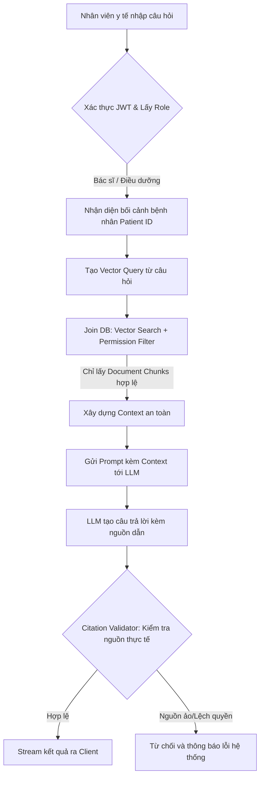

# 🤖 AI-Powered Hospital Knowledge Assistant

[](https://www.python.org/)
[](https://fastapi.tiangolo.com/)
[](https://www.postgresql.org/)
[](https://redis.io/)
[](https://nextjs.org/)
[](https://react.dev/)

Một hệ thống trợ lý tri thức AI toàn diện (AI Agent) dành cho cán bộ nhân viên y tế (bác sĩ, điều dưỡng, dược sĩ). Hệ thống cho phép tra cứu nhanh chính sách bệnh viện, quy trình vận hành và bệnh án bệnh nhân dựa trên kiến trúc **RAG (Retrieval-Augmented Generation) phân quyền**. Dự án được thiết kế đặt tiêu chuẩn bảo mật dữ liệu sức khỏe (PHI) làm trọng tâm, ngăn ngừa rò rỉ thông tin y khoa giữa các phòng ban.

---

## 🌟 Phân Phẩm Tính Năng & Giải Pháp Kỹ Thuật

| Tính Năng RAG An Toàn | Giải Pháp Triển Khai | Lợi Ích Cho Bệnh Viện |
|---|---|---|
| **RAG Lọc Quyền Trước Truy Vấn** | Tích hợp bộ lọc phân quyền vai trò (Role-based permission filter) vào trực tiếp câu lệnh join vector DB trước khi gửi ngữ cảnh tới LLM. | Đảm bảo bác sĩ không thể vô tình truy vấn thông tin nhạy cảm của phòng ban khác hoặc bệnh nhân không thuộc quyền quản lý. |
| **Xác Thực Nguồn Trích Dẫn** | Cơ chế **Citation Validation**: Kiểm tra chéo toàn bộ chỉ mục nguồn trích dẫn và từ chối persit/hiển thị câu trả lời nếu phát hiện trích dẫn ma (hallucinated references). | Loại bỏ hoàn toàn câu trả lời sai lệch thông tin lâm sàng tự tạo của mô hình ngôn ngữ lớn (LLM). |
| **Streaming Buffer an toàn** | Luồng Streaming SSE được lưu trữ tạm trong buffer để xác thực tính hợp lệ của nguồn trích dẫn trước khi đẩy ra màn hình client. | Tránh hiện tượng rò rỉ thông tin chưa được kiểm chứng ra giao diện người dùng. |
| **Xử lý tài liệu nền (Async Ingestion)** | Tách biệt API tải lên và tiến trình index thông qua **Redis/RQ Worker**, hỗ trợ phân tích định dạng PDF/docx và OCR (PaddleOCR). | Tối ưu hóa hiệu năng, giảm thời gian phản hồi API khi nhân viên tải tài liệu y khoa dung lượng lớn. |
| **Đồng bộ hóa Hệ Thống HMS** | Cổng API import và sync đồng bộ dữ liệu lịch khám, kết quả xét nghiệm y khoa trực tiếp từ HMS thành dữ liệu RAG. | Cung cấp ngữ cảnh thời gian thực về hồ sơ điều trị bệnh nhân cho trợ lý AI. |
| **Audit Trails & Logs** | Lưu vết toàn bộ các sự kiện truy cập dữ liệu, từ chối quyền truy cập y khoa, truy vấn AI phục vụ thanh tra. | Đảm bảo tính tuân thủ pháp lý về an toàn thông tin y tế (giống như HIPAA/SOC2). |

---

## 📐 Kiến Trúc RAG Phân Quyền Bảo Mật (Permission-first RAG)

Quy trình dưới đây mô tả cách hệ thống lọc quyền truy xuất trước khi đưa vào ngữ cảnh sinh câu trả lời của LLM:



---

## 📊 Số Liệu Kỹ Thuật Dự Án (Project Metrics)

* **Backend API Surface**: **34 REST API endpoints** (FastAPI) quản lý phân quyền, chatbot, tài liệu, và đồng bộ dữ liệu.
* **Cấu Trúc Bảng DB**: **13 lớp mô hình cơ sở dữ liệu** (SQLAlchemy Async ORM), kiểm soát phiên bản qua **6 Alembic migrations** (hỗ trợ lưu trữ Vector qua pgvector).
* **Kiểm Thử Chất Lượng (Quality Gates)**:
  - **245 Test Cases Pytest** (Backend) chạy kiểm thử tích hợp tự động với database Docker PostgreSQL/pgvector.
  - **16 TAP-style Contract Tests** (Frontend) xác minh tính nhất quán cấu hình luồng chat, hiển thị citation và xử lý ngoại lệ.
  - Tích hợp công cụ **Ruff** kiểm tra định dạng và chất lượng mã nguồn Python.

---

## 📂 Tổ Chức Thư Mục Dự Án

```text
app/
├── backend/
│   ├── alembic/         # Quản lý phiên bản migration database
│   ├── src/hospital_ai/ # Mã nguồn chính FastAPI (db, core, api, schemas, services)
│   ├── tests/           # 245 bài test kiểm thử RAG, phân quyền, và citation
│   └── scripts/         # Scripts tiện ích bao gồm công cụ kiểm tra API Contract
└── frontend/
    ├── src/app/         # Giao diện App Router (Sidebar, Chat Workspace, Document)
    ├── src/components/  # UI components thiết kế dựa trên shadcn/Tailwind v4
    └── src/lib/         # Client API gọi kết nối API với cơ chế xác thực JWT
```

---

## 🛠️ Hướng Dẫn Khởi Chạy Dự Án

### 1. Yêu Cầu Cài Đặt
- Python 3.11 hoặc 3.12
- Node.js 20+ & npm
- Docker & Docker Compose

### 2. Khởi Chạy Cơ Sở Hạ Tầng (PostgreSQL/pgvector & Redis)
Khởi chạy dịch vụ nền:
```bash
docker compose up -d postgres redis
```

### 3. Cài Đặt và Chạy Backend FastAPI
```bash
cd app/backend
# Khởi tạo môi trường ảo Python
python -m venv venv
source venv/bin/activate # Trên Windows dùng: .\venv\Scripts\activate
# Cài đặt thư viện phát triển
pip install -e ".[dev,postgres]"
# Thực hiện migrations
alembic upgrade head
# Khởi chạy ứng dụng
uvicorn hospital_ai.main:app --host 0.0.0.5 --port 8000 --reload
```
*Tài liệu Swagger API: `http://localhost:8000/docs`*

### 4. Chạy RQ Background Worker (Phục vụ xử lý tài liệu)
```bash
cd app/backend
python -m hospital_ai.workers.queue
```

### 5. Cài Đặt và Chạy Frontend Next.js
```bash
cd app/frontend
npm install
npm run dev
```
*Mở giao diện UI tại: `http://localhost:3000`*

---

## 📈 Quy Trình CI/CD & Đảm Bảo Hợp Đồng API (API Contract Gate)
- **CI Pipeline**:
  - Chạy linter & formatter bằng Ruff.
  - Tự động chạy 245 Pytest kết hợp container PostgreSQL/pgvector.
  - **API Contract Verification**: Tự động chạy script `verify_contracts.py` so sánh schema OpenAPI backend xuất ra với client frontend `api-client.ts`, chặn đứng lỗi lệch endpoint/route trước khi đóng gói.
  - Đóng gói Docker image đẩy lên GHCR.
- **CD Pipeline**: SSH tự động kéo các image mới từ GHCR về VPS và khởi chạy lại dịch vụ qua Docker Compose (`cd.yml`).
