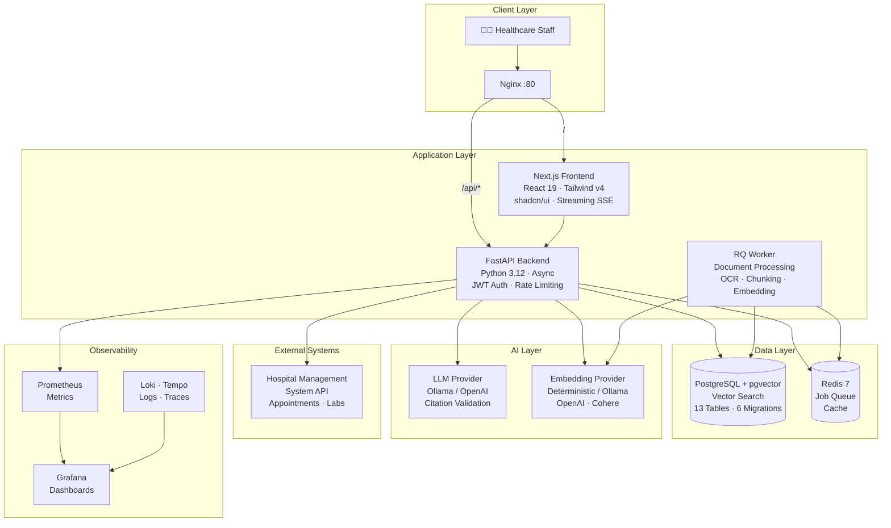
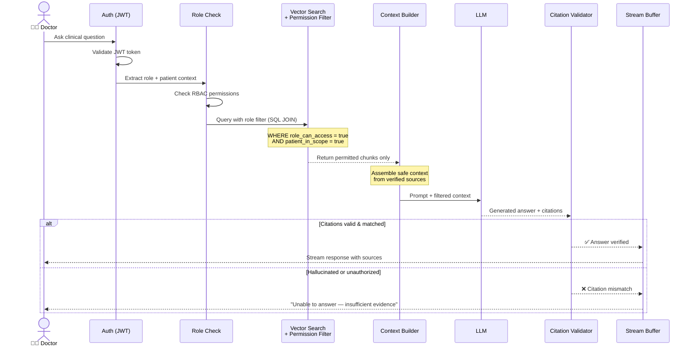
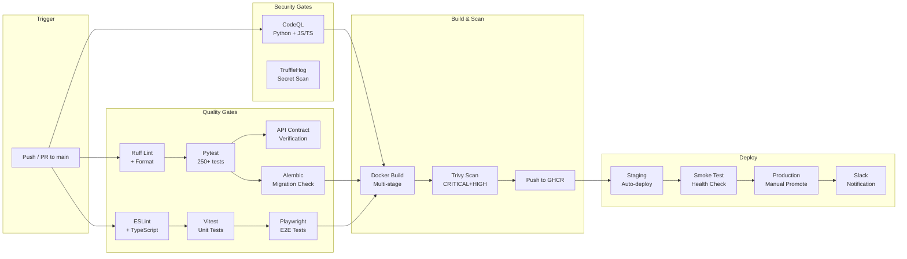
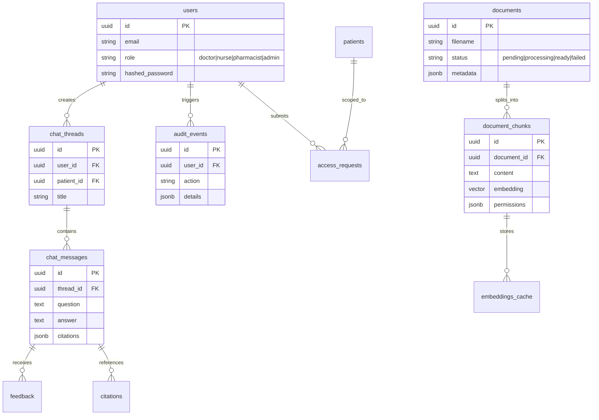
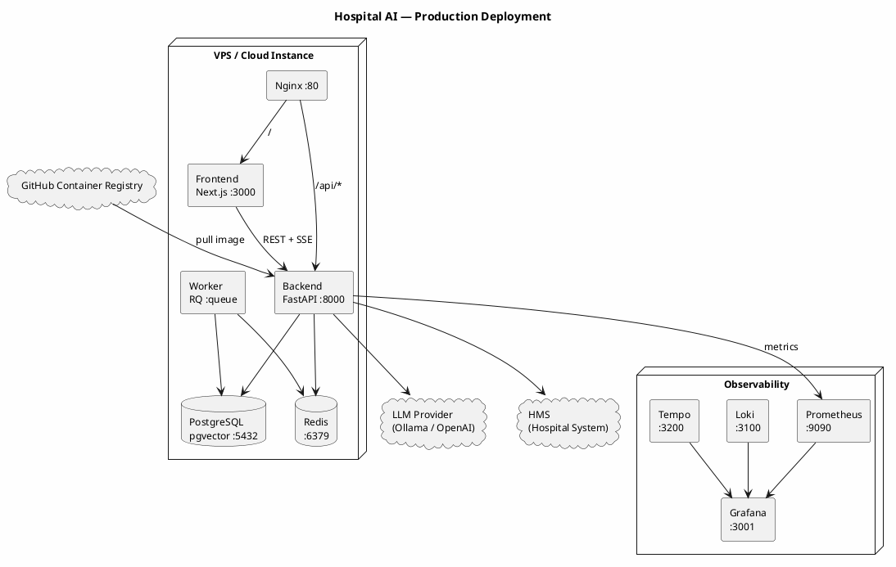

# 🏥 AI-Powered Hospital Knowledge Assistant

<div align="center">

[](https://www.python.org/)
[](https://fastapi.tiangolo.com/)
[](https://nextjs.org/)
[](https://react.dev/)
[](https://www.postgresql.org/)
[](https://redis.io/)
[](https://www.docker.com/)
[](https://github.com/qwan30/chat-hospital-system/actions)

**A Permission-Aware RAG System for Clinical Decision Support**

[📖 Documentation Portal](docs/documentation-portal.html) · [🏗️ Architecture ADRs](docs/04-architecture/adr/) · [🔒 Security](docs/04-architecture/security-architecture.md) · [🚀 Deployment](docs/10-deployment/deployment-guide.md)

</div>

---

## 🎯 What This Project Demonstrates

This is a **production-grade AI application** built to showcase full-stack engineering skills across multiple dimensions:

| Dimension | Demonstrated Skills |
|-----------|-------------------|
| **AI/ML Engineering** | RAG pipeline with citation validation, permission-aware vector search, multi-provider LLM/embedding abstraction, synthetic RAG evaluation suite |
| **Backend Engineering** | FastAPI with async SQLAlchemy, pgvector, Redis/RQ workers, Alembic migrations, API contract verification, structured logging |
| **Frontend Engineering** | Next.js 16 App Router, React 19, shadcn/ui, Tailwind CSS v4, streaming SSE, Playwright E2E, Vitest |
| **DevOps / SRE** | Multi-environment CI/CD (GitHub Actions), Docker multi-stage builds, Trivy container scanning, CodeQL SAST, full Grafana observability stack (Prometheus, Loki, Tempo), Dependabot, automated rollback |
| **Security** | JWT RBAC, PHI-aware permission filtering, citation hallucination detection, TruffleHog secret scanning, npm audit + pip-audit + Bandit SAST, security headers |
| **Documentation** | 100+ doc files across 12 domains, interactive HTML portal, ADRs with trade-off rationale, Mermaid/PlantUML diagrams |

---

## 🏗️ System Architecture



---

## 🔐 Permission-First RAG Flow

This sequence diagram shows how the system ensures **zero PHI leakage** by filtering document access at the database query level before any context reaches the LLM:



---

## 🔄 CI/CD Pipeline



---

## 🗄️ Database Entity Relationship



---

## 🚢 Deployment Architecture



---

## 📊 Project Metrics

| Metric | Value | Context |
|--------|-------|---------|
| **Backend Tests** | 250+ Pytest | Unit + integration, 2 skipped (known issues) |
| **RAG Eval Score** | 6/6 scenarios passed | Cited answer, no-evidence refusal, denied patient, HMS appointment, general knowledge, graph relation |
| **API Surface** | 35+ route decorators | 28 OpenAPI-documented endpoints |
| **Database Tables** | 13 models | pgvector vector store, 6 Alembic migrations |
| **Frontend Components** | 60+ | shadcn/ui, custom clinical components |
| **E2E Tests** | Playwright (Chromium) | Critical user flows covered |
| **CI Jobs** | 8 parallel | CodeQL, lint, test, migration, build, scan, deploy |
| **Code Quality** | Ruff + ESLint + TypeScript strict | Zero linting errors |

---

## 🧠 Architectural Decision: Why Hybrid Clean/Pipeline Architecture?

> **"Why not full DDD layers like `hospital-management-system`?"**

The `hospital-management-system` is a **complex ERP CRUD** application with deep domain logic, multi-role workflows, inventory, billing, and clinical operations. Full DDD layers (domain/application/infrastructure/presentation) add **necessary structure** to manage that complexity.

This project (`chatbot-hospital-system`) is a **RAG data pipeline** — the core flow is:

```
Ingest Document → Chunk → Embed → Store Vector → Query → Retrieve → Generate → Validate → Stream
```

This maps naturally to a **pipeline architecture** where each stage is a self-contained service. Adding DDD directory layers would introduce **indirection without benefit** — the data flow IS the domain.

**However**, we still achieve the **same architectural goals** as DDD:

| DDD Principle | How We Achieve It |
|---------------|-------------------|
| **Dependency Inversion** | `core/` has ZERO FastAPI imports. Business logic depends on abstract protocols (`ILLMProvider`, `IEmbeddingProvider`), not frameworks |
| **Domain Isolation** | Domain exceptions (`MedicalDataAccessException`, `CitationHallucinationException`) live in `core/`. The API layer maps them to HTTP codes |
| **Separation of Concerns** | `api/` handles HTTP, `services/` handles orchestration, `core/` handles pure business rules, `db/` handles persistence |
| **Testability** | Every component testable in isolation. Core logic tested without database or HTTP |

This is the **Clean Architecture dependency rule** implemented through convention, not directory structure. An interviewer who reads the `core/` directory will immediately recognize the discipline.

---

## 📂 Project Structure

```
.
├── .github/
│   ├── workflows/
│   │   ├── ci.yml              # 8-job CI pipeline (CodeQL, test, build, scan)
│   │   ├── cd.yml              # Multi-env CD (staging → production)
│   │   ├── security-scan.yml   # Weekly: pip-audit, npm audit, TruffleHog, Trivy
│   │   └── rollback.yml        # Manual rollback with confirmation gate
│   └── dependabot.yml          # Automated dependency updates (npm, pip, GHA)
├── infra/
│   ├── docker-compose.yml           # Production stack (5 services)
│   ├── docker-compose.observability.yml  # Grafana, Prometheus, Loki, Tempo
│   ├── nginx/default.conf           # Reverse proxy with SSE streaming
│   └── observability/              # Prometheus, Tempo, Loki, Grafana configs
├── app/
│   ├── backend/
│   │   ├── src/hospital_ai/
│   │   │   ├── api/            # FastAPI routes, middleware, exception handlers
│   │   │   ├── core/           # Framework-free business logic (ZERO FastAPI deps)
│   │   │   ├── db/             # SQLAlchemy models, sessions, migrations
│   │   │   ├── schemas/        # Pydantic request/response models
│   │   │   └── services/       # RAG pipeline, LLM, embedding, HMS integration
│   │   ├── alembic/            # Database migration history
│   │   └── tests/              # 250+ Pytest tests
│   └── frontend/
│       ├── src/
│       │   ├── app/            # Next.js App Router pages
│       │   ├── components/     # 60+ React components (shadcn/ui)
│       │   ├── hooks/          # Custom React hooks
│       │   └── lib/            # API client, streaming, utilities
│       └── e2e/                # Playwright E2E tests
└── docs/
    ├── documentation-portal.html   # Interactive HTML documentation portal
    ├── 00-overview/                # Project foundation & governance
    ├── 01-business/                # BRD, BRs, stakeholders, glossary
    ├── 04-architecture/            # ADRs, tech stack, security architecture
    ├── 05-api/                     # API contract & error codes
    ├── 06-database/                # ERD, schema, data dictionary
    └── ... (12 documentation domains, 100+ files)
```

---

## 🚀 Quick Start

### Prerequisites
- Python 3.12+ · Node.js 22+ · Docker & Docker Compose

### 1. Start Infrastructure
```bash
docker compose up -d postgres redis
```

### 2. Backend (FastAPI)
```bash
cd app/backend
python -m venv venv && source venv/bin/activate  # Windows: .\venv\Scripts\activate
pip install -e ".[dev,postgres]"
alembic upgrade head
uvicorn "hospital_ai.main:create_app" --factory --host 0.0.0.0 --port 8000 --reload
```
Swagger UI: http://localhost:8000/docs

### 3. Frontend (Next.js)
```bash
cd app/frontend
npm install
npm run dev
```
UI: http://localhost:3000

### 4. Full Production Stack
```bash
docker compose -f infra/docker-compose.yml up -d
# With observability:
docker compose -f infra/docker-compose.yml -f infra/docker-compose.observability.yml up -d
```

---

## 🔗 Quick Links

| Resource | Description |
|----------|-------------|
| [📖 Documentation Portal](docs/documentation-portal.html) | Interactive HTML portal with all 100+ docs, diagrams, and search |
| [🏗️ Architecture ADRs](docs/04-architecture/adr/) | 12 Architecture Decision Records with trade-off analysis |
| [🔒 Security Architecture](docs/04-architecture/security-architecture.md) | PHI protection, RBAC, audit trails |
| [📊 Database Schema](docs/06-database/db-schema.md) | 13 tables, pgvector, ERD diagram |
| [🧪 Test Plan](docs/09-testing/test-plan.md) | 250+ tests, RAG evaluation, coverage strategy |
| [🚀 Deployment Guide](docs/10-deployment/deployment-guide.md) | Local, staging, production deployment |
| [👨‍💻 Developer Onboarding](docs/12-handover/developer-onboarding.md) | Setup, commands, conventions |

---

## 🛡️ Security

- **PHI Protection**: Permission filters applied at SQL JOIN level before LLM context assembly
- **Citation Validation**: Every LLM response verified against source database before streaming to client
- **Audit Trail**: Every access, denial, query, and config change logged with user+timestamp
- **Container Scanning**: Trivy scans on every CI push (CRITICAL+HIGH severity)
- **Secret Detection**: TruffleHog weekly scan across full git history
- **Dependency Monitoring**: Dependabot + pip-audit + npm audit for vulnerability tracking

---

<div align="center">

**Built with ❤️ for healthcare professionals**

*This project uses synthetic/de-identified data. It is a demonstration of engineering capability, not a certified medical device.*

</div>
