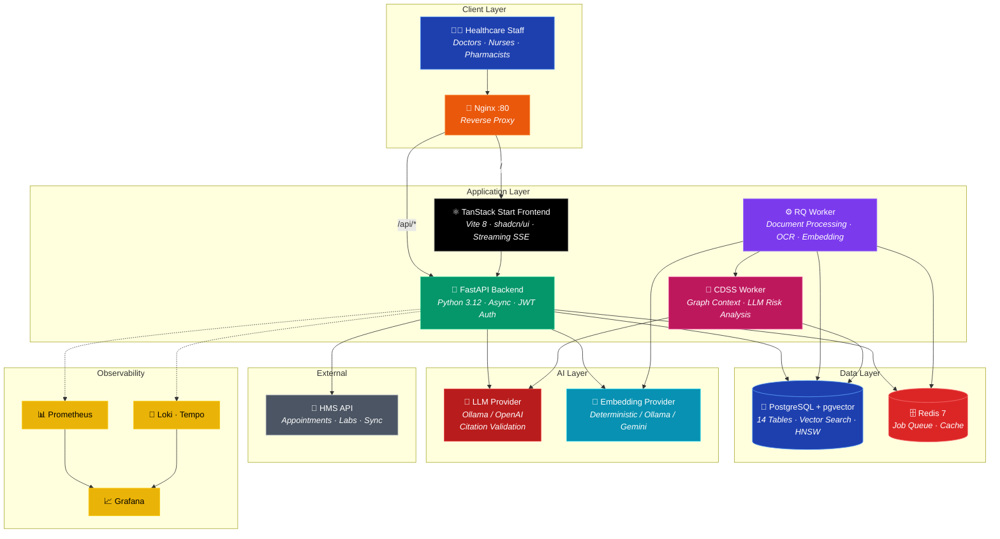
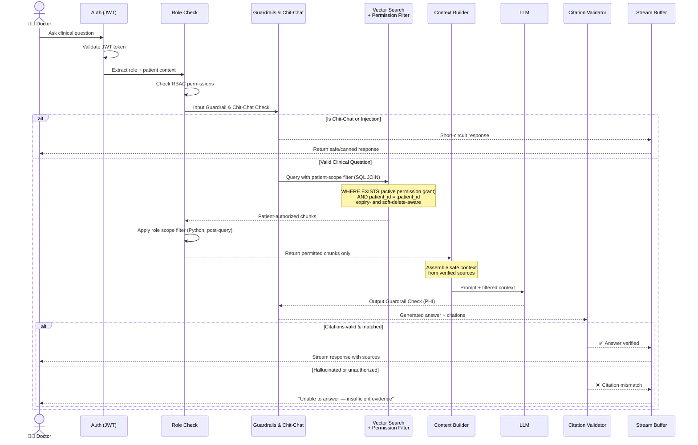
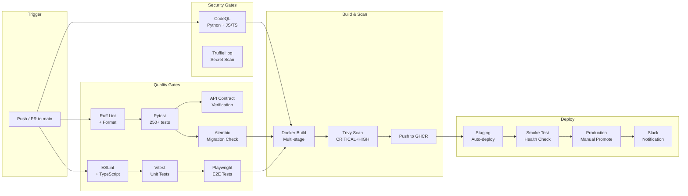
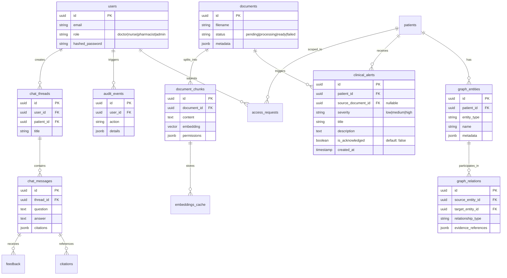
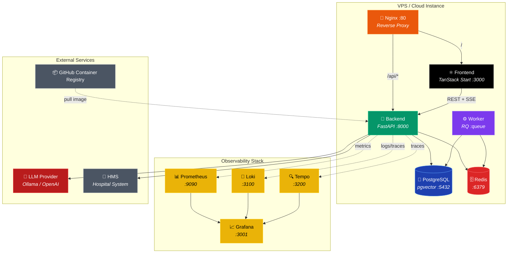
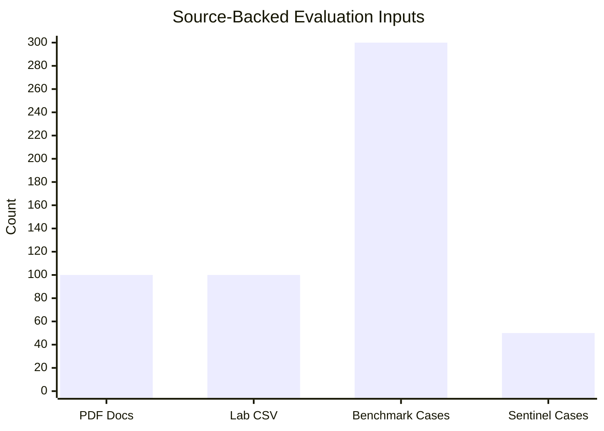
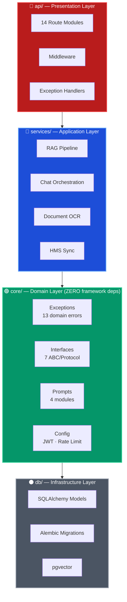
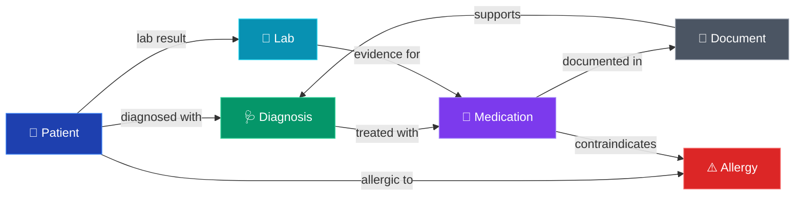

# 🏥 AI-Powered Hospital Knowledge Assistant

<div align="center">

[](https://www.python.org/)
[](https://fastapi.tiangolo.com/)
[](https://tanstack.com/start)
[](https://vitejs.dev/)
[](https://react.dev/)
[](https://www.postgresql.org/)
[](https://redis.io/)
[](https://www.docker.com/)
[](https://github.com/qwan30/chat-hospital-system/actions)
[](https://github.com/qwan30/chat-hospital-system/actions)
[](app/backend/data/evaluation/rag_sentinel_v2.jsonl)
[](app/backend/scripts/run_ai_evaluation.py)

**An AI-powered clinical decision support system** integrating RAG (Retrieval-Augmented Generation) with permission-aware vector search, citation hallucination detection, and HMS (Hospital Management System) data synchronization. Built with a **hybrid Clean/Pipeline architecture** — framework-free domain core, abstract provider interfaces, centralized prompt registry, and domain-driven exceptions. Designed to demonstrate production-grade AI engineering with strict PHI (Protected Health Information) compliance considerations.

> **🟠 AI evaluation status: CONDITIONAL**
> The versioned corpus and 300 source-backed cases are available, but the 50-case sentinel is still `draft`. It requires two independent reviewer approvals with no unresolved issues and therefore blocks release. Retrieval, Graph RAG, chat, and controlled-scan OCR are not represented as passing until their real adapters execute and produce run artifacts.
>
> 📚 **[Interactive Documentation Portal →](docs/documentation-portal.html)** | 📂 **[Documentation Index →](docs/README.md)** | 📋 **[API Contract →](docs/05-api/api-contract.md)**

</div>

---

## 🎯 Key Features & Business Value

| # | Clinical Domain | Technical Implementation | Business Impact |
|---|---------------|-------------------------|-----------------|
| 🔍 | **Permission-Aware RAG** | Vector search with SQL JOIN permission filter — only document chunks the user's role can access are included in LLM context | Zero PHI leakage across role boundaries; HIPAA-aligned data access |
| ✅ | **Citation Validation** | Regex-based post-generation verification: validates that LLM citation IDs (e.g. [E1]) exist in retrieved evidence. (Note: factual content cross-checking is unimplemented) | Blocks hallucinated source references before streaming |
| 📄 | **Document OCR & Indexing** | Async RQ pipeline: PDF parsing (PyMuPDF) → conditional OCR fallback (PaddleOCR) → chunking → embedding (Ollama/Gemini) → pgvector index → BM25 tsvector → Graph RAG extraction → CDSS trigger | Converts unstructured hospital documents into searchable knowledge base |
| 🏥 | **HMS Data Sync** | API bridge to Hospital Management System — imports appointments, lab results, medications; caches as RAG-readable context | Real-time patient context without manual data entry |
| 💊 | **Drug-Allergy Pre-Check** | Cross-references prescribed medications against patient allergy list + current medications using RAG context + LLM analysis | Prevents adverse drug events at point of care |
| 🔐 | **RBAC + ABAC Security** | JWT authentication with role-based claims; 7 roles with scoped patient permissions; enforcement at API gateway + RAG retrieval layers | Enforced separation of duties; audit-ready access control |
| 🚨 | **Autonomous CDSS Agent** | Background RQ worker automatically analyses every ingested document using a flat dump of the patient's Knowledge Graph entities/relations as context; feeds LLM a structured risk-analysis prompt; persists `ClinicalAlert` records | Proactive clinical decision support — alerts clinicians to risk factors before they are noticed manually |
| 📊 | **Impact Metrics** | Time-saved and cost-saved tracking per AI-assisted query; helpfulness feedback loop; dashboard analytics | Quantifiable ROI for hospital administration |
| 🔄 | **Streaming SSE** | Server-Sent Events for real-time token streaming; buffered until citation validation passes; client-side progressive rendering | Immediate clinician feedback with safety gate |

---

## 🎯 Engineering Skills Demonstrated

| Dimension | Demonstrated Skills |
|-----------|-------------------|
| **AI/ML Engineering** | RAG pipeline with citation ID validation, permission-aware vector search, multi-provider LLM/embedding abstraction (Ollama/Gemini), source-backed AI evaluation contracts, centralized prompt registry |
| **Backend Engineering** | FastAPI async, SQLAlchemy 2.0+asyncpg, pgvector HNSW, Redis/RQ workers, Alembic migrations, API contract verification, structured JSON logging |
| **Frontend Engineering** | TanStack Start (Vite 8), React 19, shadcn/ui, Tailwind CSS v4, SSE streaming, Playwright E2E, 90+ routes with RBAC-gated navigation |
| **DevOps / SRE** | 5 GitHub Actions workflows (CI/CD/Security/Rollback/Dependabot), Docker multi-stage, Trivy+CodeQL scanning, Grafana+Prometheus+Loki+Tempo observability |
| **Security** | JWT RBAC+ABAC, PHI-aware SQL JOIN filters, citation hallucination detection, TruffleHog+Bandit+pip-audit+npm audit, security headers |
| **Documentation** | 100+ docs across 12 domains, interactive HTML portal with dark mode+search+Mermaid, ADRs, 5 architecture diagrams |

---

## 🏗️ System Architecture



---

## 📸 Application Screenshots

<div align="center">

### 🔐 Login & Authentication


### 🏠 Dashboard & Navigation

| | |
|:---:|:---:|
| **Dashboard** — KPI metrics, recent patients, clinical overview | **Screen Index** — Navigation hub |
|  |  |

### 👤 Patient Management

| | |
|:---:|:---:|
| **Patient Records** — RBAC-filtered patient roster | **Patient Timeline** — Chronological clinical events |
|  |  |

### 🤖 AI Chat & Knowledge Graph

| | |
|:---:|:---:|
| **AI Chat** — Evidence-cited clinical Q&A with streaming SSE | **Graph RAG** — Knowledge graph explainability view |
|  |  |

| |
|:---:|
| **Graph RAG Detail** — Node relationships, evidence, and citations |
|  |

### 📋 Audit & Compliance

| | |
|:---:|:---:|
| **Audit Log** — Full event trail with filtering | **Notifications** — Real-time clinical alerts |
|  |  |

</div>

---

## 🔐 Permission-First RAG Flow

This sequence diagram shows the two-stage authorization applied before any context reaches the LLM. **Patient-scope permissions are enforced in the SQL `WHERE` clause**, so chunks the user has no grant for never leave the database. A second **role-scope filter runs in Python after retrieval** (`_apply_role_filters`) — note it executes *after* `LIMIT :top_k`, so a filtered result set can be smaller than the requested `top_k`:



---

## 🔄 CI/CD Pipeline

> **Note on the `main` build status.** Pull requests run the evaluation `smoke` suite and
> pass. Pushes to `main` and the nightly schedule run the **`release`** suite, which enforces
> `sentinel_independent_review` — *50 sentinel cases approved by two independent reviewers
> with no unresolved issues*. That human review is still outstanding, so the
> `rag-evaluation` job fails **by design** rather than passing by skip. Every other job
> (CodeQL ×2, backend tests, migrations, frontend, observability, Docker) is green.
> This is a deliberate quality gate, not a broken pipeline — see
> [`evaluation/runner.py`](app/backend/src/hospital_ai/evaluation/runner.py) and
> [`rag_sentinel_v2.jsonl`](app/backend/data/evaluation/rag_sentinel_v2.jsonl).



---

## 🗄️ Database Entity Relationship



---

## 🚢 Deployment Architecture



---

## 📊 Verified Project Metrics



| Metric | Value | Status |
|--------|-------|--------|
| **Canonical patient corpus** | 100 PDF documents + 100 lab CSV files | ✅ Versioned manifest: `synthetic-100-v2` |
| **Source-backed AI benchmark** | 300 cases; 50-case sentinel | 🟠 Corpus smoke validates all 50 contracts; independent review still blocks release |
| **Evaluation evidence** | `run.json`, `cases.jsonl`, `junit.xml`, `summary.md` | ✅ Produced by each evaluation-runner invocation |
| **REST API surface** | 62 OpenAPI paths/routes | ℹ️ Repository inventory; not a production-traffic claim |
| **Database schema** | 18 tables, 16 Alembic migrations | ℹ️ Repository inventory; migration execution is environment-specific |
| **Frontend components** | 84 React components (32 domain, 6 shell, 46 shadcn/ui) | ℹ️ Repository inventory |
| **Backend test suite** | 550 Pytest tests | ✅ Verified locally; see CI for the current run |
| **E2E test suites** | 13 Playwright specs (auth, RBAC, business flow, CDSS, chat, graph, accessibility) | 🔴 Written but **not executed in CI** — the job needs a backend service container (gh#123) |
| **CI/CD workflows** | 5 pipelines (CI, CD, Security, Rollback, Dependabot) | ℹ️ Workflow inventory; check the current GitHub run for status |
| **Backend coverage** | 73.3% statements (6,117 / 8,059), branch coverage on | ✅ CI gate at `--cov-fail-under=60`. Gaps are concentrated in LLM/embedding providers and document loaders (0%) — they need live services to exercise meaningfully |
| **Code quality** | Ruff + ESLint + TypeScript strict | ✅ Focused evaluation checks are recorded; no blanket “zero errors” claim |

---

## 🧠 Architectural Decision: Why Hybrid Clean/Pipeline Architecture?

> **"Why not full DDD layers like `hospital-management-system`?"**

The `hospital-management-system` is a **complex ERP CRUD** application with deep domain logic, multi-role workflows, inventory, billing, and clinical operations. Full DDD layers (domain/application/infrastructure/presentation) add **necessary structure** to manage that complexity.

This project (`chatbot-hospital-system`) is a **RAG data pipeline** — the core flow is:

```
Ingest Document → Chunk → Embed → Store Vector → Query → Retrieve → Generate → Validate → Stream
```

This maps naturally to a **pipeline architecture** where each stage is a self-contained service. Adding DDD directory layers would introduce **indirection without benefit** — the data flow IS the domain.

**However**, we still achieve the **same architectural goals** as DDD:



> ⬆️ **Dependency Flow: db ← core ← services ← api** (inner layers never depend on outer layers)

| DDD Principle | How We Achieve It |
|---------------|-------------------|
| **Dependency Inversion** | `core/` has ZERO FastAPI imports. Business logic depends on abstract protocols (`ILLMProvider`, `IEmbeddingProvider`), not frameworks |
| **Domain Isolation** | Domain exceptions (`MedicalDataAccessException`, `CitationHallucinationException`) live in `core/`. The API layer maps them to HTTP codes |
| **Separation of Concerns** | `api/` handles HTTP, `services/` handles orchestration, `core/` handles pure business rules, `db/` handles persistence |
| **Testability** | Every component testable in isolation. Core logic tested without database or HTTP |

This is the **Clean Architecture dependency rule** implemented through convention, not directory structure. An interviewer who reads the `core/` directory will immediately recognize the discipline.

---

## 📂 Project Structure

```
.
├── .github/
│   ├── workflows/
│   │   ├── ci.yml              # 8-job CI pipeline (CodeQL, test, build, scan)
│   │   ├── cd.yml              # Multi-env CD (staging → production)
│   │   ├── security-scan.yml   # Weekly: pip-audit, npm audit, TruffleHog, Trivy
│   │   └── rollback.yml        # Manual rollback with confirmation gate
│   └── dependabot.yml          # Automated dependency updates (npm, pip, GHA)
├── infra/
│   ├── docker-compose.yml           # Production stack (5 services)
│   ├── docker-compose.observability.yml  # Grafana, Prometheus, Loki, Tempo
│   ├── nginx/default.conf           # Reverse proxy with SSE streaming
│   └── observability/              # Prometheus, Tempo, Loki, Grafana configs
├── app/
│   ├── backend/
│   │   ├── src/hospital_ai/
│   │   │   ├── api/            # FastAPI routes, middleware, exception handlers
│   │   │   ├── core/           # Framework-free business logic (ZERO FastAPI deps)
│   │   │   ├── db/             # SQLAlchemy models, sessions, migrations
│   │   │   ├── schemas/        # Pydantic request/response models
│   │   │   ├── services/       # RAG pipeline, LLM, embedding, HMS integration
│   │   │   └── workers/        # RQ job handlers: OCR, Graph indexing, CDSS agent
│   │   ├── alembic/            # Database migration history
│   │   └── tests/              # 260+ Pytest tests (incl. CDSS agent tests)
│   └── frontend/
│       ├── src/
│       │   ├── routes/         # TanStack Router pages (90+ routes)
│       │   ├── components/     # 100+ React components (shadcn/ui)
│       │   ├── hooks/          # Custom React hooks
│       │   └── lib/            # API client, auth, session, utilities
│       └── e2e/                # Playwright E2E tests
└── docs/
    ├── documentation-portal.html   # Interactive HTML documentation portal
    ├── 00-overview/                # Project foundation & governance
    ├── 01-business/                # BRD, BRs, stakeholders, glossary
    ├── 04-architecture/            # ADRs, tech stack, security architecture
    ├── 05-api/                     # API contract & error codes
    ├── 06-database/                # ERD, schema, data dictionary
    └── ... (12 documentation domains, 100+ files)
```

---

## 🚀 Quick Start

### Prerequisites
- Python 3.12+ · Node.js 22+ · Docker & Docker Compose

### 1. Start Infrastructure
```bash
docker compose up -d postgres redis
```

### 2. Backend (FastAPI)
```bash
cd app/backend
python -m venv venv && source venv/bin/activate  # Windows: .\venv\Scripts\activate
pip install -e ".[dev,postgres]"
alembic upgrade head
uvicorn "hospital_ai.main:create_app" --factory --host 0.0.0.0 --port 8000 --reload
```
Swagger UI: http://localhost:8000/docs

### 3. Frontend (TanStack Start)
```bash
cd app/frontend
bun install
bun run dev
```
UI: http://localhost:3000 (Vite dev server; the Docker image serves on **8082**)

### 4. Full Local Docker Stack
```bash
export BACKEND_IMAGE=hospital-ai-backend:local
docker compose -f infra/docker-compose.yml -f infra/docker-compose.local-build.yml up -d
# Optional local observability:
docker compose -f infra/docker-compose.yml -f infra/docker-compose.local-build.yml -f infra/docker-compose.observability.yml up -d
```

Staging uses the GitHub-built immutable GHCR image through Dokploy. Set
`BACKEND_IMAGE` to the approved `sha-<7-hex>` tag or digest in Dokploy; do not
build the backend from a VPS source clone.

### Demo Accounts

Synthetic local-only accounts seeded by `scripts/seed_dev.py`. **All roles share the
password `demo`** — `/auth/token` is a portfolio stub that checks for that literal and
returns a static dev token; there is no password hashing or credential store. These
accounts exist only against synthetic data and are refused outside `HOSPITAL_AI_ENVIRONMENT=local`
(audit finding F-SEC-001).

| Role | Email | Password | Static token |
|------|-------|----------|--------------|
| 👨‍⚕️ Doctor | `doctor@example.test` | `demo` | `dev-doctor` |
| 👩‍⚕️ Nurse | `nurse@example.test` | `demo` | `dev-nurse` |
| 💊 Pharmacist | `pharmacist@example.test` | `demo` | `dev-pharmacist` |
| 📁 Records | `records@example.test` | `demo` | `dev-records` |
| 🔒 Security | `security@example.test` | `demo` | `dev-security` |
| ⚙️ Admin | `admin@example.test` | `demo` | `dev-admin` |

### Before a live demo

The prompt-injection and PHI-redaction scanners are ONNX models that run on CPU. Measured on
a dev laptop: **~7.8s** for the first input scan and **~4.4s** for the first output scan,
settling to **~4s per chat turn** once warm. The app warms the models on startup
(`warm_up_guardrails`), but the very first chat still pays model-load cost.

Measured end-to-end chat latency: **22.5s cold → 5.7s → 4.0s warm**.

So: **start the backend and send one throwaway question before presenting.** Watch for
`Guardrail scanners warmed up` in the log, then verify with:

```bash
curl -s -X POST http://127.0.0.1:8000/api/v1/chat \
  -H "Authorization: Bearer dev-doctor" -H "Content-Type: application/json" \
  -d '{"question":"List the current medications","patient_id":"20000000-0000-0000-0000-000000000001","top_k":3}'
```

A healthy response has `"pipeline":"simple_qa"` and a non-empty `citations` array. If you
see `"pipeline":"blocked"` with *"security policy violation"*, the guardrail scan exceeded
`HOSPITAL_AI_GUARDRAIL_TIMEOUT_SECONDS` (default 15s) and failed closed — raise it rather
than disabling guardrails. Setting `HOSPITAL_AI_DISABLE_GUARDRAILS=true` removes the delay
but also removes the prompt-injection defence that is worth demonstrating.

Note `HOSPITAL_AI_CHAT_PROVIDER=stub` in `.env` returns canned answers. Point it at
`ollama` or `openai` if you want the LLM path live.

---

## 🧪 Testing & Quality

```bash
# Backend — 549 Pytest tests (546 pass, 3 skipped)
cd app/backend && python -m pytest tests/ -v --tb=short

# Backend — deterministic source-backed PR sentinel contract (not product scoring)
cd app/backend && python scripts/run_ai_evaluation.py --suite smoke --lane deterministic --components corpus --output-dir evaluation-artifacts/deterministic

# Backend — full 300-case deterministic evaluation
cd app/backend && python scripts/run_ai_evaluation.py --suite release --lane deterministic --components corpus,ocr,retrieval,graph,chat --output-dir evaluation-artifacts/release

# Note: retrieval, Graph RAG, chat, and controlled-scan OCR require real adapters.
# If an adapter is unavailable, the requested component is a hard failing gate; it is never a pass by skip.

# Backend — API contract verification
cd app/backend && python scripts/verify_contracts.py

# Frontend — Unit tests (Vitest)
cd app/frontend && bun run test

# Frontend — E2E tests (Playwright)
cd app/frontend && bun run test:e2e

# CDSS-specific E2E test
cd app/frontend && bun run test:e2e e2e/cdss-flow.spec.ts
```

---

## 📈 CI/CD & Observability

| Pipeline | Trigger | Actions |
|----------|---------|---------|
| **CI** (`ci.yml`) | Push / PR | CodeQL · Ruff · Pytest · ESLint · Playwright · Docker build+Trivy → GHCR |
| **CD** (`cd.yml`) | CI success / Manual | SCP configs · SSH deploy · Alembic migrate · Smoke checks · Slack notify |
| **Rollback** (`rollback.yml`) | Manual | Confirmation gate · Specific tag deploy · Health check |
| **Security** (`security-scan.yml`) | Weekly / Manual | pip-audit · npm audit · Bandit · TruffleHog · Trivy container scan |
| **Dependabot** (`dependabot.yml`) | Weekly | Automated PRs for npm, pip, GitHub Actions |

**Observability Stack:** `Nginx → Backend → Prometheus → Grafana + Loki → Tempo`

Configurations in [`infra/observability/`](infra/observability/) — Prometheus metrics, Grafana dashboards, Loki log aggregation, Tempo distributed tracing.

---

## 📚 Documentation

| Section | Content | Primary Doc |
|---------|---------|-------------|
| **00-overview** | Project foundation, conventions, governance | [`project-foundation.md`](docs/00-overview/project-foundation.md) |
| **01-business** | Business rules, BR-001–BR-007 + BR-CDSS-001, glossary, scope | [`business-rules.md`](docs/01-business/business-rules.md) |
| **02-product** | PRD, personas, MVP criteria | [`prd.md`](docs/02-product/prd.md) |
| **03-requirements** | SRS (25 FRs + 22 NFRs), use cases UC-001–UC-009, permissions | [`srs.md`](docs/03-requirements/srs.md) |
| **04-architecture** | System design, security architecture, ADR-001–ADR-012, coding standards | [`architecture.md`](docs/04-architecture/architecture.md) |
| **05-api** | API contract, endpoint specs, error codes | [`api-contract.md`](docs/05-api/api-contract.md) |
| **06-database** | Schema (14 tables), ERD, data dictionary, migrations | [`db-schema.md`](docs/06-database/db-schema.md) |
| **07-flows** | Business flows, state machines, user journeys | [`end-to-end-business-flow.md`](docs/07-flows/end-to-end-business-flow.md) |
| **08-ui-ux** | Design system, Figma specs, UI/API traceability | [`00_product_ui_truth.md`](docs/08-ui-ux/00_product_ui_truth.md) |
| **09-testing** | Test strategy, plan, RTM, 250+ test cases | [`test-plan.md`](docs/09-testing/test-plan.md) |
| **10-deployment** | CI/CD (5 workflows), env variables, Docker, rollback | [`deployment-guide.md`](docs/10-deployment/deployment-guide.md) |
| **11-operations** | Monitoring (Grafana), incident response, troubleshooting | [`monitoring-guide.md`](docs/11-operations/monitoring-guide.md) |
| **12-handover** | Developer onboarding, repository guide, known issues | [`developer-onboarding.md`](docs/12-handover/developer-onboarding.md) |

> 📄 **[Interactive Documentation Portal →](docs/documentation-portal.html)** | 📂 **[Full Documentation Index →](docs/README.md)**

---

## 🛡️ Security & Compliance

- **PHI Protection**: Permission filters applied at SQL JOIN level before LLM context assembly — zero PHI leakage to unauthorized roles
- **Citation Validation**: Every LLM response verified against source database before streaming to client — hallucination detection blocks fabricated references
- **Authentication**: JWT bearer validation with pinned algorithm, issuer/audience checks, and expiry enforcement (`services/jwt_auth.py`). ⚠️ The demo login endpoint is a **portfolio stub** — it accepts the literal password `demo` and returns a static token; password hashing, refresh rotation, and httpOnly cookies are documented as future work, not implemented
- **Authorization**: RBAC with ABAC overlay — 7 roles with scoped patient permissions enforced at API gateway + RAG retrieval layers
- **Rate Limiting**: Per-endpoint limits via slowapi, enabled by default and fail-closed — login `10/min`, chat `10/min`, streaming `5/min`, search `20/min`, access requests `3/min`, global default `60/min`. Disabled only when `TESTING=true` is set explicitly (test suite and local dev)
- **Audit Trail**: Patient reads, permission denials, chat queries, document access, and config changes are logged with actor ID, trace ID, and timestamp via `PermissionService.require_read` / `AuditService`. User-authored text is passed through `sanitize_audit_query` so raw clinical free text does not enter audit metadata
- **Container Scanning**: Trivy scans on every CI push (CRITICAL+HIGH severity) + weekly scheduled full scan (CRITICAL,HIGH,MEDIUM)
- **Secret Detection**: TruffleHog weekly scan across full git history + Bandit SAST for Python source code
- **Dependency Monitoring**: Dependabot (npm, pip, GitHub Actions) + pip-audit + npm audit for continuous vulnerability tracking
- **Transport Security**: Nginx reverse proxy with security headers (X-Frame-Options, X-Content-Type-Options, X-XSS-Protection, Referrer-Policy)

---

## 🧠 Knowledge Graph Explainability

The Knowledge Graph (previously "Graph RAG") is a backend-backed explainability feature that shows how clinical reasoning connects patient data, diagnoses, medications, labs, and evidence documents.



**Key capabilities:**
- **Backend-backed graph data** — nodes/edges come from the database, not hardcoded frontend data
- **Multi-patient support** — graph works for any accessible seeded patient, not only Eleanor Vance
- **Interactive controls** — zoom, fullscreen, filter by node type, highlight reasoning paths
- *(Planned)* **Node detail side panel** — click any node to see clinical summary, related evidence, and source citations
- *(Planned)* **Edge evidence** — click any relationship to see why two nodes are connected and the source document/page
- *(Planned)* **Export** — PNG screenshot and JSON data export; PDF report export

---

## ⚠️ Known Limitations

This project is a **portfolio demonstration**, not a certified medical device. The following limitations are clearly acknowledged:

| Area | Current Status | Future Plan |
|------|---------------|-------------|
| **Citation Validation** | Uses regex to verify citation IDs (`[E1]`) exist in context. Factual content cross-checking is currently dead code. | Implement full semantic verification of generated claims against source evidence |
| **Streaming Endpoint** | The `chat_stream.py` endpoint forces `simple_qa` and ignores advanced reasoning pipelines (`decompose`, `patient_summary`) and HyDE | Enable full reasoning pipeline support for streaming responses |
| **Document Loaders** | Advanced file loaders (`docx`, `xlsx`, `html`) are implemented but bypassed by the worker which only calls PyMuPDF | Wire up the `services/loaders/` suite into the `jobs.py` ingestion worker |
| **OCR Pipeline** | PaddleOCR is an optional fallback for blank/image PDFs. Cohere and OpenAI are not wired to the embedding pipeline | Make OCR a standard deterministic step; fix provider integrations |
| **Login / Credentials** | `/auth/token` is a stub: accepts the literal password `demo` and returns a static, non-expiring token. JWT *validation* is real; JWT *issuance* is not | Password hashing (argon2), real token minting, refresh rotation, revocation |
| **Token Storage** | Bearer token is kept in-memory to prevent XSS, but session rehydration re-derives a dev token | Implement an httpOnly refresh cookie for secure, persistent sessions |
| **CDSS Alert Grounding** | Clinical alerts are written from raw LLM JSON with no citation or confidence gate | Apply the same evidence-grounding contract to the CDSS worker |
| **E2E in CI** | 13 Playwright specs exist but do not run in CI — the job needs a backend service container (gh#123) | Add a backend service to the frontend CI job and make E2E blocking |
| **PHI Redaction** | Not implemented — UI honestly states "PHI redaction is planned for production hardening" | Implement NER-based PHI detection before embedding pipeline |
| **Break-Glass Emergency Access** | Disabled by default (`ENABLE_BREAK_GLASS=false`) — treated as planned/future | Implement with justification, expiry, audit trail, and mandatory review |
| **Session-Only Attachments** | All uploaded files go to the knowledge base — session-only temp files are planned | Add ephemeral document scope that expires with the chat thread |
| **PDF Graph Export** | PNG and JSON export available — PDF clinical report export is planned | Generate formatted PDF reports from graph data |
| **Multi-Role Users** | One role per account — multi-role mapping documented as future work | Many-to-many user-role table with role-switching workflow |
| **LLM Provider** | Requires Ollama or OpenAI API key — no built-in LLM bundled | Support additional providers (Anthropic, Azure OpenAI, local models) |
| **Data Source** | Uses synthetic/de-identified seed data only | Production deployment requires real HMS integration |

---

## 🔮 Future Improvements

- **PHI Redaction Pipeline** — NER-based detection (Presidio/spaCy) with dual-storage: redacted text for embeddings, originals for authorized citation viewing
- **Break-Glass Emergency Access** — Justification-required emergency override with automatic expiry, audit logging, and mandatory compliance review
- **Session-Only Chat Attachments** — Temporary file scope that doesn't persist to the hospital knowledge base
- **PDF Graph Reports** — Formatted clinical reasoning reports generated from Knowledge Graph data
- **Multi-Role Users** — Role-switching workflow with many-to-many user-role mapping
- **Live AI Evaluation Adapters** — Execute retrieval, Graph RAG, chat, and controlled-scan OCR against the source-backed benchmark and publish comparable regression artifacts
- **Real-Time HMS Integration** — WebSocket-based live sync with Hospital Management System for appointment updates, lab results, and medication orders
- **Mobile-Responsive UI** — Optimized touch-friendly layout for tablet/mobile clinical use

---

<div align="center">

**Built with ❤️ following Clean Architecture principles, AI safety engineering practices, and healthcare industry compliance standards.**

*This project uses synthetic/de-identified data. It demonstrates engineering capability for portfolio purposes — not a certified medical device.*

</div>
