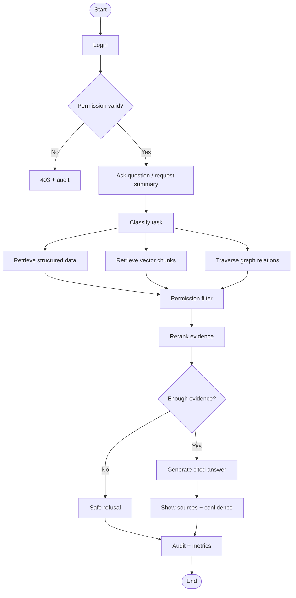

# Process Flow, BPMN & Use Case Specification

**Project:** AI-Powered Hospital Knowledge Assistant
**Project Code:** HOSP-AI-001
**Version:** 1.0
**Status:** Draft
**Last Updated:** 2026-04-27

**Owner:** BA / Clinical SME / Product Owner

## 1. Process Overview
| Process | Objective | Trigger | Output | Owner |
|---|---|---|---|---|
| Patient information lookup | Reduce manual search time | User asks question | Cited answer / summary | Clinical SME |
| Document ingestion | Make PDFs/images searchable | Upload/sync document | OCR text + indexed chunks | Data Lead |
| Medication/allergy pre-check | Reduce manual verification effort | User asks safety question | Warning + evidence | Pharmacist SME |
| Audit and metrics | Track compliance and impact | Any sensitive query | Audit + metric events | Security / PM |

## 2. SIPOC
| Supplier | Input | Process | Output | Customer |
|---|---|---|---|---|
| HIS/EMR PostgreSQL | Patients, encounters, labs, meds | Sync + normalize | Structured records | Doctors/nurses |
| File storage | PDF/image documents | OCR + chunk + embed | Searchable chunks | Hospital users |
| Identity provider | User/role/dept | Auth + permission scope | Access context | System |
| AI/RAG services | Query + evidence | Retrieve + generate | Cited answer | Authorized user |

## 3. As-Is Process
| Step | Actor | Current Activity | Pain Point |
|---|---|---|---|
| 1 | Doctor/nurse | Opens multiple systems and PDFs | Slow and repetitive |
| 2 | Staff | Searches scanned documents manually | Poor searchability |
| 3 | Pharmacist/doctor | Checks meds and allergies manually | Error-prone and slow |
| 4 | Staff | Copies findings into notes | No standardized source trail |
| 5 | PM/IT | Cannot measure saved time | No impact metrics |

## 4. To-Be Process
| Step | Actor/System | Target Activity | Control Point |
|---|---|---|---|
| 1 | User | Login and choose patient/document scope | Authentication required |
| 2 | System | Evaluate RBAC/ABAC permissions | Permission before retrieval |
| 3 | User | Ask a question or request summary | Query logged |
| 4 | System | Retrieve structured rows, vector chunks, graph relations | Authorized evidence only |
| 5 | System | Rerank and compress evidence | Preserve citations |
| 6 | LLM | Generate answer | Evidence-grounded only |
| 7 | UI | Show answer, citations, confidence, disclaimer | User verifies source |
| 8 | System | Store audit and metrics | ROI and compliance |

## 5. BPMN / Activity Diagram

## 6. Use Case Inventory
| UC ID | Use Case | Actor | Goal | Priority |
|---|---|---|---|---|
| UC-001 | Ask patient question | Doctor/nurse | Get cited patient information | Must |
| UC-002 | Generate patient summary | Doctor | Review history quickly | Must |
| UC-003 | Upload and OCR document | Records staff | Make document searchable | Must |
| UC-004 | Search documents semantically | Authorized users | Find evidence fast | Must |
| UC-005 | View citations/source page | Authorized users | Verify AI answer | Must |
| UC-006 | Drug/allergy pre-check | Doctor/pharmacist | Find possible safety risk | Should |
| UC-007 | View patient timeline | Doctor/nurse | See longitudinal history | Should |
| UC-008 | Review audit logs | Security | Investigate access | Must |
| UC-009 | View impact metrics | PM/PO | Prove time/cost savings | Must |

## 7. Use Case Details
### UC-001 Ask Patient Question
| Field | Detail |
|---|---|
| Primary Actor | Doctor/nurse |
| Precondition | User is authenticated and has patient access. |
| Main Flow | Select patient -> ask question -> retrieve authorized evidence -> generate answer -> show citations -> log audit/metrics. |
| Alternate Flow | No permission -> 403. No evidence -> safe refusal. Low OCR confidence -> warning. |
| Acceptance Criteria | Answer appears in <30 sec on MVP dataset and includes citations. |

### UC-002 Generate Patient Summary
| Field | Detail |
|---|---|
| Primary Actor | Doctor |
| Main Flow | Open patient -> click Generate Summary -> retrieve history, meds, allergies, labs, docs -> show structured summary. |
| Acceptance Criteria | Summary includes required sections and source references. |

### UC-003 Upload and OCR Document
| Field | Detail |
|---|---|
| Primary Actor | Records staff |
| Main Flow | Upload file -> store original -> run OCR -> chunk -> embed -> index -> searchable. |
| Acceptance Criteria | Indexed document appears in semantic search with page citation. |
