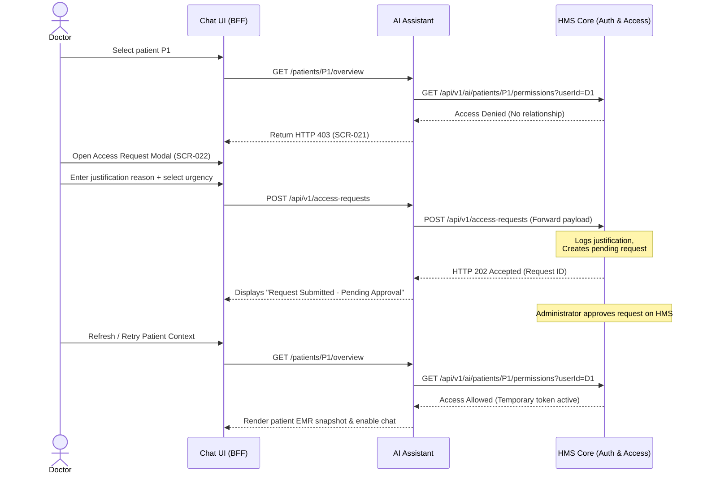

# Permissions Matrix & Access Control Rules

> Project: AI Copilot for Hospital Management System (HMS)  
> Project Code: HOSP-AI-001  
> Version: 3.0  
> Status: Approved  
> Owner: Product Owner / Security Lead  
> Last Updated: 2026-06-07  

---

## 1. Role-Based Access Control (RBAC) Matrix

Feature-level access permissions are verified using the user's role, resolved directly from the HMS authentication token:

| Role | AI Chat | Patient Summary | Upload Documents | Review Audit Logs | View Metrics | Admin Config |
|---|---|---|---|---|---|---|
| **Doctor** | Scoped | Scoped | No | No | Limited | No |
| **Nurse** | Scoped | Limited | No | No | Limited | No |
| **Pharmacist** | Med scope | Med sections | No | No | Limited | No |
| **Lab staff** | Lab scope | Lab sections | No | No | Limited | No |
| **Records staff** | No | No | Yes | No | No | No |
| **Security** | No | No | No | Yes | Yes | No |
| **Admin / IT** | Config only | No PHI default | Yes | Limited | Yes | Yes |

*Note: "Scoped" indicates access is restricted by Attribute-Based Access Control (ABAC) rules (e.g. active treatment relationship or department).*

---

## 2. HMS Access Policy (ABAC)

The Hospital Management System acts as the **single source of truth** for patient access scopes and clinical relationship policies. The AI Assistant checks these scopes in real-time before context retrieval:

*   **Attending Provider Rule**: Clinicians can only access patient EMR snapshots or chat context if they are registered as the active attending doctor/nurse for that patient on the HMS.
*   **Departmental Rule**: Access is allowed if the clinician is assigned to the department (e.g., Cardiology, ICU) where the patient is currently admitted.
*   **Audit-on-Denial**: Standard users trying to access patients outside their EMR scope receive HTTP 403 blocks, triggering an automatic critical write to `audit_logs`.

---

## 3. Temporary Access Request Justification Workflow

When a clinician lacks a default treatment relationship (e.g., in cross-department consultations or emergency overrides), they must request temporary access (`SCR-022` dialog):

---

## Change Log
| Version | Date | Author | Change |
|---|---|---|---|
| 1.0 | 2026-04-27 | Product Owner | Initial access matrix draft |
| 2.0 | 2026-06-07 | Agent | Split into standalone requirements document |
| 3.0 | 2026-06-07 | Agent | Realigned to HMS source of truth, added ABAC rules and justification flow |
