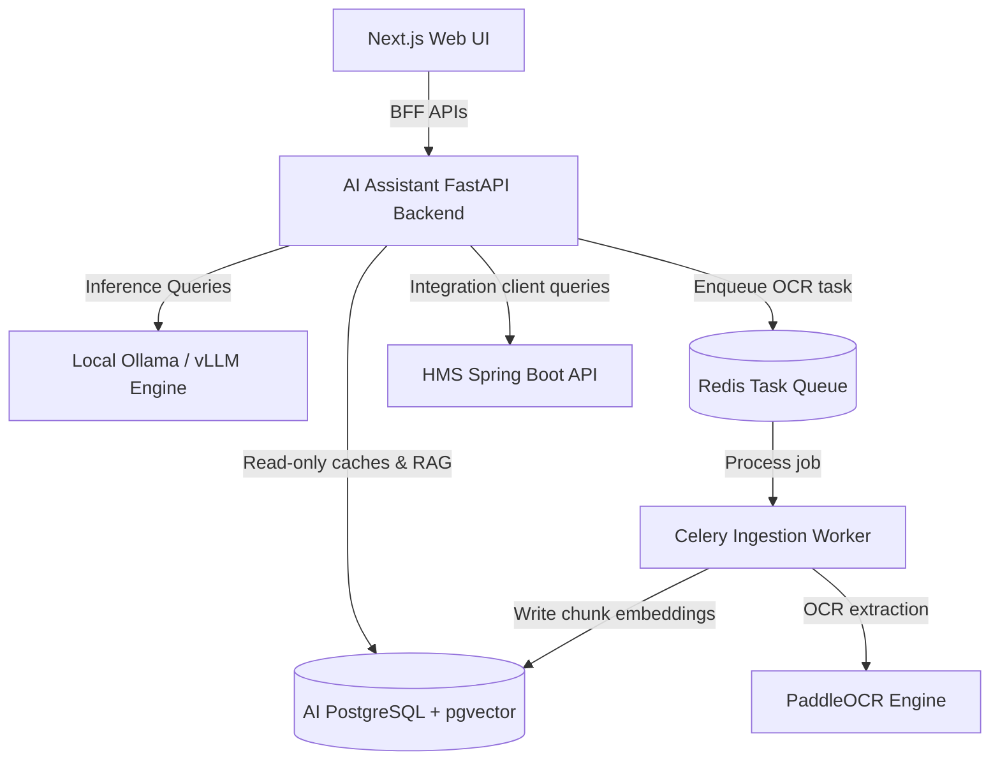
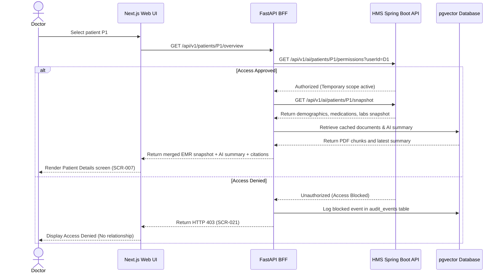

# System Architecture & Software Design Document

> Project: AI Copilot for Hospital Management System (HMS)  
> Project Code: HOSP-AI-001  
> Version: 3.0  
> Status: Approved  
> Owner: System Architect / Tech Lead  
> Last Updated: 2026-06-07  

---

## 1. Architecture Goals and Constraints
*   **System of Record Separation**: The HMS owns all transactional hospital clinical data. The AI assistant functions as a read-model caching layer and RAG vector store.
*   **Next.js UI BFF Aggregator**: The Next.js web application interacts exclusively with the AI Assistant Backend (BFF), which consolidates endpoints and proxies EMR data checks to the HMS API.
*   **Local-first Privacy**: No patient Protected Health Information (PHI) is processed by external cloud LLMs. Local quantized models (Qwen2.5 3B/7B via Ollama) are used.
*   **HNSW Vector Indexing**: Document chunks, metadata, and embeddings are managed locally in PostgreSQL using the `pgvector` extension.

---

## 2. System Context

The multi-layer integration architecture operates as follows:

---

## 3. Component Architecture

| Component Layer | Responsibility | Primary Datastore |
|---|---|---|
| **Next.js Web UI** | Interacts with Chat, Patient snapshots, Document OCR dashboards, and Metrics views. | Browser state |
| **FastAPI Backend (BFF)** | Direct entry point for UI. Handles request validation, routes queries, checks policies, and performs auth bridge mappings. | PostgreSQL |
| **HMS Spring Boot API** | External system of record owning clinical patient records, logins, appointments, and access requests. | HMS Production DB |
| **Celery Indexing Worker** | Processes uploaded documents, page OCR blocks, and generates vector chunks. | Local filesystem / S3 |
| **Ollama Inference Engine** | Local quantized Large Language Model execution. | Model directory |
| **pgvector Database** | Stores user chat threads, de-identified metrics, audit logs, and document chunk vectors. | PostgreSQL |

---

## 4. Key Sequences

### Request Patient Overview & Context
This sequence outlines permission check routing before HMS EMR snapshots are cached and displayed to clinicians:

---

## 5. Quality Attribute Design

*   **Security & Privacy**: Enforces active patient permission predicates at the HMS API gateway layer before any RAG search vector retrieval runs.
*   **Performance**: Minimizes HMS network request count by utilizing composite snapshot endpoints (`/ai/patients/{id}/snapshot`) instead of querying vitals, labs, and logs in separate requests.
*   **Resource Management**: Restricts local worker threads and limits concurrent Ollama batch sizes to fit standard hospital workstation 16GB RAM limits.

---

## Change Log
| Version | Date | Author | Change |
|---|---|---|---|
| 1.0 | 2026-04-27 | System Architect | Initial architecture draft |
| 2.0 | 2026-06-07 | Agent | Restructured into standalone doc |
| 3.0 | 2026-06-07 | Agent | Updated system context to position HMS as the external system of record and added BFF sequence |
