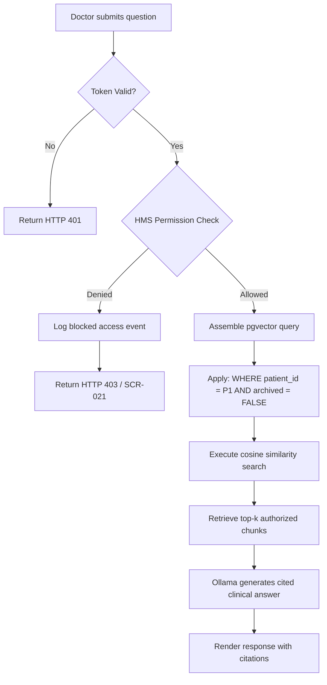

# Security & Privacy Architecture

> Project: AI Copilot for Hospital Management System (HMS)  
> Project Code: HOSP-AI-001  
> Version: 3.0  
> Status: Approved  
> Owner: Security Architect / Lead Dev  
> Last Updated: 2026-06-07  

---

## 1. Cross-System Authentication Model

The AI Copilot does not maintain a separate user registry or credential store. It relies entirely on the **HMS Auth Server** as the single source of identity truth:

```
[TanStack Start Web UI] ──(Bear token: HMS JWT)──> [AI Assistant BFF] ──(Validate token key)──> [HMS Core APIs]
```

*   **Token Format**: The UI sends standard OIDC Bearer tokens in the header:
    ```http
    Authorization: Bearer <HMS_JWT_ACCESS_TOKEN>
    ```
*   **Token Validation**: The FastAPI Backend (BFF) validates incoming JWTs using the HMS public signature key or a shared HMAC secret. User identity attributes (User ID, Name, Department, active EMR Roles) are extracted from token claims.

---

## 2. Access Request Justification Workflow (ABAC)

When a doctor or nurse attempts to access patient PHI without an active EMR treatment relationship or admission mapping:

1.  **Encounter block**: The HMS returns access denied to the BFF.
2.  **User warning**: The UI displays the "No Treatment Relationship" screen (`SCR-021`).
3.  **Submission**: The user enters a justification reason and urgency level in the modal dialog (`SCR-022`).
4.  **Registration**: The request is POSTed through the BFF directly to `/api/v1/access-requests` on the HMS. The justification is saved as a pending access override in EMR audits.
5.  **Audit trail**: Both the blocked query and the justification request write events to the audit log with matching Trace IDs.

---

## 3. Retrieval Safety & Context Filtration

The system applies strict access filtering *before* any text chunks or graphs are read from the vector database, preventing LLM data leakages:



---

## 4. LLM Input/Output Guardrails (AI Engineering Hardening)

To prevent Prompt Injection and PHI Data Leakage to unauthorized topics, the system implements runtime AI Guardrails using the `llm_guard` library:

1.  **Input Guardrails (PromptInjection)**: Scans the user query and context payload before dispatching to the LLM. Blocks queries that attempt to override instructions (e.g., "Ignore previous instructions") or jailbreak the system.
2.  **Output Guardrails (BanTopics, Deanonymize)**: Scans the generated output from the LLM. 
    *   **BanTopics**: Prevents the assistant from generating restricted content, such as providing direct medical advice.
    *   **Deanonymize (Presidio)**: Detects if the output leaks PII/PHI (like SSN or phone numbers) inappropriately.

*Performance note: To minimize Time-To-First-Token (TTFT) impact, these guardrails are wrapped in `asyncio.to_thread` with an explicit `3.0s` timeout. If the guardrail system hangs or is slow, it fails closed (safe refusal).*

---

## Change Log
| Version | Date | Author | Change |
|---|---|---|---|
| 1.0 | 2026-04-27 | Security Lead | Initial security guidelines |
| 2.0 | 2026-06-07 | Agent | Restructured into standalone doc |
| 3.0 | 2026-06-07 | Agent | Realigned to HMS SSO Auth bridge and detailed justification flows |
| 4.0 | 2026-07-12 | Agent | Added LLM Input/Output Guardrails (AI Engineering Hardening) |
