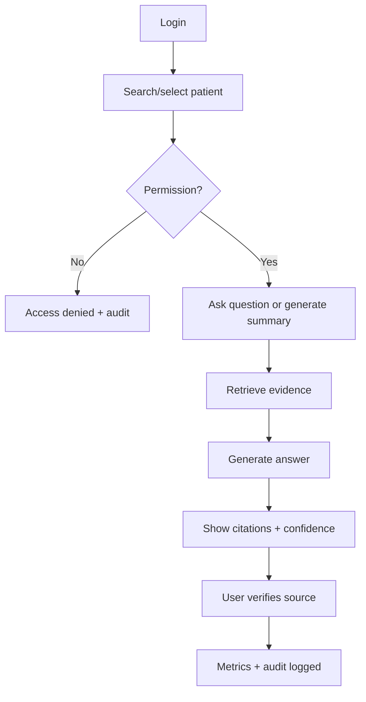

# UI/UX Design Package

**Project:** AI-Powered Hospital Knowledge Assistant
**Project Code:** HOSP-AI-001
**Version:** 1.0
**Status:** Draft
**Last Updated:** 2026-04-27

**Owner:** UI/UX Designer

## 1. Design Brief
| Item | Content |
|---|---|
| Goal | Help hospital users retrieve and verify patient information in under 30 seconds. |
| UX Principles | Clinical clarity, minimal distraction, fast verification, source visibility. |
| Visual Direction | Linear/Cal.com-inspired monochrome UI plus medical semantic colors. |
| Accessibility | WCAG AA: contrast, keyboard navigation, visible focus, labels. |

## 2. User Journey
| Stage | Goal | Touchpoint | Pain Point | Opportunity |
|---|---|---|---|---|
| Discover | Know what AI can do | Home dashboard | Unclear capabilities | Task cards and prompt examples |
| Select context | Choose patient/doc | Patient search | Wrong-patient risk | Sticky patient banner |
| Ask | Ask question | Chat input | Query may be vague | Suggested prompts |
| Retrieve | Wait for evidence | Progress state | Black-box AI | Show retrieval steps |
| Verify | Check answer | Answer + citations | Trust issue | Source viewer and confidence |
| Measure | Prove impact | Metrics dashboard | No ROI data | Time/cost saved cards |

## 3. Information Architecture
| Level | Screen | Purpose |
|---|---|---|
| L1 | Home Dashboard | Entry point and task shortcuts |
| L1 | Patient Search | Find authorized patients |
| L1 | AI Chat | Main assistant interface |
| L1 | Documents | Upload, OCR, index, search |
| L1 | Metrics | Impact dashboard |
| L1 | Audit | Sensitive access review |
| L2 | Patient Overview | Summary, alerts, timeline |
| L2 | Source Viewer | Verify cited evidence |
| L2 | Admin Settings | Roles and permission rules |

## 4. User Flow


## 5. Screen Inventory
| Screen ID | Screen | User | Linked FR | Notes |
|---|---|---|---|---|
| UX-001 | Home Dashboard | All | FR-004 | Task cards, recent activity |
| UX-002 | Patient Search | Doctor/nurse | FR-003 | Permission-scoped results |
| UX-003 | Patient Overview | Doctor/nurse | FR-008/013 | Summary, alerts, timeline |
| UX-004 | AI Chat | All scoped users | FR-004/005 | Chat + evidence panel |
| UX-005 | Document Upload | Records staff | FR-006 | OCR queue/status |
| UX-006 | Document Search | All scoped users | FR-007 | Semantic search results |
| UX-007 | Source Viewer | All | FR-005 | Page preview with highlight |
| UX-008 | Metrics Dashboard | PM/Admin | FR-009 | Time saved, cost saved |
| UX-009 | Audit Log | Security/Admin | FR-010 | Filterable events |
| UX-010 | Admin Settings | Admin | FR-014 | Role management |

## 6. Components
| Component | States | Accessibility Note |
|---|---|---|
| Button | default, hover, focus, disabled, loading | Visible focus |
| Chat Input | empty, typing, disabled | Keyboard submit |
| AI Answer Card | loading, cited, no evidence, warning | Source list navigable |
| Citation Chip | default, selected | Text + icon, not color-only |
| Patient Banner | normal, restricted, emergency | Always show MRN/DOB |
| Medical Alert | success, warning, danger | Label and explanation |
| Source Viewer | loading, preview, unavailable | Screen-reader compatible |
| Status Badge | processing, indexed, failed | Text included |

## 7. Visual System
| Role | Color |
|---|---|
| Primary text | #242424 |
| Secondary text | #898989 |
| Background | #ffffff |
| Info | #2563eb |
| Success | #16a34a |
| Warning | #f59e0b |
| Danger | #dc2626 |

Use Inter for body text and a clean geometric display font for headings. Use subtle ring shadows instead of heavy borders.

## 8. AI Answer Pattern
```text
Answer
Evidence / Citations
Confidence
Safety note: AI assists retrieval and summarization; clinical staff verify decisions.
```

## 9. Usability Review Plan
| Scenario | Participant | Expected Finding to Validate |
|---|---|---|
| Generate patient summary | Doctor | Can verify each summary section |
| Search latest document | Nurse | Can find and open source quickly |
| Upload OCR document | Records staff | Understands processing status |
| Review drug warning | Pharmacist | Understands severity and source |
| Review metrics | PM | Can read time/cost savings |
