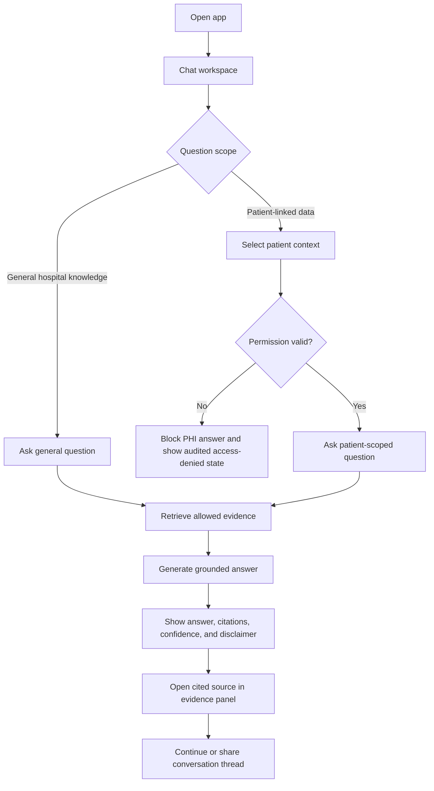

# UI/UX Design Package

**Project:** AI-Powered Hospital Knowledge Assistant
**Project Code:** HOSP-AI-001
**Version:** 1.1
**Status:** Draft
**Last Updated:** 2026-04-28

**Owner:** UI/UX Designer

## 1. Design Brief

| Item | Content |
|---|---|
| Goal | Help hospital staff ask questions, inspect cited evidence, and avoid wrong-patient access in a chat-first workspace. |
| Primary UI Reference | Kotaemon chat workspace: conversation sidebar, central chat transcript, prompt input, answer rendering, citations, and source/evidence panel. |
| Design Refinement Layer | `docs/design/core-ui-linear.md` for shell density, `docs/design/document-notion-lite.md` for readable source surfaces, and `docs/design/dashboard-vercel.md` only for later dashboard/admin slices. |
| UX Principles | Chat-first access, clinical clarity, minimal distraction, visible permission gates, source visibility, and no hidden PHI context. |
| Accessibility | WCAG AA: contrast, keyboard navigation, visible focus, labels, and citation/source controls usable without color alone. |

## 2. Phase 1 Scope

Phase 1 is the Kotaemon-style collaborative assistant workspace. The first screen of the application must be the chat assistant, not a dashboard.

| In Scope | Out of Scope for Phase 1 |
|---|---|
| Conversation sidebar and shared thread affordances | Knowledge-base management screens |
| Central chat transcript and prompt composer | Settings screens |
| Answer cards with citations, confidence, and disclaimer | Admin dashboards and metrics screens |
| Source/evidence inspection panel | Document upload and indexing UI |
| Patient/context selector with permission-gated state | Team-level workspace administration |
| Clearly marked local mock data for missing backend pieces | Any mock shown as real hospital data |

### Phase 1 Data Boundary

Backend-backed patient chat responses, citations, confidence, and disclaimer fields may be shown when they match the verified current API contract. Shared threads, general hospital knowledge, HMS integration fields, and any missing patient metadata must be labeled as local/sample or documented as unavailable until a real backend contract exists.

Phase 1 UI states must never imply that document upload, knowledge-base management, settings, admin dashboards, metrics dashboards, or real shared-thread persistence already exist.

## 3. User Journey

| Stage | Goal | Touchpoint | Pain Point | Opportunity |
|---|---|---|---|---|
| Open assistant | Start asking immediately | Chat workspace | Dashboard-first flows slow the user down | Land directly in the active chat surface |
| Select context | Choose general or patient-linked scope | Patient/context gate | Wrong-patient or unauthorized PHI risk | Keep selected scope visible before asking |
| Ask | Ask a hospital or clinical question | Prompt composer | Query may be vague or missing context | Suggested prompts and patient-aware placeholders |
| Retrieve | Wait for evidence | Answer loading state | Black-box AI | Show retrieval and permission state clearly |
| Verify | Check answer | Answer + citations + evidence panel | Trust issue | First-class source viewer with citation links |
| Collaborate | Continue shared thread | Conversation sidebar | Staff repeat questions or lose context | Shared thread list, rename/share affordances, audit-ready IDs |

## 4. Information Architecture

| Level | Screen / Region | Purpose | Phase |
|---|---|---|---|
| L1 | Chat Workspace | Main first screen and primary assistant experience | Phase 1 |
| L2 | Conversation Sidebar | New, open, rename, delete, and share conversation threads | Phase 1 |
| L2 | Chat Transcript | Questions, answers, citation chips, confidence, and safe refusals | Phase 1 |
| L2 | Prompt Composer | Submit hospital or patient-scoped questions | Phase 1 |
| L2 | Patient Context Gate | Select patient/context and show permission status before PHI answers | Phase 1 |
| L2 | Evidence Panel | Inspect cited source summaries, document/page metadata, and unavailable states | Phase 1 |
| Later | Knowledge Base / Documents | Upload, OCR, index, and manage documents | Later |
| Later | Metrics Dashboard | Impact and operations dashboard | Later |
| Later | Admin Settings | Roles, permission rules, and workspace settings | Later |

## 5. User Flow



## 6. Screen Inventory

| Screen ID | Screen / Region | User | Linked Requirement | Notes |
|---|---|---|---|---|
| UX-001 | Chat Workspace | All scoped staff | FR-004/005 | Main entry; Kotaemon-style shell |
| UX-002 | Conversation Sidebar | All scoped staff | FR-004 | Shared threads, rename/delete/new/share affordances |
| UX-003 | Patient Context Gate | Doctor/nurse/scoped staff | FR-003/004 | Permission-scoped patient selection and explicit PHI state |
| UX-004 | Prompt Composer | All scoped staff | FR-004 | Keyboard submit, disabled/loading states, suggested prompts |
| UX-005 | AI Answer Block | All scoped staff | FR-004/005 | Answer, citations, confidence, disclaimer, no-evidence state |
| UX-006 | Evidence Panel | All scoped staff | FR-005 | Source cards, document/page/chunk metadata, unavailable state |
| UX-007 | Access Denied State | All scoped staff | FR-003/010 | Blocks unauthorized PHI evidence and supports audit trail |
| Later | Document Upload | Records staff | FR-006 | Deferred |
| Later | Metrics Dashboard | PM/Admin | FR-009 | Deferred |
| Later | Admin Settings | Admin | FR-014 | Deferred |

## 7. Components

| Component | States | Accessibility Note |
|---|---|---|
| Conversation Sidebar | empty, active thread, shared thread, loading, error | Thread actions must have labels and focus states |
| Thread Action Button | new, rename, delete, share, expand | Use icons with tooltips or accessible labels |
| Patient Context Gate | general, patient selected, permission pending, allowed, denied | Never hide the selected PHI scope |
| Chat Input | empty, typing, disabled, submitting | Keyboard submit and screen-reader label |
| AI Answer Block | loading, cited, no evidence, warning, denied | Source list navigable |
| Citation Chip | default, selected, unavailable | Text + icon, not color-only |
| Evidence Panel | closed, loading, source selected, unavailable | Source metadata readable without visual-only cues |
| Safety Disclaimer | default, elevated-risk | Keep concise and attached to answer |

## 8. Visual System

The base visual direction is Kotaemon structure with a Linear-like dark product shell and Notion-lite source reading surfaces.

| Role | Color |
|---|---|
| App background | #08090a |
| Shell surface | #0f1011 |
| Elevated surface | #17181a |
| Primary text | #f7f8f8 |
| Secondary text | #a3a7ad |
| Muted text | #6f747d |
| Accent | #5e6ad2 |
| Info | #60a5fa |
| Success | #34d399 |
| Warning | #fbbf24 |
| Danger | #f87171 |

### Figma Mockups & Wireframes
The visual designs and interactive desktop wireframe have been drawn directly in the Figma workspace:
[Hospital AI Assistant Desktop Workspace Mockup](https://www.figma.com/design/QucDTsPwShazdDCLLqUHHW/Untitled?node-id=43-69&t=WBFw6pS24Jjm5WB4-1)

Key mockups implemented:
* **UX-001 (Chat Workspace)**: Desktop shell layout (`43:69`) displaying three principal areas: Sidebar (left), Main Chat (center), and Evidence Panel (right).
* **UX-002 (Conversation Sidebar)**: Sidebar widget showing New Thread triggers and active/inactive conversation status list.
* **UX-003 (Patient Context Gate)**: Context bar at the top displaying current patient name and permission badge (`semantic.success` color indicating allowed state).
* **UX-005 (AI Answer Block)**: Central card rendering answers, citation chips, trace IDs, confidence scores, and safety disclaimers.
* **UX-006 (Evidence Panel)**: Side panel with scrollable source citation cards showing metadata, page numbers, and snippet previews.

Use Inter or the existing system font stack. Keep panels dense and readable. Avoid dashboard cards as the opening experience.

## 9. AI Answer Pattern

```text
Question scope
Question
Answer
Evidence / Citations
Confidence
Safety note: AI assists retrieval and summarization; clinical staff verify decisions.
```

Patient-linked answer blocks must also show whether patient context is selected and permission has been validated.

## 10. Usability Review Plan

| Scenario | Participant | Expected Finding to Validate |
|---|---|---|
| Ask a general hospital-policy question | Nurse | Can ask without selecting a patient and can inspect citations |
| Ask a patient-linked question | Doctor | Understands patient context and permission state before answer |
| Attempt unauthorized patient context | Nurse/Admin reviewer | PHI answer is blocked and state is clear |
| Continue a shared conversation | Doctor/nurse | Can find and reuse thread history without losing context |
| Verify cited evidence | Pharmacist/clinician | Can open source detail and connect answer claims to evidence |
