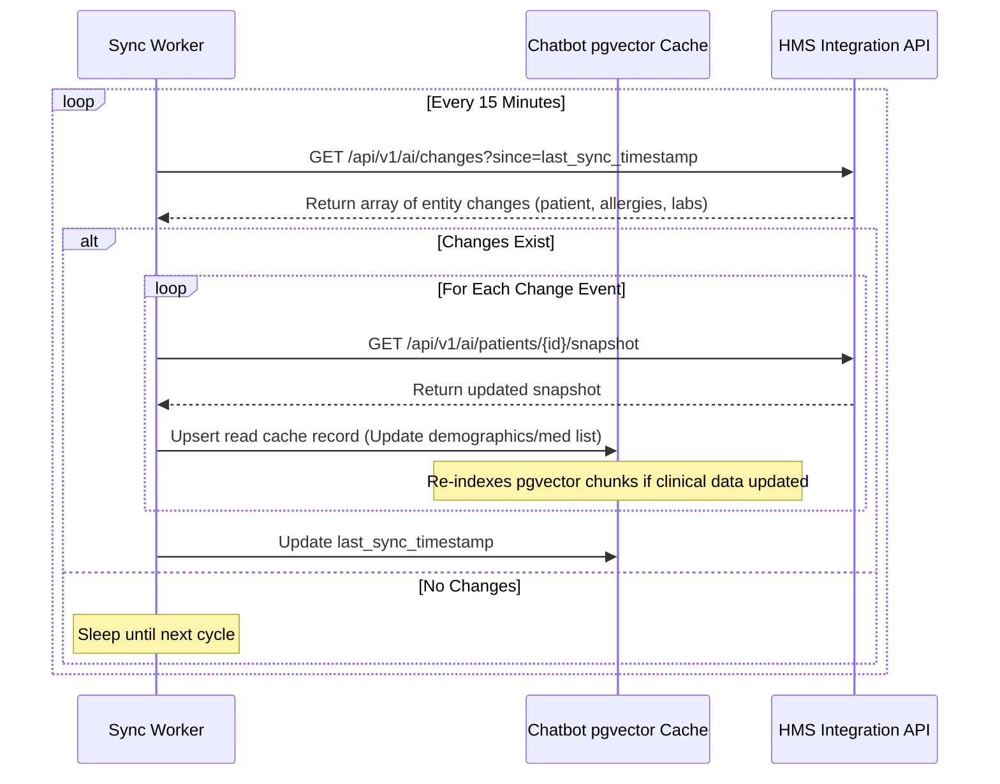

# Integration Overview & Data Mapping

> Project: AI Copilot for Hospital Management System (HMS)  
> Project Code: HOSP-AI-001  
> Version: 3.0  
> Status: Approved  
> Owner: Integration Lead / DevOps  
> Last Updated: 2026-06-07  

---

## 1. Incremental Sync Workflow (Change Feed)

To prevent querying the transactional HMS database for every search or RAG request, the AI Assistant maintains a de-identified local read cache. This cache is kept synchronized using an incremental change feed process:



---

## 2. HMS Sync Job Control Endpoints

To manage data synchronization tasks, the AI Assistant BFF exposes the following administrative endpoints:

*   `POST /api/v1/integrations/hms/sync/patients/{patientId}`: Triggers an immediate, manual refresh of the read cache for a specific patient.
*   `GET /api/v1/integrations/hms/jobs/{jobId}`: Retrieves status logs for background sync workers.
    ```json
    {
      "job_id": "job_9831a28d-3b2a-4dfb",
      "status": "completed",
      "records_processed": 14,
      "failures_count": 0,
      "finished_at": "2026-06-07T23:50:00Z"
    }
    ```

---

## 3. Integration Monitoring & Telemetry

*   **OTel Tracing**: Trace IDs are passed inside header metadata across boundaries (`SCR-023`). A query sequence from the UI generates a single Trace ID spanning the BFF layer, permission service check, and underlying HMS EMR validation checks.
*   **Sync Freshness Monitoring**: The system tracks the latency between the EMR record creation time and the corresponding vector chunk indexing time. An alert is sent to IT admins if the sync queue latency breaches 30 minutes (`SCR-024`).
*   **Sync Failure Dead-Letter Queue**: Records that fail data mapping validation are placed in a Redis dead-letter queue. Admins can view sync logs and retry processing via `/api/v1/integrations/hms/jobs` endpoints.

---

## Change Log
| Version | Date | Author | Change |
|---|---|---|---|
| 1.0 | 2026-04-27 | Integration Lead | Initial integration overview |
| 2.0 | 2026-06-07 | Agent | Restructured into standalone doc |
| 3.0 | 2026-06-07 | Agent | Realigned to incremental sync queues, change feeds, and telemetry tracing |
