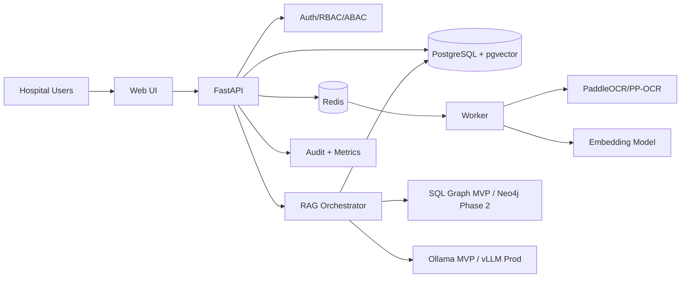
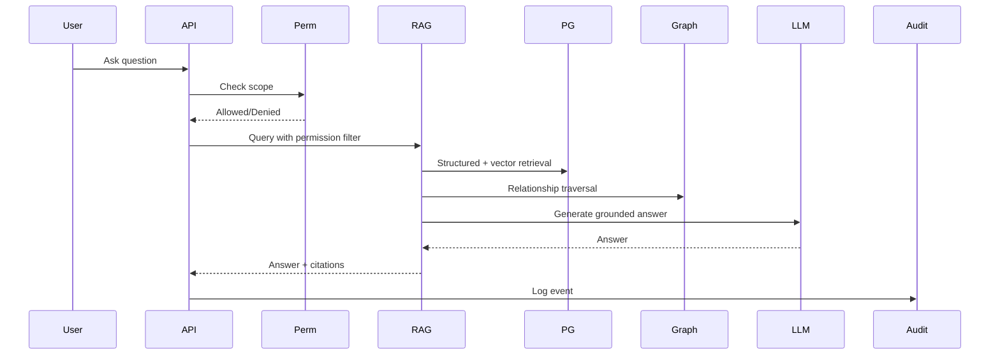
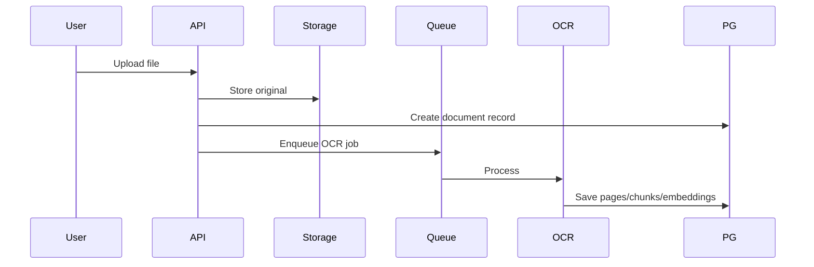

# System Architecture & Software Design Document

**Project:** AI-Powered Hospital Knowledge Assistant
**Project Code:** HOSP-AI-001
**Version:** 1.0
**Status:** Draft
**Last Updated:** 2026-04-27

**Owner:** System Architect / Tech Lead

## 1. Architecture Goals and Constraints
| Goal / Constraint | Description | Implication |
|---|---|---|
| Local-first privacy | No external LLM for PHI by default | Use Ollama/vLLM locally |
| 16GB MVP | Must run on limited RAM | 3B/7B quantized model, no Neo4j initially |
| Permission-aware retrieval | Filter before LLM context | RBAC/ABAC in retrieval layer |
| Source traceability | Every answer cites evidence | Preserve metadata end-to-end |
| Modularity | Separate OCR, RAG, graph, API, UI | Easier testing and scaling |
| Measurable impact | Track time/cost saved | Add metric events |

## 2. System Context

## 3. Component Architecture
| Component | Responsibility | Store |
|---|---|---|
| Web Frontend | Chat, patient overview, documents, metrics | Browser state |
| FastAPI Backend | REST API, orchestration, auth checks | PostgreSQL |
| OCR Worker | PDF/image OCR | Object storage + DB |
| Embedding Worker | Chunk and embed text | pgvector |
| RAG Orchestrator | Query planning, retrieval, reranking, prompt assembly | PostgreSQL/pgvector |
| Graph Layer | Relationship traversal | SQL graph / Neo4j |
| Permission Service | RBAC/ABAC and patient scope | PostgreSQL |
| Audit Service | Immutable access logs | PostgreSQL |
| Metrics Service | Workflow impact tracking | PostgreSQL |

## 4. Key Sequences
### Ask Patient Question

### Upload and OCR Document

## 5. State Machines
### Document State
| State | Next States |
|---|---|
| Uploaded | OCR Processing, Rejected |
| OCR Processing | OCR Completed, OCR Failed |
| OCR Completed | Indexing |
| Indexing | Indexed, Index Failed |
| Indexed | Reprocessing, Archived |
| Failed | Retry, Archived |

### Query State
| State | Next States |
|---|---|
| Received | Permission Check |
| Permission Check | Retrieving, Denied |
| Retrieving | Reranking, No Evidence |
| Reranking | Generating |
| Generating | Completed, Failed |
| Completed/Denied/Failed | Audited |

## 6. Quality Attribute Design
| Attribute | Decision | Rationale |
|---|---|---|
| Performance | pgvector in MVP | Simpler and lighter |
| Privacy | Local model mode | Avoid external PHI sharing |
| Security | Filter before retrieval context | Prevent LLM data leak |
| Reliability | Queue OCR/indexing jobs | Retry long-running tasks |
| Traceability | Preserve metadata | Enables citations |
| Cost | Quantized models for MVP | Fits 16GB RAM |

## 7. ADRs
| ADR ID | Decision | Status |
|---|---|---|
| ADR-001 | Use FastAPI | Accepted |
| ADR-002 | Use PostgreSQL + pgvector for MVP | Accepted |
| ADR-003 | Use PaddleOCR/PP-OCR as default OCR | Accepted |
| ADR-004 | Use Qwen2.5 3B/7B quantized via Ollama for MVP | Accepted |
| ADR-005 | Add Neo4j in Phase 2 | Accepted |
| ADR-006 | Require citations for clinical answers | Accepted |
| ADR-007 | Track time saved and cost saved | Accepted |
