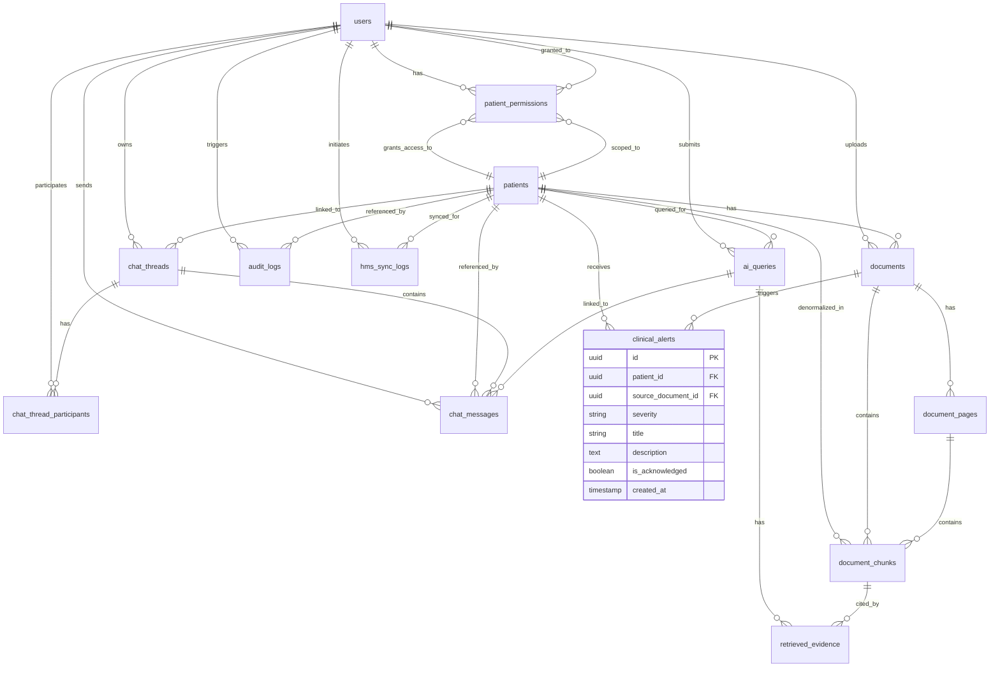

# Entity Relationship Diagram (ERD)

> Project: AI-Powered Hospital Knowledge Assistant  
> Project Code: HOSP-AI-001  
> Version: 4.0  
> Status: In Sync  
> Owner: Backend Lead / Data Lead  
> Last Updated: 2026-07-12  

---

## ERD Mermaid Diagram

---

## Core Relationships

1. **User & Access Control**:
   - `users` receive `patient_permissions` with scoped access (read/summary/medication/upload/admin).
   - `users` own `chat_threads` and participate via `chat_thread_participants`.

2. **Patients & Clinical Data**:
   - `patients` hold the core clinical identity (MRN, demographics).
   - `patients` link to `documents` (scanned files), `chat_threads` (patient-linked or general), and `hms_sync_logs` (data sync tracking).
   - `patients` receive `clinical_alerts` generated by the Autonomous CDSS Agent.

3. **Document Processing Pipeline**:
   - `documents` are processed page-by-page into `document_pages` (OCR text).
   - `document_pages` are chunked into `document_chunks` (semantic vector blocks with pgvector embeddings of dimension 1024).
   - After indexing, `documents` trigger the CDSS worker which may generate `clinical_alerts`.

4. **Chat & Retrieval**:
   - `ai_queries` record every AI question with status (`received → denied/no_evidence/completed/failed`), latency, and model info.
   - `retrieved_evidence` links queries to the specific `document_chunks` used as citations, with pre/post-rerank scores and retrieval method traces.
   - `chat_messages` store the full conversation history within `chat_threads`, each scoped to patient-linked or general.

5. **Audit & Sync**:
   - `audit_logs` provide immutable security trails for all actions (outcome: allowed/denied/failed).
   - `hms_sync_logs` track HMS data synchronization operations with progress counters (records synced/skipped/failed).

6. **Autonomous CDSS Alerts**:
   - `clinical_alerts` are created by the background CDSS worker after document ingestion.
   - Each alert references the originating `patient` and optionally the `source_document` that triggered it.
   - Severity levels: `low` / `medium` / `high`. Alerts are acknowledged by clinicians via the Notifications UI.

---

## Change Log
| Version | Date | Author | Change |
|---|---|---|---|
| 1.0 | 2026-04-27 | Backend Lead | Initial ERD |
| 2.0 | 2026-06-07 | Agent | Added EMR entity relationships |
| 3.0 | 2026-06-14 | Agent | Rewritten to match actual 13-table schema from db/models.py — replaced fictional allergies/medications/encounters/diagnoses/lab_results/metric_events with actual patient_permissions, chat_thread_participants, chat_messages, hms_sync_logs |
| 4.0 | 2026-07-12 | Agent | Added `clinical_alerts` table (14th table) — entity block, relationships patients→clinical_alerts and documents→clinical_alerts, new Core Relationships section 6 for Autonomous CDSS Alerts |
