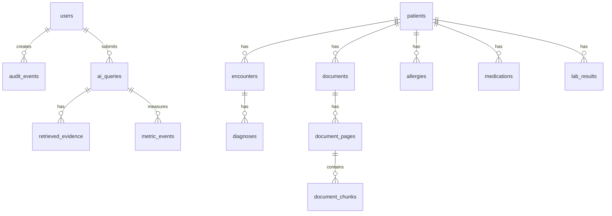

# Entity Relationship Diagram (ERD)

> Project: AI-Powered Hospital Knowledge Assistant  
> Project Code: HOSP-AI-001  
> Version: 2.0  
> Status: Draft  
> Owner: Backend Lead / Data Lead  
> Last Updated: 2026-06-07  

---

## ERD Mermaid Diagram

---

## Core Relationships
1. **User Activity & Logging**:
   - `users` submits natural language chat queries (`ai_queries`) and triggers system-level actions logged in `audit_events`.
2. **Medical EMR Entities**:
   - `patients` have historical medical records (demographics, `encounters`, `diagnoses`, `medications`, `allergies`, `lab_results`).
3. **Unstructured Documents**:
   - `patients` are linked to scanned files (`documents`) such as consent forms or external lab sheets.
   - `documents` are processed page-by-page (`document_pages`) into semantic vector blocks (`document_chunks`).
4. **Retrieval & Analytics**:
   - `ai_queries` link back to specific vector segments and table records (`retrieved_evidence`) used as source citations.
   - `ai_queries` are tracked against execution metadata (`metric_events`) to show productivity and cost savings.
