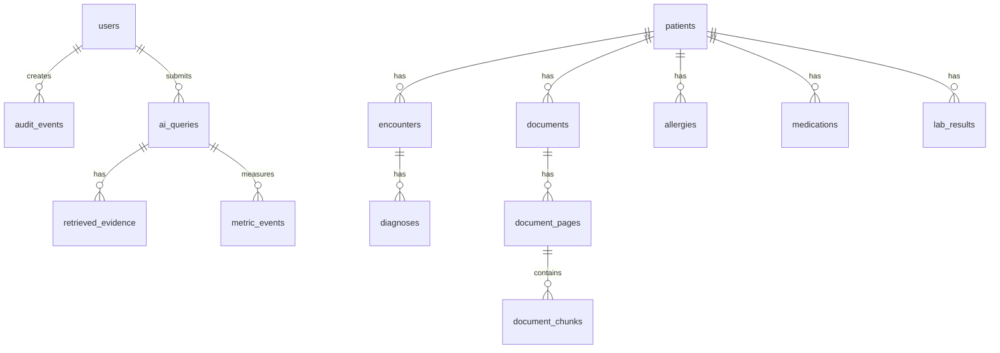

# Database, API & Integration Specification

**Project:** AI-Powered Hospital Knowledge Assistant
**Project Code:** HOSP-AI-001
**Version:** 1.0
**Status:** Draft
**Last Updated:** 2026-04-27

**Owner:** Backend Lead / Data Lead

## 1. Data Model Overview


## 2. Entity Dictionary
| Entity | Purpose | Key Fields | PII/PHI |
|---|---|---|---|
| users | App users | id, email, name, department_id | Yes |
| roles/user_roles | Access control | user_id, role_id | Yes |
| patients | Patient identity | id, MRN, name, DOB | PHI |
| encounters | Visits/admissions | id, patient_id, date, dept | PHI |
| diagnoses | Diagnosis data | code, name, date | PHI |
| medications | Medication history | drug, dose, route | PHI |
| allergies | Allergies/reactions | allergen, reaction, severity | PHI |
| lab_results | Lab values | test, value, unit, timestamp | PHI |
| documents | Document metadata | id, type, file_uri, status | PHI |
| document_pages | OCR text per page | document_id, page, text, confidence | PHI |
| document_chunks | Retrieval chunks | text, embedding, metadata | PHI |
| ai_queries | Query lifecycle | user_id, patient_id, task, latency | May contain PHI |
| audit_events | Sensitive access log | actor, action, object, trace_id | Sensitive |
| metric_events | Impact tracking | task, baseline, actual, saved | De-identified preferred |
| graph_edges | Relationship graph | source, relation, target | Depends |

## 3. API Contract Summary
| API ID | Endpoint | Method | Purpose | Auth |
|---|---|---|---|---|
| API-001 | `/api/v1/auth/me` | GET | Current user and roles | User |
| API-002 | `/api/v1/patients/search` | GET | Patient search | User |
| API-003 | `/api/v1/patients/{id}` | GET | Patient overview | Scoped user |
| API-004 | `/api/v1/patients/{id}/summary` | POST | Generate summary | Doctor/nurse |
| API-005 | `/api/v1/chat` | POST | Ask AI question | Scoped user |
| API-006 | `/api/v1/documents` | POST | Upload document | Records/admin |
| API-007 | `/api/v1/documents/search` | POST | Semantic search | Scoped user |
| API-008 | `/api/v1/documents/{id}/pages/{page}` | GET | Source preview | Scoped user |
| API-009 | `/api/v1/chat-threads` | GET/POST/PATCH/DELETE | Persisted chat threads and messages | User + patient scope |
| API-010 | `/api/v1/hms/appointments/import` | POST | Import synthetic/de-identified HMS appointment summary evidence | Records/admin |
| API-011 | `/api/v1/medication/check` | POST | Drug/allergy check | Doctor/pharmacist |
| API-012 | `/api/v1/audit/events` | GET | Audit log | Security/admin |
| API-013 | `/api/v1/metrics/productivity` | GET | Impact metrics | PM/admin |
| API-014 | `/api/v1/admin/roles` | GET/POST | Role management | Admin |

## 4. Example API
### POST `/api/v1/chat`
Request:
```json
{
  "patient_id": "uuid",
  "question": "What allergies does this patient have?",
  "task_type": "question_answer"
}
```
Response:
```json
{
  "answer": "...",
  "citations": [
    {"source_type": "document", "document_id": "uuid", "page": 2, "chunk_id": "uuid"}
  ],
  "confidence": "high",
  "disclaimer": "AI output must be verified by clinical staff."
}
```
Errors: `400 VALIDATION_ERROR`, `403 FORBIDDEN`, `422 INSUFFICIENT_EVIDENCE`.

## 5. Integration Mapping
| Integration | Source | Target | Frequency | Error Handling |
|---|---|---|---|---|
| HIS/EMR sync | Existing PostgreSQL | App DB | Scheduled/manual | Retry + checkpoint |
| Document upload | UI | Object storage | On demand | Failed status + retry |
| OCR | Worker | document_pages | Event-driven | Retry, mark failed |
| Embedding | Worker | document_chunks | Event-driven | Retry/reindex |
| HMS appointments | Synthetic/de-identified appointment summary import | documents/document_pages/document_chunks | Manual/dev seed | Reject patient mismatch, preserve source lineage, retrieve only after patient permission |
| LLM | RAG service | Ollama/vLLM | Per query | Timeout + safe error |
| Graph sync | PostgreSQL | graph_edges/Neo4j | Scheduled | Rebuild from source |
| Monitoring | Services | OTel stack | Realtime | Alert thresholds |

## 6. Security and Privacy Controls
| Control | Implementation |
|---|---|
| Authentication | Local auth/OIDC |
| Authorization | RBAC + ABAC + patient scope |
| Retrieval safety | Permission filters before vector/graph retrieval |
| HMS evidence safety | Appointment import requires records/admin, matching patient ownership, source lineage metadata, and existing patient permission filters before retrieval |
| Data protection | TLS, encryption at rest where possible |
| Secrets | `.env.example`, secret scan, Vault/SOPS later |
| Audit | Immutable `audit_events` |
| Privacy | Local model mode by default |
| Test data | Synthetic/de-identified only |

## 7. Access Matrix Draft
| Role | AI Chat | Summary | Upload | Audit | Metrics | Admin |
|---|---|---|---|---|---|---|
| Doctor | Scoped | Scoped | No | No | Limited | No |
| Nurse | Scoped | Limited | No | No | Limited | No |
| Pharmacist | Med scope | Med sections | No | No | Limited | No |
| Lab staff | Lab scope | Lab sections | No | No | Limited | No |
| Records staff | No | No | Yes | No | No | No |
| Security | No | No | No | Yes | Yes | No |
| Admin/IT | Config only | No PHI default | Yes | Limited | Yes | Yes |
