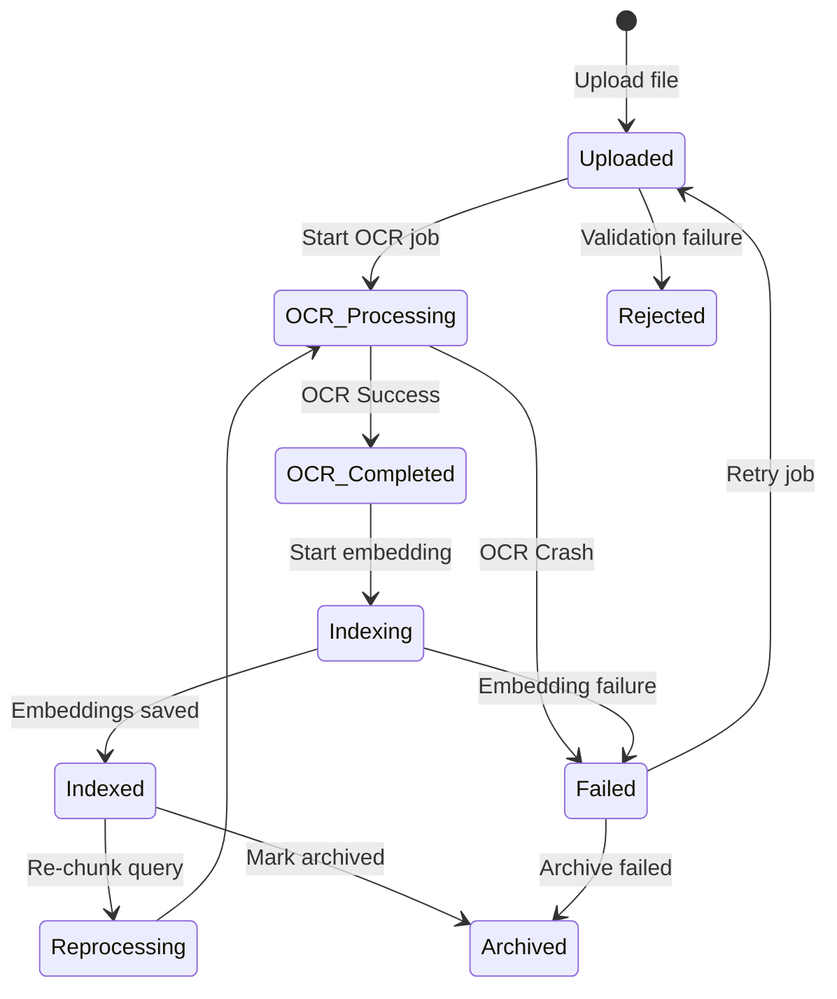
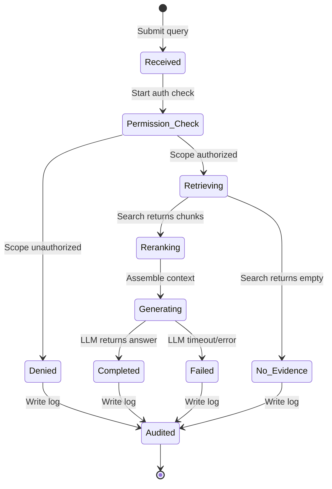

# State Machines

> Project: AI-Powered Hospital Knowledge Assistant  
> Project Code: HOSP-AI-001  
> Version: 2.0  
> Status: Draft  
> Owner: System Architect / Tech Lead  
> Last Updated: 2026-06-07  

---

## 1. Document State Machine
During ingestion and OCR processing, a document moves through the following states:

| Source State | Event / Action | Target State | Description |
|---|---|---|---|
| **None** | User uploads document | **Uploaded** | Document record created, file stored in storage. |
| **Uploaded** | Ingestion worker picks up job | **OCR Processing** | Worker extracts document text and pages. |
| **Uploaded** | File type or size validation fails | **Rejected** | File discarded due to format/size limits. |
| **OCR Processing** | PaddleOCR completes successfully | **OCR Completed** | Structured text blocks extracted. |
| **OCR Processing** | PaddleOCR fails / crashes | **OCR Failed** | Ingestion failed, record saved with error trace. |
| **OCR Completed** | Chunker processes text | **Indexing** | Content split into chunks and queued for embeddings. |
| **Indexing** | pgvector saves embeddings successfully | **Indexed** | Chunks active and searchable in vector database. |
| **Indexing** | Vector generation or DB write fails | **Index Failed** | Indexing job failed. |
| **Indexed** | Administrator requests re-chunking | **Reprocessing** | Document is queued for re-ingestion. |
| **Indexed** | Administrator archives document | **Archived** | Document hidden from standard searches. |
| **Failed** | Administrator triggers manual retry | **Uploaded** | Document queued again for OCR processing. |

### Document State Machine Diagram

---

## 2. Query State Machine
During user interaction, a natural language query moves through the following sequence:

| Source State | Event / Action | Target State | Description |
|---|---|---|---|
| **None** | User submits chat query | **Received** | Query payload mapped and trace ID assigned. |
| **Received** | RBAC/ABAC check initiated | **Permission Check** | Evaluating if user has scope for patient/context. |
| **Permission Check** | Access control verifies scope | **Retrieving** | Permission filters applied to pgvector/SQL queries. |
| **Permission Check** | Access control denies scope | **Denied** | Access logs written, query execution halted. |
| **Retrieving** | Vector/SQL query finds matches | **Reranking** | Retrieve top context chunks and rank by relevance. |
| **Retrieving** | Vector/SQL query returns no matches | **No Evidence** | No matching facts, query proceeds without LLM. |
| **Reranking** | Prompts assembled with top chunks | **Generating** | Context injected, prompt sent to local Ollama LLM. |
| **Generating** | LLM completes response | **Completed** | Answer generated with structured citations. |
| **Generating** | LLM timeout or out-of-memory | **Failed** | Fallback message returned to user. |
| **Completed / Denied / Failed / No Evidence** | Trigger audit write event | **Audited** | Trace audit written to database, response sent to user. |

### Query State Machine Diagram

---

## Change Log
| Version | Date | Author | Change |
|---|---|---|---|
| 1.0 | 2026-04-27 | System Architect | Initial state descriptions in architecture document |
| 2.0 | 2026-06-07 | Agent | Extracted state machines to separate flow document with state diagrams |
