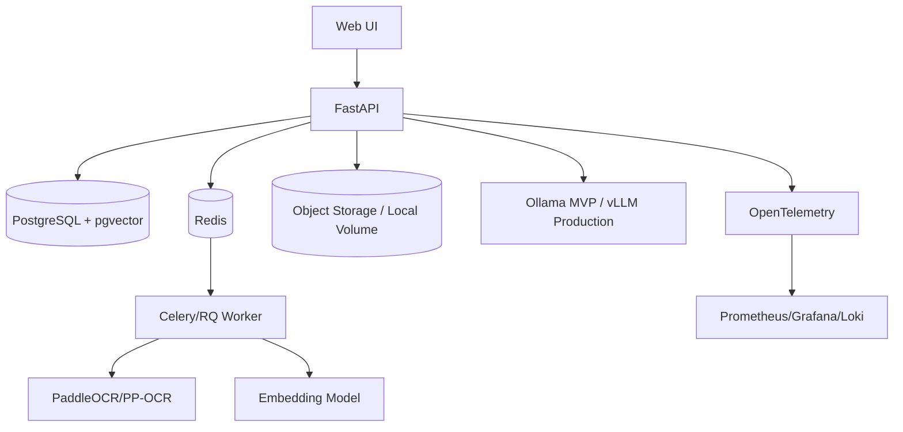

# Deployment & Infrastructure Plan

**Project:** AI-Powered Hospital Knowledge Assistant
**Project Code:** HOSP-AI-001
**Version:** 1.0
**Status:** Draft
**Last Updated:** 2026-04-27

**Owner:** DevOps / SRE / Tech Lead

## 1. Deployment Overview
| Environment | Purpose | Data | Access |
|---|---|---|---|
| Local Lite | 16GB RAM development/demo | Synthetic | Developer |
| Dev | Integration | Synthetic/de-identified | Dev team |
| QA | Functional/integration testing | Synthetic/masked | QA + Dev |
| UAT | Business validation | Masked UAT data | SME/PO |
| Prod | Real operations | Production | Restricted |

## 2. Infrastructure Diagram

## 3. Local Lite Plan for 16GB RAM
| Service | Mode | Notes |
|---|---|---|
| FastAPI | Local/Docker | Lightweight |
| PostgreSQL + pgvector | Docker | Main DB + vector search |
| Redis | Docker | Queue/cache |
| Worker | Single process | Avoid many parallel jobs |
| OCR | CPU PaddleOCR | Slower but feasible |
| LLM | Ollama Qwen2.5 3B/7B quantized | Avoid 14B+ |
| UI | Streamlit/Next.js | Streamlit fastest for demo |
| Neo4j | Disabled in MVP | Phase 2 when resources allow |

Avoid running Neo4j, heavy VLM OCR, and a 7B LLM concurrently on 16GB unless memory has been tested.

## 4. CI/CD Pipeline
| Stage | Checks | Gate |
|---|---|---|
| Build | Install deps, build UI/images | No critical errors |
| Lint | Ruff/black, TypeScript lint | No blockers |
| Unit Test | Backend, permissions, RAG utilities | Critical tests pass |
| Integration | API + DB + Redis + OCR smoke | Core flows pass |
| Security | Secret scan, dependency scan | No critical/high unresolved |
| Deploy QA | Migrations + deploy | Smoke pass |
| UAT | Business scenarios | Sign-off |
| Release | Backup, deploy, smoke, monitor | Checklist signed |

## 5. Release Plan
| Milestone | Activities | Exit Criteria |
|---|---|---|
| Sprint 0 | Repo, docs, local stack, sample data | Local stack runs |
| MVP Build | Auth, upload, OCR, search, chat, summary | Feature complete |
| System Test | E2E, access, OCR, RAG tests | No P0/P1 |
| UAT | SME validation | UAT sign-off |
| Demo Release | Metrics report and portfolio demo | Demo-ready |
| Pilot | Controlled hospital pilot | Compliance approval |

## 6. Observability and Runbook
| Signal | Threshold | Action |
|---|---|---|
| API 5xx | >2% in 5 min | Check logs, rollback if needed |
| Chat latency | P95 >5 sec | Check DB/RAG/LLM |
| LLM latency | >20 sec avg | Reduce context or smaller model |
| OCR backlog | stale >30 min | Scale/pause/retry |
| Retrieval no-evidence rate | >30% on known set | Review chunking/embeddings |
| Authorization errors | unexpected spike | Review policy |
| Missing audit event | any patient query missing audit | Block release |

## 7. Rollback Plan
| Scenario | Trigger | Steps |
|---|---|---|
| API defect | Smoke fail/P0 | Stop traffic -> rollback image -> verify |
| DB migration fail | Error/data risk | Stop -> restore backup -> validate |
| OCR failure | Queue stuck | Pause worker -> fix -> retry |
| LLM failure | Timeout/unavailable | Switch smaller model or safe unavailable state |
| Permission bug | Unauthorized retrieval | Disable endpoint -> patch policy -> audit |

## 8. Security Notes
- Do not use real patient data in local/dev.
- Do not expose MVP publicly.
- Keep local-first LLM for PHI workflows.
- Never commit secrets.
- Run secret scanning in CI.
