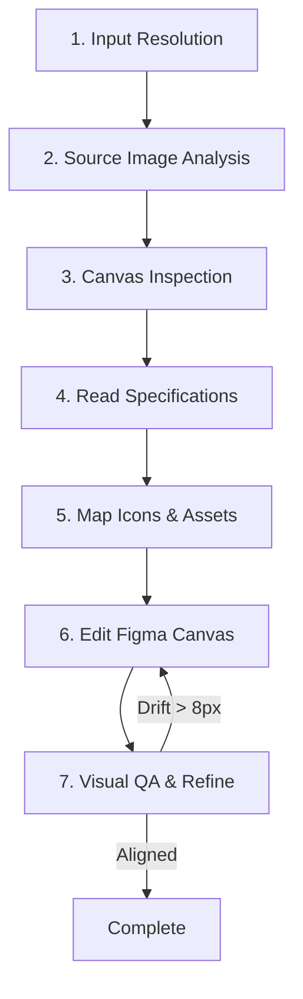

# Image-to-Figma Screen Replication and Alignment Skill

This document defines the specialized skill and execution workflow for programmatically replicating and aligning UI design screens inside Figma based on reference screenshots, design system tokens, layout contracts, and local design assets.

---

## Skill Overview

- **Name:** `image-to-figma-replication`
- **Description:** Replicates screen designs in Figma from reference screenshots by applying local layout contracts (`hms-figma-screen-layout-contract.md`), reusing component libraries, mapping design tokens, and validating visual compliance using iterative screenshot comparisons.
- **Target System:** Figma API / `figma-mcp-go` tools

---

## Operational Execution Steps

When executing this skill, follow these 7 sequential phases:

### Phase 1: Input Resolution
Identify the target section and screen mapping from user input.
1. Match the provided Figma section link (e.g., containing `node-id=26-1505` or similar) or the Screen ID (e.g., `SCR-015: OCR Indexing & Semantic Search Dashboard`).
2. Resolve the matching file ID and node ID on the target Figma page.
3. Check the page structure of the target Figma file (`RnOWTUhlXXie7AO24zggMm`) to locate the active node.

### Phase 2: Source Image Retrieval & Analysis
Locate the reference image and perform design analysis.
1. Find the corresponding PNG screenshot under [docs/screen-design](file:///d:/projects/chatbot-hospital-system/docs/screen-design) matching the screen name/purpose (e.g., `documents.dashboard.ocr-indexing-semantic-search.png` for `SCR-015`).
2. Analyze the visual elements of this reference screenshot:
   - Identify layout blocks (sidebar width, topbar height, content area, right rail).
   - Detect text styles, colors, active states (e.g., selected menu items, status chips).
   - Note the exact icons and illustrations used.

### Phase 3: Figma Canvas Inspection
Evaluate the current state of the target canvas section.
1. Use `figma-mcp-go` tools (`get_node` or `get_nodes_info`) on the resolved Node ID to audit existing elements.
2. Catalog existing layout boxes, text frames, or nested components.
3. Determine what is missing, misaligned, or needs style updates to match the source screenshot.

### Phase 4: Document Specifications Integration
Read and apply layout contracts and business rules.
1. Check the screen lists in [docs/08-ui-ux/screen-list-design(2).md](file:///d:/projects/chatbot-hospital-system/docs/08-ui-ux/screen-list-design(2).md) to identify component requirements.
2. Read the layout coordinates contract in [docs/08-ui-ux/hms-figma-screen-layout-contract(1).md](file:///d:/projects/chatbot-hospital-system/docs/08-ui-ux/hms-figma-screen-layout-contract(1).md) for the specific Screen ID (e.g., Section `# 9. documents.dashboard.ocr-indexing-semantic-search` containing top-level coordinates like `UploadDropzone x=268 y=176 w=728 h=205`).
3. Align all top-level layers according to the exact `x/y/w/h` coordinates defined in the contract.

### Phase 5: Icons & Assets Mapping
Identify and swap assets from the local repository.
1. Check the local folders for assets and icons:
   - [docs/screen-design/hospital_ka_design_assets](file:///d:/projects/chatbot-hospital-system/docs/screen-design/hospital_ka_design_assets) (contains illustrations and main visual assets like `access_denied_shield_lock.png`, `empty_state_dashboard_no_data.png`, etc.).
   - [docs/screen-design/hospital_ka_design_icons_png](file:///d:/projects/chatbot-hospital-system/docs/screen-design/hospital_ka_design_icons_png) (contains specific icons like `icon_security_shield_lock.png`, `icon_upload_cloud.png`, etc.).
2. Map these assets to corresponding component nodes or image placeholders in the Figma frame.

### Phase 6: Figma Canvas Modification
Modify the target nodes in the Figma file programmatically.
1. **Layout & Positioning:** Apply exact coordinates and dimensions using `resize_nodes` or `move_nodes`. Ensure standard Auto Layout settings are applied to interior groups (`set_auto_layout`).
2. **Style Binding:** Use `apply_style_to_node` to bind fills, strokes, fonts, and shadows to their respective Design Tokens:
   - Fills: e.g., `Color/Bg/App`, `Color/Bg/Surface`, `Color/Primary/600`, `Color/Danger/100`.
   - Typography: e.g., `Typography/H1`, `Typography/Body`, `Typography/CaptionStrong`.
3. **Component Swapping:** Swap layout placeholders with actual component library instances (`swap_component`).
4. **Content Overrides:** Update text contents (`set_text`) to match the copy in the reference screenshot exactly.
5. **Asset Ingestion:** Import and attach required local images/icons (`import_image`).

### Phase 7: Visual Verification & Iterative QA
Verify the visual outcomes and correct any drift.
1. Call `get_screenshot` on the modified frame node.
2. Compare the generated screenshot with the reference PNG from Phase 2.
3. Review alignment, padding, fonts, status chip colors, and text contents.
4. If there are visible discrepancies or layout drifts (> 8px), return to Phase 6 to adjust node properties.
5. Repeat the cycle until the generated layout is structurally identical and visually aligned with the source design.
