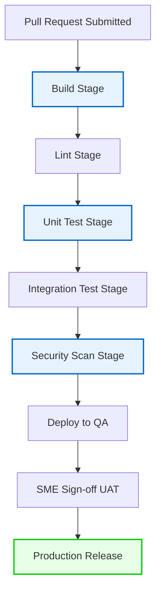

# CI/CD Pipeline Specification

> Project: AI-Powered Hospital Knowledge Assistant  
> Project Code: HOSP-AI-001  
> Version: 2.0  
> Status: Draft  
> Owner: DevOps / SRE / Tech Lead  
> Last Updated: 2026-06-07  

---

## 1. Pipeline Stages

The CI/CD pipeline enforces automated quality, security, and integration gates before code reaches deployment targets:

| Stage | Activities & Checks | Failure Gate Conditions |
|---|---|---|
| **Build** | Installs dependencies; compiles Next.js frontend; builds Docker images for backend and workers. | Any syntax error, compile failure, or dependency mismatch. |
| **Lint** | Runs Ruff and Black formatting checks for Python; runs ESLint and TypeScript compilation checks for frontend. | Code style violations or compiler warnings/errors. |
| **Unit Test** | Executes backend unittest/pytest suites; validates permissions logic; runs RAG utility tests. | Any test failure. Code coverage must meet the project's target (minimum 80%). |
| **Integration**| Starts DB + Redis containers; runs API endpoint smoke tests; verifies OCR worker task queue processing. | Failures in core API integration flows or database migration errors. |
| **Security** | Runs Trufflehog secret scanning; runs dependency vulnerability scans (pip-audit, npm audit). | Critical or High security issues detected. Hardcoded secrets found. |
| **Deploy QA** | Applies database migrations; deploys new container versions to QA environment. | Deployment scripts failure or target health checks timed out. |
| **UAT Gate** | Orchestrates manual or semi-automated clinical validation scenarios. | Blocked until product owner sign-off on release checklist. |
| **Release** | Triggers production backups; deploys code to Hospital intranet production VMs; runs health checks. | Any production smoke test failure triggers immediate automatic rollback. |

---

## 2. CI/CD In-Line Gate Workflow

---

## Change Log
| Version | Date | Author | Change |
|---|---|---|---|
| 1.0 | 2026-04-27 | DevOps Engineer | Initial pipeline definition |
| 2.0 | 2026-06-07 | Agent | Restructured into dedicated CI/CD documentation with graphical flow |
