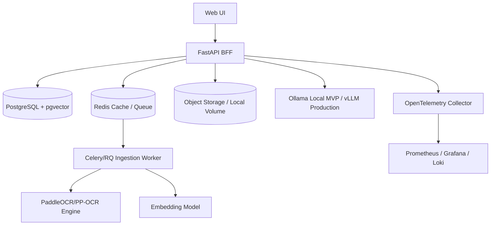

# Deployment Guide

> Project: AI-Powered Hospital Knowledge Assistant  
> Project Code: HOSP-AI-001  
> Version: 2.0  
> Status: Draft  
> Owner: DevOps / SRE / Tech Lead  
> Last Updated: 2026-06-07  

---

## 1. Deployment Environments

The application is deployed across five distinct environment tiers:

| Environment | Purpose | Data | Access | Hosting Target |
|---|---|---|---|---|
| **Local Lite** | 16GB RAM developer local stack | Synthetic data | Developer | Docker Desktop / Local PC |
| **Dev** | API and feature integration | Synthetic / de-identified | Backend/Frontend Dev | Cloud VM / Local Server |
| **QA** | QA automation and manual test | Synthetic / masked EMR data | QA Lead / Tester | Cloud VM / K8s Namespace |
| **UAT** | Clinical user acceptance testing | Masked UAT data | Clinician SMEs / PO | Staging Server |
| **Prod** | Clinical live operations | Real patient records | Authorized Clinical Staff | Hospital Secure Intranet |

---

## 2. Infrastructure Architecture Diagram

The system components interact as follows:

---

## 3. Local Lite Plan for 16GB RAM

For development, testing, and system demonstrations on standard laptops with a 16GB RAM ceiling, follow this configuration:

| Service | Local Lite Mode | Memory Management / Tuning |
|---|---|---|
| **FastAPI BFF** | Local Process or Docker | Minimal memory footprint (<100MB). |
| **PostgreSQL** | Docker Container | Limit shared buffers to 512MB. |
| **Redis** | Docker Container | Cache only, disable persistent AOF snapshots. |
| **Celery Worker** | Single worker thread | Avoid high concurrency; process OCR jobs sequentially. |
| **PaddleOCR** | CPU mode | PP-OCR models run slowly on CPU (~10-15s per page) but save GPU RAM. |
| **Ollama LLM** | Qwen2.5 3B/7B Q4 Quantized | Q4 quantization reduces model footprint to 2.2GB/4.5GB. Avoid models >7B. |
| **Next.js Frontend**| Local dev server | Disable heavy compiler source mapping. |
| **Neo4j** | Disabled | Defer graph operations to PostgreSQL tables. |

---

## 4. Environment Security Notes
- **No Real PHI**: Under no circumstances should real patient records be loaded into Local Lite, Dev, or QA environments. Use generated synthetic records or de-identified data.
- **Network Boundaries**: The MVP is designed for hospital intranets and must not be exposed to the public internet without passing penetration tests and compliance audits.
- **Local LLM Enforcement**: Enforce local inference mode in configuration settings. External cloud API keys (e.g. OpenAI keys) must be blocked in production configurations.
- **Secrets Management**: Never commit credentials to git. Use `.env.example` as a template and inject credentials at runtime using environment variables.

---

## Change Log
| Version | Date | Author | Change |
|---|---|---|---|
| 1.0 | 2026-04-27 | DevOps Engineer | Initial deployment plan |
| 2.0 | 2026-06-07 | Agent | Split into dedicated deployment guide and architecture-linked diagrams |
