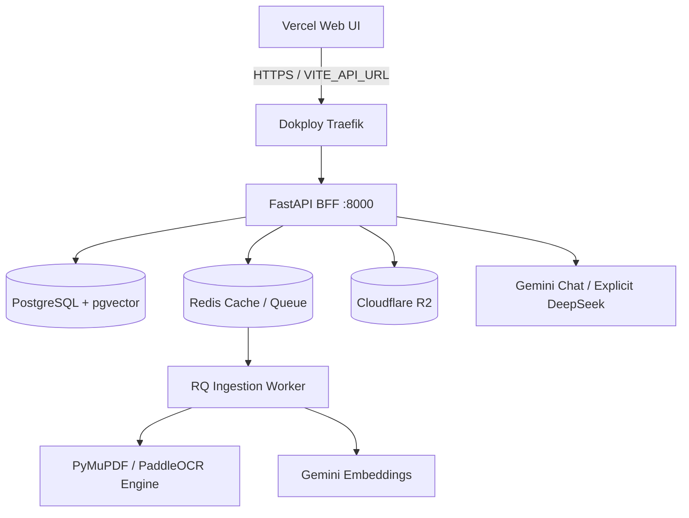

# Deployment Guide

> Project: AI-Powered Hospital Knowledge Assistant  
> Project Code: HOSP-AI-001  
> Version: 2.2
> Status: In Sync  
> Owner: DevOps / SRE / Tech Lead  
> Last Updated: 2026-08-04

---

## 1. Deployment Environments

The current deployment contract separates the Vercel frontend from the
Dokploy-managed backend stack. The VPS profile is a staging/demo target until
hospital production approval, PHI controls, and an approved intranet boundary
exist.

| Environment | Purpose | Data | Access | Hosting Target |
|---|---|---|---|---|
| **Local Lite** | 16GB RAM developer local stack | Synthetic data | Developer | Docker Desktop / Local PC |
| **Dev** | API and feature integration | Synthetic / de-identified | Backend/Frontend Dev | Local or cloud VM |
| **QA** | QA automation and manual test | Synthetic / masked data | QA Lead / Tester | CI or staging VM |
| **UAT** | Clinical user acceptance testing | Masked UAT data | Clinician SMEs / PO | Approved staging server |
| **VPS staging/demo** | Dokploy deployment validation | Synthetic / de-identified only | Project team | Dokploy VPS + Vercel |
| **Prod** | Future clinical operations | Only after approval | Authorized Clinical Staff | Hospital secure intranet |

---

## 2. Infrastructure Architecture Diagram

The system components interact as follows:



Dokploy/Traefik is the only public ingress for the VPS stack. PostgreSQL,
Redis, the worker, and the backend port are private Compose services; no
application Nginx service is required. The frontend remains on Vercel and
sets `VITE_API_URL=https://api.<domain>/api/v1`.

---

## 3. Local Lite Plan for 16GB RAM

For development, testing, and system demonstrations on standard laptops with a 16GB RAM ceiling, follow this configuration:

| Service | Local Lite Mode | Memory Management / Tuning |
|---|---|---|
| **FastAPI BFF** | Local Process or Docker | Minimal memory footprint (<100MB). |
| **PostgreSQL** | Docker Container | Limit shared buffers to 512MB. |
| **Redis** | Docker Container | Cache only, disable persistent AOF snapshots. |
| **RQ Worker** | Single worker thread | Avoid high concurrency; process OCR jobs sequentially. |
| **PyMuPDF / OCR** | CPU mode | PyMuPDF for text extraction; optional PaddleOCR for scanned documents (~10-15s per page on CPU). |
| **Local LLM (optional)** | Ollama Qwen2.5 3B/7B Q4 Quantized | Local-only developer option; not installed on the Dokploy VPS. |
| **TanStack Start Frontend**| Local dev server | Disable heavy compiler source mapping. |

---

## 4. Environment Security Notes
- **No Real PHI**: Under no circumstances should real patient records be loaded into Local Lite, Dev, or QA environments. Use generated synthetic records or de-identified data.
- **Network Boundaries**: The VPS profile is for staging/demo validation. Do not expose clinical data publicly without penetration tests, compliance approval, and an approved hospital network boundary.
- **Provider Policy**: The VPS uses Gemini through its API key. The existing OpenAI-compatible contract can target DeepSeek when explicitly selected; Task 1 does not provide automatic provider fallback. Ollama is not installed on the VPS.
- **Data Policy**: Cloudflare R2 is the durable document store for the VPS profile. Use synthetic or de-identified data until hospital security and PHI controls are approved.
- **Secrets Management**: Never commit credentials to git. Use `.env.example` as a template and inject credentials at runtime using environment variables.

## 5. Dokploy/VPS preflight

Before installing or deploying Dokploy, verify that the VPS has enough free
disk/RAM and that ports 80/443 are available for Traefik. The 4 GB VPS profile
should not run the optional observability overlay until memory usage has been
measured. Configure the backend service route in Dokploy as:

```text
api.<domain> → backend:8000
```

Configure these values in Dokploy, not in Git:

```text
POSTGRES_PASSWORD
HOSPITAL_AI_GEMINI_API_KEY
HOSPITAL_AI_OPENAI_API_KEY       # only when explicitly using DeepSeek
HOSPITAL_AI_R2_ENDPOINT
HOSPITAL_AI_R2_BUCKET
HOSPITAL_AI_R2_ACCESS_KEY_ID
HOSPITAL_AI_R2_SECRET_ACCESS_KEY
HOSPITAL_AI_JWT_ISSUER
HOSPITAL_AI_JWT_AUDIENCE
HOSPITAL_AI_JWKS_URL
HOSPITAL_AI_CORS_ORIGINS
```

Set `BACKEND_IMAGE` to an immutable GHCR tag or digest for a release. A
floating tag is not a release identity.

## 6. Task 7 GitHub-to-Dokploy image flow

The normal staging control plane has one image construction authority:

1. GitHub Actions runs backend tests, the migration check, frontend checks,
   infrastructure checks, and the image scan.
2. GitHub Actions builds `app/backend/Dockerfile`, publishes the backend image
   to GHCR, and records the source SHA, `sha-<7-hex>` tag, image digest, and
   workflow run ID.
3. The CD workflow verifies the exact image reference and sends it to the
   selected Dokploy deploy hook.
4. Dokploy injects that exact value as `BACKEND_IMAGE` and runs the VPS stack.

The VPS source clone is not a build input for this release path. Do not use
`git pull`, `docker compose build`, or the local build override on the staging
VPS. The developer-only local path is explicit:

```powershell
$env:BACKEND_IMAGE = "hospital-ai-backend:local"
docker compose -f infra/docker-compose.yml -f infra/docker-compose.local-build.yml build backend worker
```

The 4 GB VPS profile has these initial service ceilings:

| Service | `mem_limit` |
|---|---:|
| PostgreSQL | `768m` |
| Redis | `256m` |
| Backend | `768m` |
| Worker | `1024m` |

The combined ceiling is `2.75 GiB`, leaving headroom for the OS, Dokploy,
Traefik, image pulls, and the one-off migration. Limits are guardrails, not
proof of healthy runtime behavior; capture actual RAM, swap, disk, and
`docker stats` evidence.

For each candidate, Dokploy performs the controlled order below:

1. Verify the immutable image tag or digest and required environment key names.
2. Pull the candidate image and dependent base images.
3. Run `alembic upgrade head` in a one-off backend container using the candidate
   image.
4. Start or replace backend and worker with the same image reference.
5. Wait for container health and query `https://<API_DOMAIN>/api/v1/health`.
6. Run synthetic/de-identified auth, R2, worker, Gemini, and SSE smoke checks.
7. Record migration revision, runtime results, image digest, and source SHA.

A successful GitHub hook response is only a handoff acknowledgement. The
staging route remains `UNVERIFIED` until an operator records candidate-specific
Dokploy/VPS evidence.

---

## Change Log
| Version | Date | Author | Change |
|---|---|---|---|
| 1.0 | 2026-04-27 | DevOps Engineer | Initial deployment plan |
| 2.0 | 2026-06-07 | Agent | Split into dedicated deployment guide and architecture-linked diagrams |
| 2.1 | 2026-06-14 | Agent | Corrected services: Celery → RQ, PaddleOCR → PyMuPDF, removed Neo4j, Ollama-only → LLM Manager multi-provider |
| 2.2 | 2026-08-04 | Agent | Freeze Vercel + Dokploy/Traefik + R2 + Gemini deployment contract; remove VPS Nginx/Ollama assumptions |
| 2.3 | 2026-08-04 | Agent | Route Task 7 through GitHub-built immutable GHCR images and separate local builds from the VPS contract |
