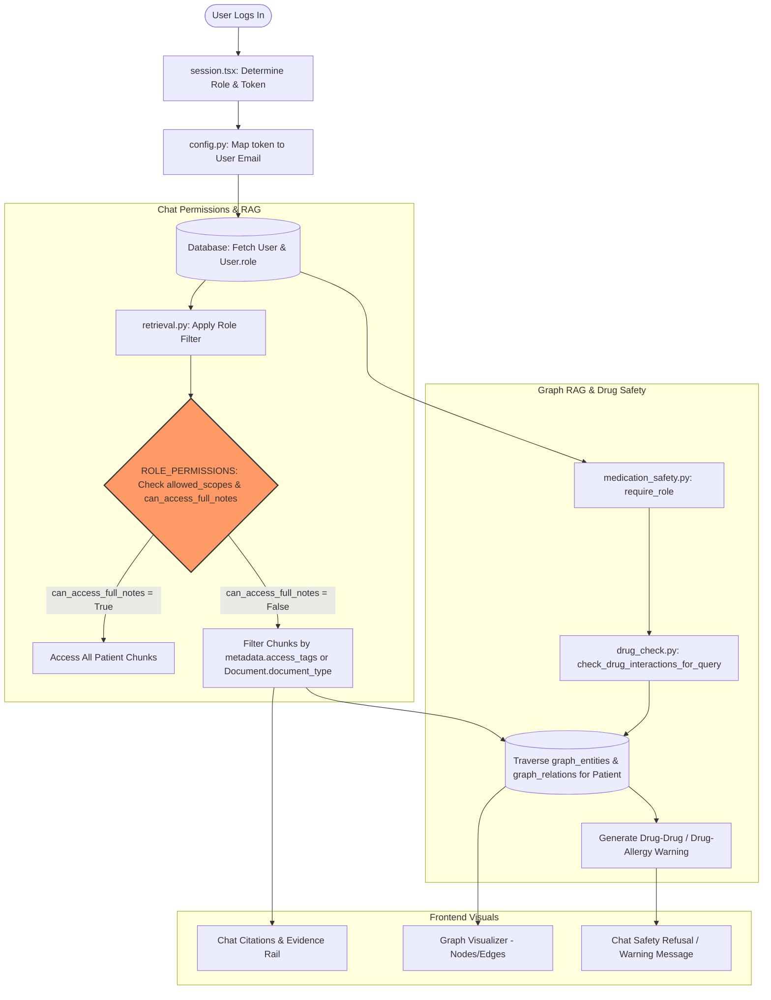

# Phân Tích Sự Liên Kết Dữ Liệu & Phân Quyền Theo Role (HMS AI Copilot)

Báo cáo này tập trung phân tích hiện trạng mapping dữ liệu giữa Frontend và Backend, kiểm tra chi tiết phân quyền (RBAC/ABAC), sự tương thích dữ liệu đối với Chat RAG, Graph RAG, các biểu đồ dashboard và các tab hồ sơ bệnh nhân.

---

## 1. Ma Trận Phân Quyền & Mapping Vai Trò Hiện Tại

Dưới đây là bảng đối chiếu chi tiết cách các vai trò (Roles) được định nghĩa trên hệ thống, cách chúng map qua Mock Token trong môi trường local và quyền truy cập thực tế trên database/RAG:

| Frontend Role | Frontend Title | Mock Token (Local) | Backend User Email | Backend Role (DB) | Allowed Scopes (Backend) | Clinical Notes RAG Filter | Tab cho phép (Frontend) |
| :--- | :--- | :--- | :--- | :--- | :--- | :--- | :--- |
| **admin** | Workspace Admin | `dev-admin` | `admin@example.test` | `admin` | `audit`, `system_config`, `access_request_metadata` | **Bị giới hạn** (Không xem PHI theo mặc định) | Tất cả các tab |
| **cardiologist** | Cardiology · Attending | `dev-doctor` | `doctor@example.test` | `doctor` | `read`, `summary`, `medication`, `labs`, `imaging`, `diagnoses`, `care_plan` | **Mở hoàn toàn** (can_access_full_notes=True) | Tất cả các tab |
| **hospitalist** | Internal Med · Hospitalist | `dev-doctor` | `doctor@example.test` | `doctor` | `read`, `summary`, `medication`, `labs`, `imaging`, `diagnoses`, `care_plan` | **Mở hoàn toàn** (can_access_full_notes=True) | overview, timeline, labs, medications, documents, med-review |
| **rn** | ICU · Bedside RN | `dev-records` | `records@example.test` | `records_staff` | *Không được định nghĩa* | **Mở hoàn toàn** (Do lỗi fallback) | overview, timeline, medications, documents |
| **pharmacist** | Inpatient Pharmacy | `dev-records` | `records@example.test` | `records_staff` | *Không được định nghĩa* | **Mở hoàn toàn** (Do lỗi fallback) | overview, medications, med-review, documents, labs |
| **front_desk** | ER · Front Desk | `dev-records` | `records@example.test` | `records_staff` | *Không được định nghĩa* | **Mở hoàn toàn** (Do lỗi fallback) | overview |

---

## 2. Các Phát Hiện Quan Trọng & Lỗi Phân Quyền (Critical Issues & Gaps)

### 🚨 Phát hiện 1: Lỗ hổng rò rỉ dữ liệu do trùng lặp Mock Token (Privilege Leak)
Trong file [session.tsx](file:///d:/projects/chatbot-hospital-system/app/frontend/src/lib/session.tsx#L52-L59), khi chạy ở môi trường local hoặc mock session, các vai trò **pharmacist**, **front_desk**, và **rn** đều sử dụng chung token `dev-records`:
```typescript
  if (!isRealAuth && !assignedToken) {
    if (role === "admin") assignedToken = "dev-admin";
    else if (role === "pharmacist") assignedToken = "dev-records";
    else if (role === "front_desk" || role === "rn")
      assignedToken = "dev-records"; // Fallback to records
    else assignedToken = "dev-doctor";
  }
```
* **Hậu quả**: Cả 3 vai trò này khi gọi API sẽ được nhận diện là user `records@example.test` với role là `records_staff`.
* Trong file [security.py](file:///d:/projects/chatbot-hospital-system/app/backend/src/hospital_ai/core/security.py#L35-L61), role `records_staff` **không có chính sách phân quyền nào**.
* Khi chạy bộ lọc RAG trong [retrieval.py](file:///d:/projects/chatbot-hospital-system/app/backend/src/hospital_ai/services/retrieval.py#L74-L77):
  ```python
  role_perms = ROLE_PERMISSIONS.get(user.role, {})
  can_access_full_notes = role_perms.get("can_access_full_notes", True)
  ```
  Vì `records_staff` không có trong danh sách, `can_access_full_notes` sẽ trả về `True` (mặc định mở).
* **Kết luận**: Dược sĩ, Điều dưỡng và Lễ tân khi đăng nhập mock đều được cấp quyền đọc **toàn bộ tài liệu lâm sàng nhạy cảm** (bỏ qua mọi tag phân quyền của RAG).

### 🚨 Phát hiện 2: Sai lệch tên vai trò giữa Frontend và Backend (Role Mismatch)
* **Frontend** sử dụng mã vai trò là `"rn"` (Registered Nurse).
* **Backend** định nghĩa vai trò trong database constraint và chính sách là `"nurse"`.
* Nếu người dùng đăng nhập bằng tài khoản thật và backend trả về role `"nurse"`, frontend sẽ map thành `"rn"` qua hàm `mapBackendRole`. Tuy nhiên, nếu frontend gửi yêu cầu với role `"rn"` hoặc backend kiểm tra quyền của user có role `"rn"`, nó sẽ không khớp với cấu hình `"nurse"` trong `ROLE_PERMISSIONS` trên backend, dẫn đến việc bỏ qua các quy tắc lọc RAG (vì không tìm thấy vai trò `"rn"` nên mặc định `can_access_full_notes = True`).

### 🚨 Phát hiện 3: Thiếu dữ liệu Seed trong Database
* Trong file [migrations.py](file:///d:/projects/chatbot-hospital-system/app/backend/src/hospital_ai/db/migrations.py#L20-L50), danh sách user khởi tạo (seed) chỉ có:
  1. `doctor@example.test` (role: `doctor`)
  2. `records@example.test` (role: `records_staff`)
  3. `security@example.test` (role: `security`)
  4. `admin@example.test` (role: `admin`)
* **Thiếu hoàn toàn** user đại diện cho vai trò Dược sĩ (`pharmacist`) và Điều dưỡng (`nurse` / `rn`).
* Trong file test `seed_data.py` có định nghĩa `nurse@example.test`, nhưng file này không chạy tự động khi tạo database dev/UAT (chỉ chạy migrations).

### 🚨 Phát hiện 4: Các Tab chi tiết bệnh nhân trên Frontend hoàn toàn là tĩnh (Hardcoded)
* Mặc dù các file API đã định nghĩa hàm `getPatientOverview` và `getPatientTimeline` để kết nối với backend, nhưng các trang frontend:
  * [overview.tsx](file:///d:/projects/chatbot-hospital-system/app/frontend/src/routes/_app.patients.$patientId.overview.tsx)
  * [timeline.tsx](file:///d:/projects/chatbot-hospital-system/app/frontend/src/routes/_app.patients.$patientId.timeline.tsx)
  * [medications.tsx](file:///d:/projects/chatbot-hospital-system/app/frontend/src/routes/_app.patients.$patientId.medications.tsx)
  * [labs.tsx](file:///d:/projects/chatbot-hospital-system/app/frontend/src/routes/_app.patients.$patientId.labs.tsx)
  * [documents.tsx](file:///d:/projects/chatbot-hospital-system/app/frontend/src/routes/_app.patients.$patientId.documents.tsx)
* Đều hiển thị dữ liệu tĩnh (hardcoded) của bệnh nhân **Eleanor Vance** (Apixaban 5mg, Metoprolol succinate, Creatinine 1.1, INR 1.0, BNP 420...) cho tất cả các bệnh nhân khác (ví dụ khi click vào Alice Synthetic hay Bob Synthetic vẫn hiện thông tin y hệt).
* Các tab Medications và Labs thậm chí **không có API backend tương ứng** vì hệ thống lưu trữ thông tin này dưới dạng tài liệu phi cấu trúc trong RAG hoặc lấy qua HMS API snapshot chứ không lưu trực tiếp vào bảng DB của ứng dụng.

### 🚨 Phát hiện 5: Đồ thị tri thức (Graph RAG Visualizer) hoàn toàn là tĩnh
* Trang đồ thị tri thức bệnh nhân `/graph/patients/$patientId` lấy dữ liệu từ endpoint `/api/v1/graph/patients/{patient_id}`.
* Trong [graph.py](file:///d:/projects/chatbot-hospital-system/app/backend/src/hospital_ai/api/routes/graph.py#L35-L69), endpoint này đang trả về dữ liệu mẫu cứng (Admission, Atrial fibrillation, Apixaban, BNP 612). Nó hoàn toàn chưa truy vấn động các bảng `graph_entities` và `graph_relations` được trích xuất từ các tài liệu của bệnh nhân.

---

## 3. Sơ Đồ Dòng Chảy & Liên Kết Dữ Liệu Phân Quyền

Sự liên kết giữa Vai trò, Quyền Chat, Graph RAG và Dữ liệu lâm sàng diễn ra theo luồng khép kín như sau:



* **Điểm nghẽn**: Khi vai trò bị map sai (ví dụ `rn` thành `records_staff` không có cấu hình), hệ thống sẽ nhảy thẳng đến nhánh `can_access_full_notes = True`. Điều này dẫn đến việc:
  1. Người dùng có quyền thấp (như Lễ tân) vẫn đọc được các tài liệu nhạy cảm.
  2. Các phản hồi của Chatbot không bao giờ kích hoạt được thông báo từ chối an toàn `"Bạn không có quyền xem thông tin này..."` (vì hệ thống nghĩ họ có quyền tối cao).
  3. Evidence Rail hiển thị cả những tài liệu lẽ ra phải bị ẩn đi.

---

## 4. Kế Hoạch Khắc Phục & Bổ Sung Dữ Liệu (Proposed Action Plan)

Để hệ thống hoạt động chính xác theo đúng phân quyền và phản ánh dữ liệu động lên biểu đồ/đồ thị, chúng ta cần thực hiện các bước sau:

### Bước 1: Đồng bộ hóa Mock Token và cấu hình vai trò trên Backend
1. **Bổ sung các token dev riêng biệt** cho Nurse và Pharmacist trong [config.py](file:///d:/projects/chatbot-hospital-system/app/backend/src/hospital_ai/core/config.py#L24-L29):
   ```python
   dev_bearer_tokens: str = (
       "dev-doctor:doctor@example.test,"
       "dev-nurse:nurse@example.test,"
       "dev-pharmacist:pharmacist@example.test,"
       "dev-records:records@example.test,"
       "dev-security:security@example.test,"
       "dev-admin:admin@example.test"
   )
   ```
2. **Cập nhật ánh xạ token trong Frontend** tại [session.tsx](file:///d:/projects/chatbot-hospital-system/app/frontend/src/lib/session.tsx#L53-L59):
   ```typescript
   if (role === "admin") assignedToken = "dev-admin";
   else if (role === "pharmacist") assignedToken = "dev-pharmacist";
   else if (role === "rn") assignedToken = "dev-nurse";
   else if (role === "front_desk") assignedToken = "dev-records";
   else assignedToken = "dev-doctor";
   ```
3. **Đồng bộ vai trò `rn` trên backend** bằng cách thêm ánh xạ hoặc cập nhật `ROLE_PERMISSIONS` để hỗ trợ cả `"rn"` và `"nurse"`, hoặc map `"rn"` về `"nurse"` một cách nhất quán:
   ```python
   # Trong security.py:
   "nurse": {"allowed_scopes": {"hospital_guidelines", "care_plan", "read"}, "can_access_full_notes": False},
   "rn": {"allowed_scopes": {"hospital_guidelines", "care_plan", "read"}, "can_access_full_notes": False},
   "records_staff": {"allowed_scopes": {"upload"}, "can_access_full_notes": False},
   ```

### Bước 2: Bổ sung seed dữ liệu vào DB Migrations
1. Cập nhật [migrations.py](file:///d:/projects/chatbot-hospital-system/app/backend/src/hospital_ai/db/migrations.py) để seed các tài khoản:
   * `nurse@example.test` (role: `nurse`)
   * `pharmacist@example.test` (role: `pharmacist`)
2. Gán các quyền bệnh nhân (`PatientPermission`) tương ứng cho các user mới này để đảm bảo họ có quyền truy cập phạm vi bệnh nhân (như Alice, Bob) trước khi RAG filter chạy.

### Bước 3: Động hóa dữ liệu các Tab chi tiết bệnh nhân trên Frontend
1. Thay vì sử dụng mảng tĩnh trong các component tab, sử dụng react-query để fetch dữ liệu từ:
   * `/patients/{patientId}/overview` để hiển thị AI summary động và thông tin nhân khẩu học thực tế.
   * `/patients/{patientId}/timeline` để hiển thị danh sách sự kiện động của bệnh nhân.
2. Thiết kế các endpoint API backend cho `/patients/{patientId}/medications` và `/patients/{patientId}/labs`. Các API này sẽ đọc từ file tài liệu đã được index của bệnh nhân (hoặc thông qua HMS Client mock) để trả về mảng JSON động thay vì hardcode.

### Bước 4: Chuyển đổi đồ thị Visual Graph RAG sang dữ liệu động
1. Sửa đổi endpoint `/graph/patients/{patient_id}` trong [graph.py](file:///d:/projects/chatbot-hospital-system/app/backend/src/hospital_ai/api/routes/graph.py).
2. Gọi hàm `find_related_entities` với danh sách thực thể mặc định hoặc trích xuất từ truy vấn gần nhất của bệnh nhân để lấy danh sách node/edge thực tế từ DB bảng `graph_entities` và `graph_relations`.
3. Định dạng lại danh sách thực thể động này thành cấu trúc `GraphNode` và `GraphEdge` để trả về cho frontend Canvas hiển thị.
