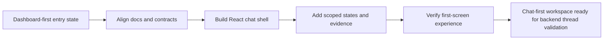

# Phase Contract: Phase 1 - Make The First Screen A Kotaemon-Style Chat Workspace

**Date**: 2026-04-28
**Feature**: kotaemon-chat-assistant-ui
**Phase Plan Reference**: `history/kotaemon-chat-assistant-ui/phase-plan.md`
**Based on**:
- `history/kotaemon-chat-assistant-ui/CONTEXT.md`
- `history/kotaemon-chat-assistant-ui/discovery.md`
- `history/kotaemon-chat-assistant-ui/approach.md`

---

## 1. What This Phase Changes

This phase changes the first thing a hospital staff user sees. Instead of landing on a dashboard, the root frontend route opens into a Kotaemon-style assistant workspace with a conversation sidebar, central chat transcript, prompt composer, patient/context gate, answer citations, and a source/evidence panel.

The phase does not make shared thread persistence or HMS integration real yet. It makes the UI contract clear and honest: current backend-backed data is used where verified, and missing shared-thread or HMS pieces are marked as local/mock or documented gaps.

---

## 2. Why This Phase Exists Now

- The current frontend is visibly dashboard-first, which conflicts with the locked decision that the app must be chat-first.
- Kotaemon is a Python/Gradio reference, so the first practical step is translating its chat workspace into this repo's React/Next.js frontend.
- Backend thread persistence and HMS integration are higher-risk PHI surfaces; the UI contract should be visible before storage and integration contracts are finalized.

---

## 3. Entry State

- `app/frontend/src/app/page.tsx` renders `HospitalDashboard`.
- `app/frontend/src/components/hospital-dashboard.tsx` is a dashboard-style prototype, not the target UI.
- The backend has a verified patient-scoped chat path, permission-filtered retrieval, citations, and audit patterns.
- The backend does not yet have shared conversation threads or a general hospital-knowledge chat request path.
- `docs/04_ui_ux_design_package.md` and `docs/10_design_system_and_metrics.md` have been updated to the Kotaemon-first Phase 1 direction.
- `gkg`, `br`, `bv`, `cass`, and `cm` are not available in the current shell.

---

## 4. Exit State

- The root frontend route opens directly into a chat workspace, not a dashboard.
- The chat workspace includes the Phase 1 regions: conversation sidebar, chat transcript, prompt composer, patient/context gate, answer/citation area, and evidence/source panel.
- UI data boundaries are explicit: real backend-backed fields are separated from clearly marked local/mock data for missing shared-thread, general-knowledge, or HMS pieces.
- Patient-linked answer states visibly require context selection and permission validation before PHI evidence appears.
- Knowledge-base management, settings, admin dashboards, metrics dashboards, and document upload/indexing UI are not added.
- Frontend verification records at least typecheck/build status and a design review note for desktop and mobile layouts.

---

## 5. Demo Walkthrough

A user opens the app and immediately sees the assistant workspace. They can select or view a conversation, choose general or patient-linked scope, see patient permission state, read an answer with citation chips, and open a cited source in the evidence panel. If a piece of data is only local mock data, the UI labels it clearly.

### Demo Checklist

- [ ] Open the frontend root route and confirm it is chat-first.
- [ ] Open a sample/shared conversation from the sidebar.
- [ ] Switch between general and patient-linked scope.
- [ ] Inspect an answer with citation chips and confidence/disclaimer.
- [ ] Open a source in the evidence panel.
- [ ] Confirm missing backend/HMS data is labeled mock/local or documented as a gap.
- [ ] Confirm deferred surfaces are not introduced in this phase.

---

## 6. Story Sequence At A Glance

| Story | What Happens | Why Now | Unlocks Next | Done Looks Like |
|-------|--------------|---------|--------------|-----------------|
| Story 1: Align docs and contract inventory | The Phase 1 source of truth is explicit and not dashboard-first | Implementation should not start from stale docs | React component work can follow a stable UI contract | Docs and history artifacts reflect D1-D12 and list real vs missing backend contracts |
| Story 2: Build the React chat workspace shell | The first screen becomes a Kotaemon-like React layout | The layout is the visible product correction | State and evidence components can be mounted in the correct regions | `page.tsx` renders a responsive chat shell with sidebar, transcript, composer, and evidence panel regions |
| Story 3: Add conversation, patient gate, and evidence states | The UI shows shared-thread affordances, permission status, citations, and source details | The shell needs meaningful healthcare states to be believable | Verification can test the actual first-screen workflow | User can distinguish general vs patient-linked scope and mock vs real data |
| Story 4: Verify the first-screen experience | Build/typecheck and design checks prove the phase is usable | The phase should not move to backend persistence with broken UI | Phase 2 can design real thread persistence from a reviewed UI | Verification output records commands, responsive findings, and remaining backend gaps |

---

## 7. Phase Diagram

---

## 8. Out Of Scope

- Backend shared-thread persistence.
- Real HMS data integration.
- General hospital-knowledge backend request path if it requires backend schema/API changes.
- Knowledge-base management screens.
- Settings screens.
- Admin dashboards and metrics dashboards.
- Document upload/indexing UI.

---

## 9. Success Signals

- Reviewers can recognize the app as a Kotaemon-style chat assistant, not a dashboard.
- The UI exposes citations and evidence inspection as first-class behavior.
- Patient-linked states make permission boundaries visible before evidence is displayed.
- TypeScript/build verification does not fail because of the new screen.
- Remaining backend gaps are explicit enough to prepare Phase 2.

---

## 10. Failure / Pivot Signals

- The first screen still looks or behaves like a dashboard.
- Mock data is visually indistinguishable from real hospital data.
- Patient-linked evidence can appear without an explicit context/permission state.
- The shell requires introducing out-of-scope KB/admin/upload screens to feel complete.
- Frontend implementation depends on removed HMS AI/internal-assistant endpoints.
