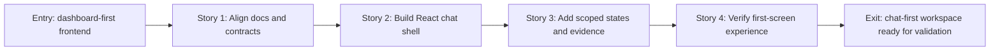

# Story Map: Phase 1 - Make The First Screen A Kotaemon-Style Chat Workspace

**Date**: 2026-04-28
**Phase Plan**: `history/kotaemon-chat-assistant-ui/phase-plan.md`
**Phase Contract**: `history/kotaemon-chat-assistant-ui/phase-1-contract.md`
**Approach Reference**: `history/kotaemon-chat-assistant-ui/approach.md`

---

## 1. Story Dependency Diagram

---

## 2. Story Table

| Story | What Happens In This Story | Why Now | Contributes To | Creates | Unlocks | Done Looks Like |
|-------|-----------------------------|---------|----------------|---------|---------|-----------------|
| Story 1: Align docs and contracts | The repo records the exact Kotaemon-first Phase 1 scope and contract gaps | It prevents implementation from following stale dashboard-first docs | Exit state: data boundaries and scope are explicit | Updated docs/history notes and contract inventory | Component work can use the right scope | D1-D12 are reflected and real vs mock backend pieces are clear |
| Story 2: Build React chat shell | The root route becomes a chat workspace layout | The visible first-screen mismatch must be fixed before detailed states matter | Exit state: root page opens directly to chat | React components for shell regions | Patient/evidence states have a place to live | Root route renders sidebar, transcript, composer, and evidence panel regions |
| Story 3: Add scoped states and evidence | The UI shows shared-thread affordances, patient gate, citation chips, and source detail states | The shell needs safe healthcare behavior before verification | Exit state: permission and evidence behavior is visible | Typed UI data, sample states, and evidence/patient components | End-to-end first-screen demo | User can see general vs patient scope, denied/no-evidence/loading states, and mock labels |
| Story 4: Verify first-screen experience | The new screen is checked with build/typecheck and design review | The phase should close with proof, not just files changed | Exit state: implementation is demonstrably usable | Verification notes and remaining gap list | Phase 2 thread contract planning | Commands/results and layout review are recorded |

---

## 3. Story Details

### Story 1: Align Docs And Contracts

- **What Happens In This Story**: The project docs and phase artifacts are aligned around the approved direction: Kotaemon-first, chat-first, Phase 1 only.
- **Why Now**: It is first because stale docs still encouraged dashboard, upload, admin, and metric surfaces.
- **Contributes To**: Explicit data boundaries and no scope creep.
- **Creates**: Updated UI/UX docs, planning history, and a verified list of current backend gaps.
- **Unlocks**: React component work can proceed without guessing what belongs in Phase 1.
- **Done Looks Like**: `docs/04`, `docs/10`, discovery, approach, phase plan, contract, story map, and `app/frontend/src/lib/chat-assistant/contracts.ts` all agree on D1-D12 and mark verified backend fields separately from local/sample or missing contracts.
- **Candidate Bead Themes**:
  - Reconcile Phase 1 docs and first-screen scope.
  - Inventory verified backend contracts vs local mock gaps.

### Story 2: Build React Chat Workspace Shell

- **What Happens In This Story**: The dashboard entry is replaced by a React chat workspace modeled after Kotaemon.
- **Why Now**: A correct shell is needed before adding scoped healthcare states.
- **Contributes To**: Root route opens directly into chat and no longer presents a dashboard-first product.
- **Creates**: `AssistantShell`, `ConversationSidebar`, `ChatTranscript`, `ChatComposer`, and `EvidencePanel` component structure.
- **Unlocks**: Story 3 can add patient context, citations, and source states inside stable regions.
- **Done Looks Like**: `page.tsx` renders a responsive chat shell with the correct regions and no out-of-scope screens.
- **Candidate Bead Themes**:
  - Replace root page with assistant shell.
  - Implement shell layout and responsive regions.
  - Translate practical Kotaemon layout patterns into React/Tailwind.

### Story 3: Add Conversation, Patient Gate, And Evidence States

- **What Happens In This Story**: The chat workspace becomes clinically believable: thread affordances, scope selection, permission state, answers, citations, source details, and safe empty/denied/no-evidence states appear.
- **Why Now**: The shell alone is not enough; hospital users need to see context and evidence safety before trusting the assistant.
- **Contributes To**: Patient-linked evidence is visibly permission-gated and mock data is never presented as real.
- **Creates**: Typed local data model, sample conversation states, patient context gate, citation chips, evidence panel content, and mock labels.
- **Unlocks**: Story 4 can verify a real first-screen workflow rather than static layout.
- **Done Looks Like**: A user can move through the demo checklist with clear general vs patient-linked scope and visible citation/source behavior.
- **Candidate Bead Themes**:
  - Define typed chat assistant data model and marked mock data.
  - Add patient context and permission states.
  - Add answer, citation, and evidence panel states.
  - Add shared-thread UI affordances without claiming persistence.

### Story 4: Verify First-Screen Experience

- **What Happens In This Story**: The frontend is checked for build/type correctness and reviewed against the chat-first phase contract.
- **Why Now**: Verification closes the phase and prevents carrying UI defects into backend thread persistence work.
- **Contributes To**: The phase exit state is observable and credible.
- **Creates**: Verification record with commands, results, responsive/design findings, and explicit backend gaps.
- **Unlocks**: Phase 2 can safely define real shared-thread persistence around the reviewed UI shape.
- **Done Looks Like**: Typecheck/build status and UI review notes are recorded, including any unresolved gap that should block or shape Phase 2.
- **Candidate Bead Themes**:
  - Run frontend typecheck/build and fix compile issues.
  - Run browser/design review on desktop and mobile.
  - Record remaining backend and data-integration gaps.

---

## 4. Story Order Check

- [x] Story 1 is obviously first.
- [x] Every later story builds on or de-risks an earlier story.
- [x] If every story reaches "Done Looks Like", the phase exit state should be true.

---

## 5. Story-To-Bead Mapping

Real beads were created with the installed Beads CLI (`bd`) because the current Beads release uses `bd` rather than the legacy `br` command name from the Khuym skill text.

| Story | Beads | Notes |
|-------|-------|-------|
| Story 1: Align Docs And Contracts | `br-dyy.2`, `br-dyy.3` | Docs/scope reconciliation must happen before shell and data work |
| Story 2: Build React Chat Workspace Shell | `br-dyy.4`, `br-dyy.5` | Root entry shell precedes scoped healthcare states |
| Story 3: Add Conversation, Patient Gate, And Evidence States | `br-dyy.6`, `br-dyy.7`, `br-dyy.8`, `br-dyy.9` | Data contract precedes thread, permission, and evidence rendering |
| Story 4: Verify First-Screen Experience | `br-dyy.10`, `br-dyy.11` | Browser review depends on build/type verification |
